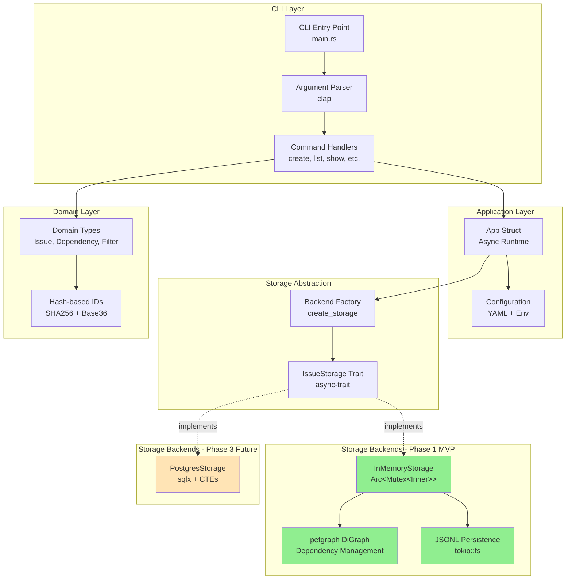
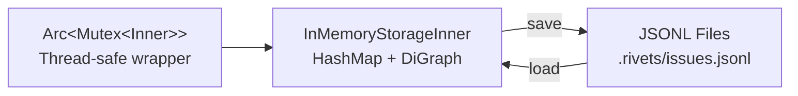
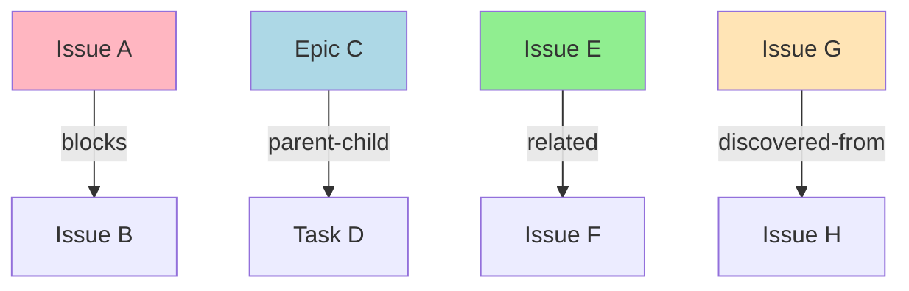
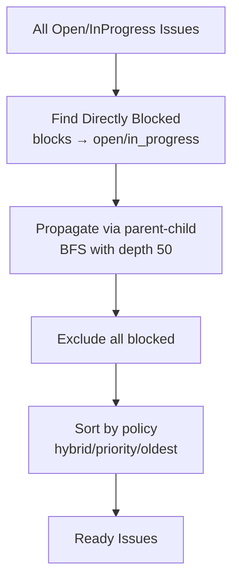
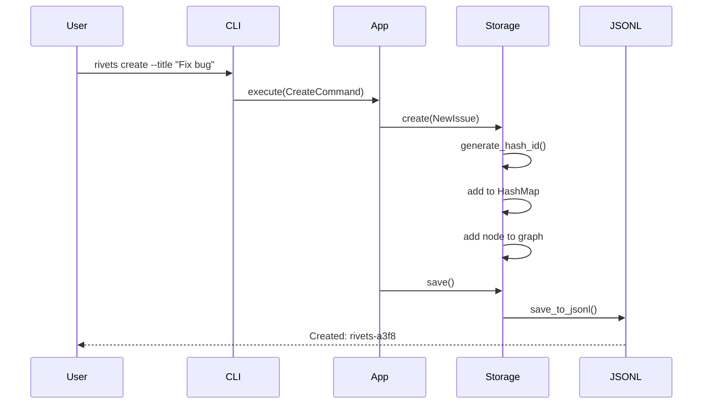
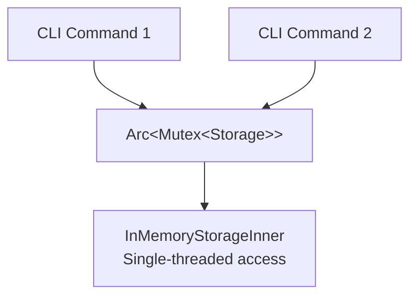

# Rivets Architecture Overview

## System Architecture



## Core Components

### 1. CLI Layer (rivets-ceg, rivets-bsp)
- **Entry Point**: `main.rs` with `#[tokio::main(flavor = "current_thread")]`
- **Argument Parsing**: Clap derive API for type-safe CLI arguments
- **Commands**: create, list, show, update, close, delete, init, ready
- **Validation**: Priority 0-4, enum types, ID format validation

### 2. Application Layer (rivets-cgl)
- **App Struct**: Manages storage lifecycle and command execution
- **Async Runtime**: Tokio current-thread for sequential CLI operations
- **Auto-save**: Persist after every mutating command (create/update/delete/close)
- **Configuration**: Hierarchical config merging (CLI flags → env → YAML → defaults)

### 3. Storage Abstraction (rivets-0gc)
```rust
#[async_trait]
pub trait IssueStorage: Send + Sync {
    // CRUD
    async fn create(&mut self, issue: NewIssue) -> Result<Issue>;
    async fn get(&self, id: &IssueId) -> Result<Option<Issue>>;
    async fn update(&mut self, id: &IssueId, updates: IssueUpdate) -> Result<Issue>;
    async fn delete(&mut self, id: &IssueId) -> Result<()>;

    // Dependencies
    async fn add_dependency(&mut self, from: &IssueId, to: &IssueId, dep_type: DependencyType) -> Result<()>;
    async fn has_cycle(&self, from: &IssueId, to: &IssueId) -> Result<bool>;

    // Queries
    async fn list(&self, filter: &IssueFilter) -> Result<Vec<Issue>>;
    async fn ready_to_work(&self, filter: Option<&IssueFilter>) -> Result<Vec<Issue>>;

    // Persistence
    async fn save(&self) -> Result<()>;
}
```

### 4. Domain Layer (rivets-06w, rivets-x1e)
- **Core Types**: Issue, Dependency, IssueFilter, NewIssue, IssueUpdate
- **Enums**: Status, Priority, IssueType, DependencyType
- **Hash-based IDs**: SHA256 → Base36 encoding with adaptive length (4-6 chars)
- **ID Format**: `{prefix}-{hash}` (e.g., "rivets-a3f8")

### 5. Storage Backends

#### Phase 1: InMemoryStorage (rivets-bz5, rivets-l66)


**Structure**:
- `InMemoryStorageInner`: HashMap for issues, petgraph DiGraph for dependencies
- `Arc<Mutex<>>`: Thread-safe wrapper for concurrent access
- **Operations**: All blocking operations wrapped in async methods

**JSONL Persistence**:
- Async file I/O with tokio::fs
- Atomic writes (temp file + rename)
- Graceful corruption recovery (skip invalid lines, detect orphans/cycles)
- Two-pass loading (issues first, then dependencies with validation)

#### Phase 3: PostgresStorage (Future)
- sqlx for async database access
- Recursive CTEs for complex graph queries
- Connection pooling
- True async I/O (non-blocking)

## Dependency System (rivets-6op)



### Dependency Types
1. **blocks**: Hard blocker (prevents work on dependent issue)
2. **related**: Soft link (informational only)
3. **parent-child**: Hierarchical relationship (epics → tasks)
4. **discovered-from**: Found during implementation

### Cycle Detection
- **Phase 1**: petgraph `has_path_connecting(graph, to, from)`
- **Phase 3**: Recursive CTEs with depth limit (100)

## Ready Work Algorithm (rivets-qeb)



### Sort Policies
- **hybrid** (default): Recent issues (<48h) by priority, older by age
- **priority**: Strict P0→P1→P2→P3→P4
- **oldest**: Creation date ascending

## Data Flow



## Phase Roadmap

### Phase 1 (MVP) - Current Focus
- ✅ In-memory storage with petgraph
- ✅ JSONL persistence
- ✅ Async trait architecture
- ✅ CLI commands (create, list, show, update, close, delete)
- ✅ Dependency system with cycle detection
- ✅ Ready work algorithm
- ✅ Hash-based IDs

### Phase 2 (Configuration)
- Storage backend selection
- Configuration system (YAML + env)
- Backend factory pattern

### Phase 3 (Production)
- PostgreSQL backend
- Recursive CTEs for queries
- Migration tools
- Multi-user support

## Technology Stack

### Core Dependencies
- **async-trait** (0.1): Async trait support
- **tokio** (1.x): Async runtime (current_thread flavor)
- **petgraph** (0.6): Graph data structures and algorithms
- **serde** (1.x): Serialization/deserialization
- **serde_json** (1.x): JSON support
- **clap** (4.x): CLI argument parsing
- **sha2** (0.10): Hash generation for IDs

### Development Dependencies
- **criterion**: Benchmarking (1000 issues <10ms target)
- **tempfile**: Test fixtures
- **tokio-test**: Async testing utilities

## Performance Targets

| Operation | Target | Implementation |
|-----------|--------|----------------|
| Create issue | <1ms | HashMap insert + graph node |
| Cycle detection | <10ms (1000 issues) | petgraph path finding |
| Ready work query | <10ms (1000 issues) | BFS traversal |
| JSONL save | <100ms (1000 issues) | Async streaming write |
| JSONL load | <200ms (1000 issues) | Async streaming read |
| Storage overhead | 1000 issues <10ms | In-memory operations |

## Error Handling Strategy

### Graceful Degradation
- **JSONL corruption**: Skip invalid lines, log warnings, continue loading
- **Orphaned dependencies**: Skip edges to non-existent issues during import
- **Circular dependencies**: Detect and skip cycles during JSONL load

### Safe Operations
- **Delete with dependents**: Fail with clear error listing dependent issues
- **Cycle creation**: Pre-check before adding dependency
- **Concurrent access**: Arc<Mutex<>> prevents data races

## Thread Safety



- **Pattern**: Arc<Mutex<InMemoryStorageInner>>
- **Guarantee**: Only one operation at a time modifies storage
- **Async**: tokio::sync::Mutex for async-compatible locking
- **Rationale**: Simple, correct, sufficient for CLI use case
