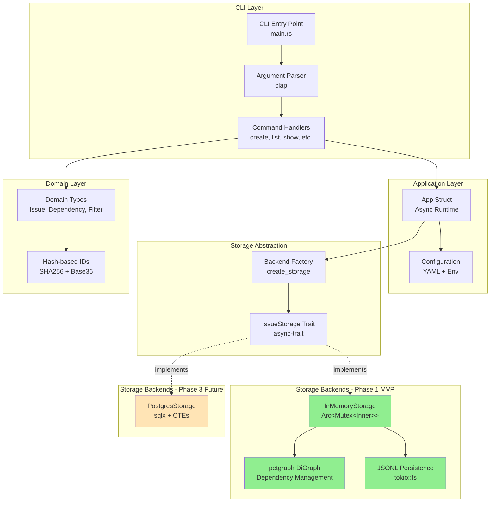
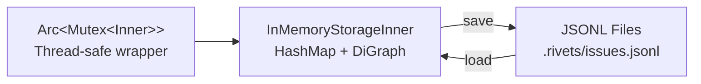
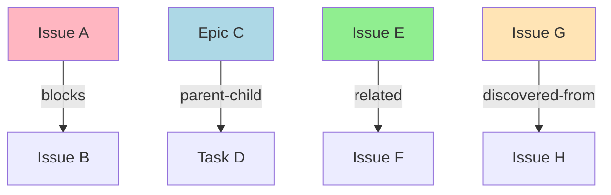
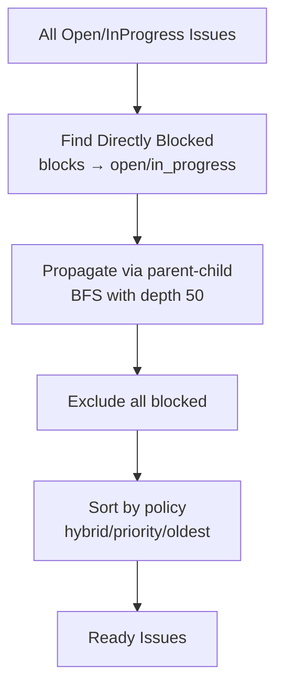
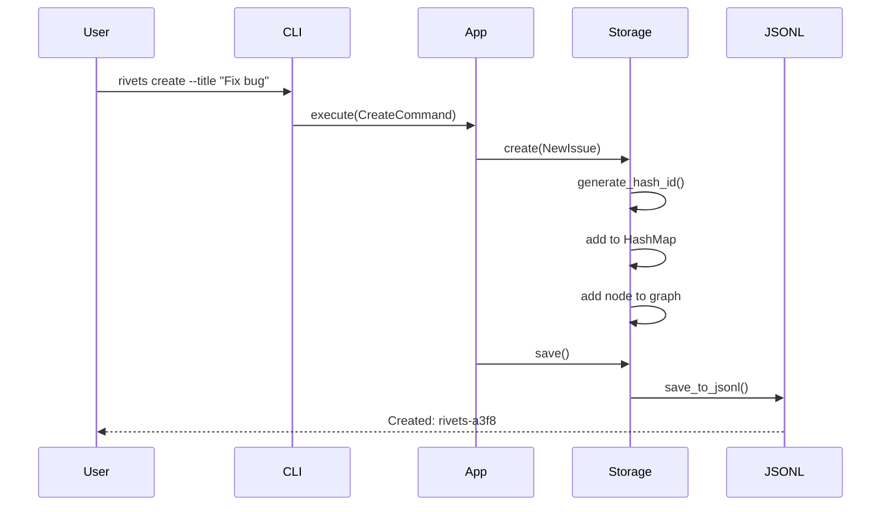
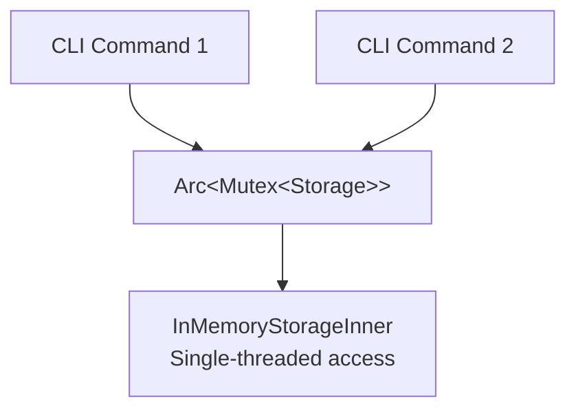
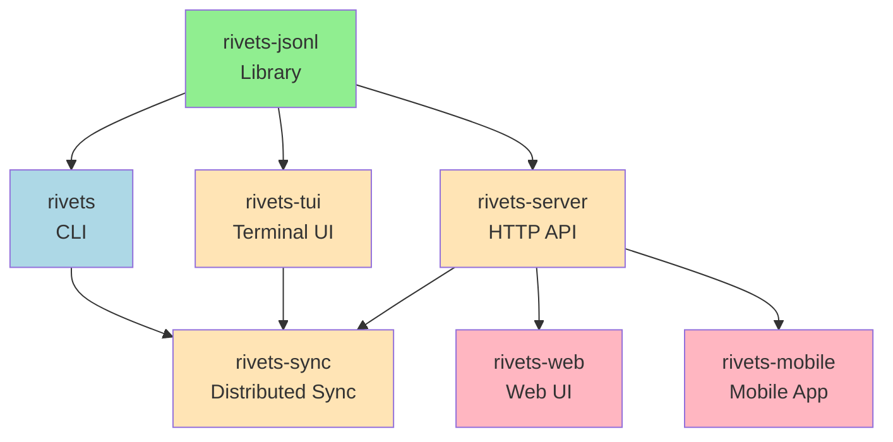

# Rivets Architecture Overview

## Document Organization

This document provides a comprehensive overview of the Rivets architecture. For detailed information on specific aspects, see:

- **[data-flow.md](data-flow.md)**: Detailed sequence diagrams for all command flows
- **[storage-architecture.md](storage-architecture.md)**: Deep dive into storage layer implementation
- **[module-structure.md](module-structure.md)**: Crate organization and module dependencies
- **[rivets-jsonl-research.md](rivets-jsonl-research.md)**: JSONL library research and API design (from rivets-fk9)
- **[terminology.md](terminology.md)**: Consistent terminology reference

## Research Foundation

This architecture is built on research from:
- **rivets-fk9**: JSONL library design and performance analysis (see rivets-jsonl-research.md)
- **rivets-kr3**: Two-crate workspace structure design (implemented in module-structure.md)

## System Architecture



## Core Components

### 1. CLI Layer (rivets-ceg, rivets-bsp)
- **Entry Point**: `main.rs` with `#[tokio::main(flavor = "current_thread")]`
- **Argument Parsing**: Clap derive API for type-safe CLI arguments
- **Commands**: create, list, show, update, close, delete, init, ready
- **Validation**: Priority 0-4, enum types, ID format validation

### 2. Application Layer (rivets-cgl)
- **App Struct**: Manages storage lifecycle and command execution
- **Async Runtime**: Tokio current-thread for sequential CLI operations
- **Auto-save**: Persist after every mutating command (create/update/delete/close)
- **Configuration**: Hierarchical config merging (CLI flags → env → YAML → defaults)

### 3. Storage Abstraction (rivets-0gc)
```rust
#[async_trait]
pub trait IssueStorage: Send + Sync {
    // CRUD
    async fn create(&mut self, issue: NewIssue) -> Result<Issue>;
    async fn get(&self, id: &IssueId) -> Result<Option<Issue>>;
    async fn update(&mut self, id: &IssueId, updates: IssueUpdate) -> Result<Issue>;
    async fn delete(&mut self, id: &IssueId) -> Result<()>;

    // Dependencies
    async fn add_dependency(&mut self, from: &IssueId, to: &IssueId, dep_type: DependencyType) -> Result<()>;
    async fn has_cycle(&self, from: &IssueId, to: &IssueId) -> Result<bool>;

    // Queries
    async fn list(&self, filter: &IssueFilter) -> Result<Vec<Issue>>;
    async fn ready_to_work(&self, filter: Option<&IssueFilter>) -> Result<Vec<Issue>>;

    // Persistence
    async fn save(&self) -> Result<()>;
}
```

### 4. Domain Layer (rivets-06w, rivets-x1e)
- **Core Types**: Issue, Dependency, IssueFilter, NewIssue, IssueUpdate
- **Enums**: Status, Priority, IssueType, DependencyType
- **Hash-based IDs**: SHA256 → Base36 encoding with adaptive length (4-6 chars)
- **ID Format**: `{prefix}-{hash}` (e.g., "rivets-a3f8")

### 5. Storage Backends

#### Phase 1: InMemoryStorage (rivets-bz5, rivets-l66)


**Structure**:
- `InMemoryStorageInner`: HashMap for issues, petgraph DiGraph for dependencies
- `Arc<Mutex<>>`: Thread-safe wrapper for concurrent access
- **Operations**: All blocking operations wrapped in async methods

**JSONL Persistence**:
- Async file I/O with tokio::fs
- Atomic writes (temp file + rename)
- Graceful corruption recovery (skip invalid lines, detect orphans/cycles)
- Two-pass loading (issues first, then dependencies with validation)

#### Phase 3: PostgresStorage (Future)
- sqlx for async database access
- Recursive CTEs for complex graph queries
- Connection pooling
- True async I/O (non-blocking)

## Dependency System (rivets-6op)



### Dependency Types
1. **blocks**: Hard blocker (prevents work on dependent issue)
2. **related**: Soft link (informational only)
3. **parent-child**: Hierarchical relationship (epics → tasks)
4. **discovered-from**: Found during implementation

### Cycle Detection
- **Phase 1**: petgraph `has_path_connecting(graph, to, from)`
- **Phase 3**: Recursive CTEs with depth limit (100)

## Ready Work Algorithm (rivets-qeb)



### Sort Policies
- **hybrid** (default): Recent issues (<48h) by priority, older by age
- **priority**: Strict P0→P1→P2→P3→P4
- **oldest**: Creation date ascending

## Data Flow



## Phase Roadmap

### Phase 1 (MVP) - Current Focus
- ✅ In-memory storage with petgraph
- ✅ JSONL persistence
- ✅ Async trait architecture
- ✅ CLI commands (create, list, show, update, close, delete)
- ✅ Dependency system with cycle detection
- ✅ Ready work algorithm
- ✅ Hash-based IDs

### Phase 2 (Configuration)
- Storage backend selection
- Configuration system (YAML + env)
- Backend factory pattern

### Phase 3 (Production)
- PostgreSQL backend
- Recursive CTEs for queries
- Migration tools
- Multi-user support

## Technology Stack

### Core Dependencies
- **async-trait** (0.1): Async trait support
- **tokio** (1.x): Async runtime (current_thread flavor)
- **petgraph** (0.6): Graph data structures and algorithms
- **serde** (1.x): Serialization/deserialization
- **serde_json** (1.x): JSON support
- **clap** (4.x): CLI argument parsing
- **sha2** (0.10): Hash generation for IDs

### Development Dependencies
- **criterion**: Benchmarking (1000 issues <10ms target)
- **tempfile**: Test fixtures
- **tokio-test**: Async testing utilities

## Performance Targets

| Operation | Target | Implementation |
|-----------|--------|----------------|
| Create issue | <1ms | HashMap insert + graph node |
| Cycle detection | <10ms (1000 issues) | petgraph path finding |
| Ready work query | <10ms (1000 issues) | BFS traversal |
| JSONL save | <100ms (1000 issues) | Async streaming write |
| JSONL load | <200ms (1000 issues) | Async streaming read |
| Storage overhead | 1000 issues <10ms | In-memory operations |

## Error Handling Strategy

### Graceful Degradation
- **JSONL corruption**: Skip invalid lines, log warnings, continue loading
- **Orphaned dependencies**: Skip edges to non-existent issues during import
- **Circular dependencies**: Detect and skip cycles during JSONL load

### Safe Operations
- **Delete with dependents**: Fail with clear error listing dependent issues
- **Cycle creation**: Pre-check before adding dependency
- **Concurrent access**: Arc<Mutex<>> prevents data races

## Thread Safety



- **Pattern**: Arc<Mutex<InMemoryStorageInner>>
- **Guarantee**: Only one operation at a time modifies storage
- **Async**: tokio::sync::Mutex for async-compatible locking
- **Rationale**: Simple, correct, sufficient for CLI use case

## Design Decisions and Rationale

### 1. Two-Crate Workspace Architecture

**Decision**: Split into `rivets-jsonl` (library) and `rivets` (CLI application)

**Rationale**:
- **Reusability**: rivets-jsonl is a general-purpose library usable by other projects
- **Separation of concerns**: Generic JSONL operations vs domain-specific issue tracking
- **Testing**: Library can be tested independently
- **Maintenance**: Clear boundaries reduce coupling
- **Future extensibility**: Enables rivets-tui, rivets-server, rivets-web

**Alternative considered**: Monolithic crate
**Why rejected**: Poor separation of concerns, library logic mixed with CLI code

**Source**: Research from rivets-kr3

### 2. Hash-Based IDs (SHA256 + Base36)

**Decision**: Generate IDs from content hash rather than sequential integers

**Rationale**:
- **Collision resistance**: Cryptographic hash ensures uniqueness
- **Distributed generation**: No central ID authority needed (future distributed sync)
- **Content-addressable**: Same content = same ID (deduplication)
- **Compact representation**: Base36 encoding keeps IDs short (4-6 chars)
- **No database auto-increment**: Works with JSONL and any storage backend

**Alternative considered**: UUID
**Why rejected**: Too verbose (36 chars), not content-addressable

**Alternative considered**: Sequential integers
**Why rejected**: Requires central authority, merge conflicts in distributed scenarios

### 3. In-Memory Storage with JSONL Persistence (Phase 1)

**Decision**: Use HashMap + petgraph in memory, persist to JSONL files

**Rationale**:
- **Simplicity**: No database setup required
- **Performance**: All operations are in-memory fast
- **Portability**: JSONL files work everywhere, no DB dependencies
- **Resilience**: Graceful error recovery (skip malformed lines)
- **Git-friendly**: JSONL can be diffed and merged
- **Low overhead**: <3MB memory for 1000 issues

**Alternative considered**: PostgreSQL from day 1
**Why rejected**: Overkill for MVP, adds complexity and deployment requirements

**Trade-off**: Single-user only (Phase 1), but sufficient for CLI use case

### 4. Async-First Design with Tokio

**Decision**: All I/O operations use async/await with tokio runtime

**Rationale**:
- **Future-proof**: Enables network operations, concurrent queries (Phase 3)
- **Non-blocking I/O**: JSONL saves don't block CLI responsiveness
- **Ecosystem alignment**: Tokio is Rust standard for async
- **Minimal overhead**: `current_thread` flavor for simple CLI has minimal runtime cost

**Alternative considered**: Synchronous I/O
**Why rejected**: Hard to add async later, blocks future extensibility

**Trade-off**: Slight complexity increase, but Rust async is now mature

### 5. Trait-Based Storage Abstraction

**Decision**: Define `IssueStorage` trait with async methods

**Rationale**:
- **Backend agnostic**: CLI code doesn't know if using memory or PostgreSQL
- **Testing**: Easy to mock storage in tests
- **Progressive enhancement**: Add PostgreSQL (Phase 3) without changing CLI
- **Dependency injection**: Factory pattern selects backend via config

**Alternative considered**: Direct coupling to InMemoryStorage
**Why rejected**: Hard-coded to one backend, can't evolve

### 6. Dependency Graph with petgraph

**Decision**: Use petgraph DiGraph for dependency relationships

**Rationale**:
- **Battle-tested**: Mature library with proven algorithms
- **Correct cycle detection**: `has_path_connecting` is O(V+E) DFS
- **Rich API**: Ready for complex queries (transitive closure, shortest path)
- **Memory efficient**: Adjacency list representation
- **Type-safe**: Compile-time checked graph operations

**Alternative considered**: Manual adjacency lists
**Why rejected**: Reinventing the wheel, error-prone cycle detection

**Alternative considered**: SQL WITH RECURSIVE (Phase 3)
**Why**: Will use for PostgreSQL backend, but petgraph sufficient for MVP

### 7. Four Dependency Types

**Decision**: Support `blocks`, `related`, `parent-child`, `discovered-from`

**Rationale**:
- **blocks**: Essential for "ready work" algorithm (hard blocker)
- **related**: Informational links (soft, doesn't block)
- **parent-child**: Hierarchical organization (epics → tasks)
- **discovered-from**: Captures work discovery process

**Alternative considered**: Only "blocks"
**Why rejected**: Insufficient expressiveness for real-world workflows

**Alternative considered**: Arbitrary labels (tags)
**Why rejected**: Too flexible, can't enforce "ready work" semantics

### 8. Resilient JSONL Loading

**Decision**: Continue loading despite malformed JSON, collect warnings

**Rationale**:
- **Graceful degradation**: Don't fail entire load for one bad line
- **User experience**: Better to load 999/1000 issues than fail completely
- **Recovery path**: Warnings guide user to fix corrupted data
- **Git merge friendly**: Partial corruption after merge doesn't brick system

**Alternative considered**: Fail-fast on any error
**Why rejected**: Poor UX, fragile to manual edits or git conflicts

### 9. Auto-Save After Mutations

**Decision**: Automatically persist to JSONL after create/update/delete

**Rationale**:
- **Data safety**: No manual save command needed
- **Simplicity**: User can't forget to save
- **Crash resistance**: Latest state always on disk
- **Atomic writes**: Temp file + rename prevents corruption

**Alternative considered**: Manual save command
**Why rejected**: Easy to forget, data loss risk

**Trade-off**: More disk I/O, but acceptable for CLI workload (<100ms for 1000 issues)

### 10. Current-Thread Tokio Flavor

**Decision**: Use `#[tokio::main(flavor = "current_thread")]`

**Rationale**:
- **CLI semantics**: Commands run sequentially, one at a time
- **Lower overhead**: No thread pool management
- **Simpler debugging**: Single-threaded execution easier to reason about
- **Sufficient**: No concurrent I/O in CLI usage

**Alternative considered**: Multi-threaded runtime
**Why rejected**: Unnecessary overhead for sequential CLI operations

### 11. No RPC Protocol (Current Architecture)

**Decision**: Direct in-process function calls, no network/RPC layer

**Rationale**:
- **Phase 1 scope**: Single-user CLI doesn't need RPC
- **Simplicity**: Avoid network serialization, error handling, versioning
- **Performance**: In-process calls are orders of magnitude faster
- **YAGNI**: Don't build what isn't needed yet

**Future consideration**: Phase 3+ may add RPC for:
- Multi-user server mode
- Remote storage backends
- Web UI / TUI communication

**Current data flow**: CLI → Commands → App → Storage Trait → InMemoryStorage → JSONL
**NOT**: CLI → RPC → Storage (this doesn't exist yet)

## Future Extensibility

### Phase 2: Configuration & Backend Selection

**Planned features**:
- YAML configuration system (`.rivets/config.yaml`)
- Environment variable overrides (`RIVETS_PREFIX`, `RIVETS_BACKEND`)
- Backend factory pattern (select memory vs postgres via config)
- User-level config (`~/.config/rivets/config.yaml`)
- Hierarchical config merging (defaults → project → user → env → CLI)

**Extensibility points**:
- New storage backends: Implement `IssueStorage` trait
- Custom output formats: JSON, YAML, table, CSV
- Plugin system: Load custom commands at runtime

### Phase 3: Production Multi-User

**PostgreSQL backend**:
- Recursive CTEs for complex graph queries
- Connection pooling (sqlx)
- True async I/O (non-blocking database access)
- Multi-user concurrency with transactions
- Optimistic locking or row-level locks

**Migration system**:
- Import from JSONL to PostgreSQL
- Export from PostgreSQL to JSONL (backup, portability)
- Schema versioning and automatic migrations

**Performance targets**:
- 1M issues in database
- <100ms for ready work query (indexed)
- Concurrent user support (10-100 users)

### Phase 4+: Advanced Features

**Potential enhancements**:
- **rivets-tui**: Terminal UI with interactive workflows
- **rivets-server**: HTTP API for web/mobile clients
- **rivets-web**: Browser-based UI (WASM or server-side)
- **rivets-sync**: Distributed sync protocol (CRDT-based)
- **Git integration**: Auto-commit on issue changes
- **Webhook system**: Notify external services on issue events
- **Query language**: SQL-like DSL for complex filters
- **Scripting**: Lua/Rhai for custom automations

**Extensibility by design**:
- Workspace structure supports multiple crates
- Storage trait enables backend experimentation
- Async foundation enables network operations
- JSONL format is human-readable and git-friendly
- Hash IDs support distributed generation

### Crate Ecosystem Growth



**Design principles for extensibility**:
1. **Core library first**: rivets-jsonl is reusable by all other crates
2. **Clear separation**: Each crate has single responsibility
3. **Trait-based abstractions**: Easy to add implementations
4. **Config-driven behavior**: Change behavior without code changes
5. **Backward compatibility**: Maintain JSONL format stability
