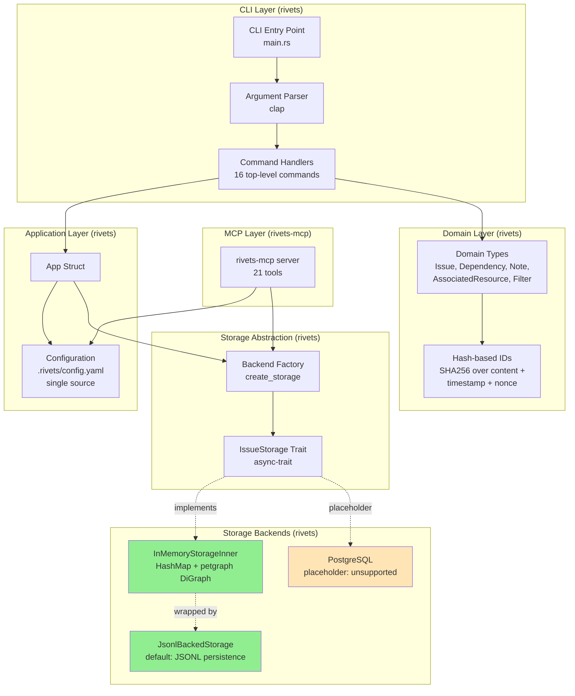
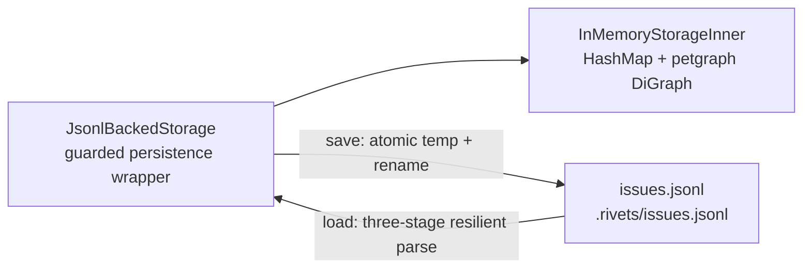
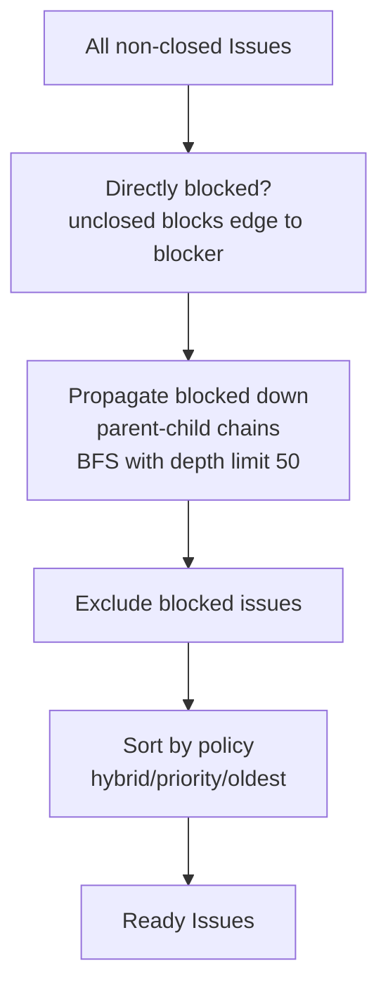
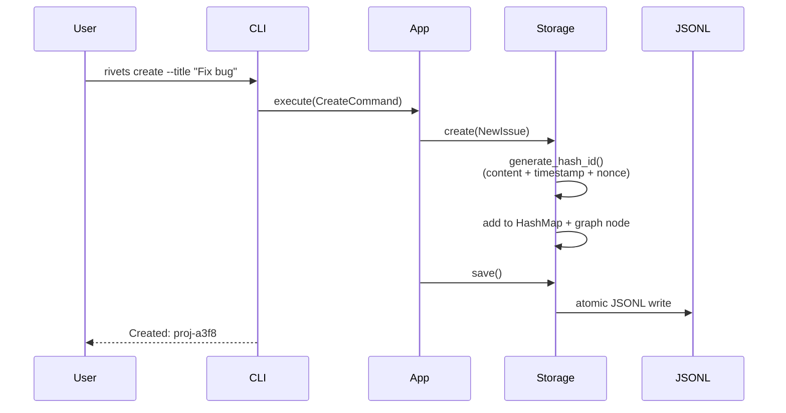
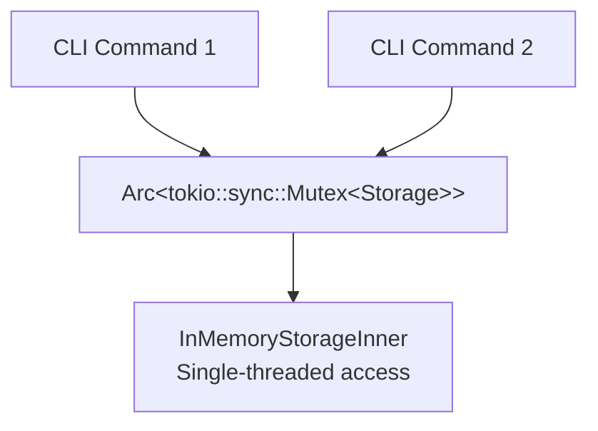
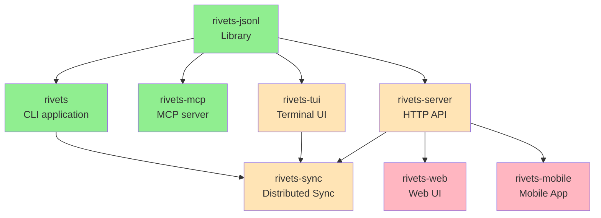

# Rivets Architecture Overview

## Document Organization

This document provides a comprehensive overview of the Rivets architecture. For detailed information on specific aspects, see:

- **[data-flow.md](data-flow.md)**: Detailed sequence diagrams for all command flows
- **[storage-architecture.md](storage-architecture.md)**: Deep dive into storage layer implementation
- **[module-structure.md](module-structure.md)**: Crate organization and module dependencies
- **[rivets-jsonl-research.md](rivets-jsonl-research.md)**: JSONL library research and API design
- **[terminology.md](terminology.md)**: Consistent terminology reference

## Research Foundation

The current implementation is a three-crate Cargo workspace:

- **`rivets`**: CLI application, domain model, and storage layer (the `crates/rivets` crate)
- **`rivets-jsonl`**: Generic JSON Lines (JSONL) library providing resilient, line-numbered parsing and atomic writes (the `crates/rivets-jsonl` crate)
- **`rivets-mcp`**: MCP (Model Context Protocol) server exposing the tracker as 21 tools (the `crates/rivets-mcp` crate)

Earlier design research (rivets-fk9 for JSONL library design, rivets-kr3 for workspace structure) informed the original two-crate layout; the workspace has since grown to three crates with the addition of `rivets-mcp`.

## System Architecture


```mermaid
graph TB
    subgraph "CLI Layer (rivets)"
        CLI[CLI Entry Point<br/>main.rs]
        Args[Argument Parser<br/>clap]
        Commands[Command Handlers<br/>16 top-level commands]
    end

    subgraph "MCP Layer (rivets-mcp)"
        Mcp[rivets-mcp server<br/>21 tools]
    end

    subgraph "Application Layer (rivets)"
        App[App Struct]
        Config[Configuration<br/>.rivets/config.yaml<br/>single source]
    end

    subgraph "Storage Abstraction (rivets)"
        Trait[IssueStorage Trait<br/>async-trait]
        Factory[Backend Factory<br/>create_storage]
    end

    subgraph "Domain Layer (rivets)"
        Types[Domain Types<br/>Issue, Dependency, Note,<br/>AssociatedResource, Filter]
        IDs[Hash-based IDs<br/>SHA256 over content +<br/>timestamp + nonce]
    end

    subgraph "Storage Backends (rivets)"
        Memory[InMemoryStorageInner<br/>HashMap + petgraph DiGraph]
        Jsonl[JsonlBackedStorage<br/>default: JSONL persistence]
        Postgres[PostgreSQL<br/>placeholder: unsupported]
    end

    CLI --> Args --> Commands
    Commands --> App
    App --> Config
    App --> Factory
    Mcp --> Config
    Mcp --> Factory
    Factory --> Trait
    Trait -.implements.-> Memory
    Memory -.wrapped by.-> Jsonl
    Trait -.placeholder.-> Postgres
    Commands --> Types
    Types --> IDs

    style Jsonl fill:#90EE90
    style Memory fill:#90EE90
    style Postgres fill:#FFE4B5
```

## Core Components

### 1. CLI Layer (`rivets`)

- **Entry Point**: `main.rs` with `#[tokio::main(flavor = "current_thread")]`
- **Argument Parsing**: Clap derive API for type-safe CLI arguments
- **Commands** (16 top-level): init, info, create, list, show, update, close, reopen, delete, ready, dep, label, resource, stale, blocked, stats
- **Validation**: Priority 0-4, enum types (status, kind, dependency type), ID format validation, prefix validation (2-20 alphanumeric characters)

### 2. Application Layer (`rivets`)

- **App Struct**: Manages storage lifecycle and command execution; `App::from_directory` searches upward (max depth 256) for the `.rivets/` directory, loads configuration, and creates storage from it
- **Configuration**: `.rivets/config.yaml` is the **single** configuration source: `issue-prefix` plus a `storage` section (`backend` and `data_file`). There is no config layering, no environment-variable merge, and no user-level config. Defaults (prefix `proj`, backend `jsonl`, data file `.rivets/issues.jsonl`) are baked into `init`
- **Auto-save**: Mutating commands persist after execution. Batch `update`/`close`/`reopen` and label mutations reload storage after a failed save; `create`, `delete`, dependency mutations, and resource mutations return the save error without reloading that process's in-memory state
- **Async Runtime**: Tokio current-thread for sequential CLI operations

### 3. Storage Abstraction (`rivets`)

```rust
#[async_trait]
pub trait IssueStorage: Send + Sync {
    // CRUD
    async fn create(&mut self, issue: NewIssue) -> Result<Issue>;
    async fn get(&self, id: &IssueId) -> Result<Option<Issue>>;
    async fn update(&mut self, id: &IssueId, updates: IssueUpdate) -> Result<Issue>;
    async fn delete(&mut self, id: &IssueId) -> Result<()>;

    // Blocking Dependencies
    async fn add_blocking_dependency(&mut self, dependency: BlockingDependency) -> Result<()>;
    async fn remove_blocking_dependency(&mut self, dependency: &BlockingDependency) -> Result<()>;
    async fn blocking_prerequisites(&self, dependent: &IssueId) -> Result<Vec<BlockingDependency>>;
    async fn blocking_dependents(&self, prerequisite: &IssueId) -> Result<Vec<BlockingDependency>>;
    async fn blocking_dependency_tree(&self, dependent: &IssueId, max_depth: Option<usize>) -> Result<Vec<(BlockingDependency, usize)>>;

    // Queries
    async fn list(&self, filter: &IssueFilter) -> Result<Vec<Issue>>;
    async fn ready_to_work(&self, filter: Option<&IssueFilter>, sort_policy: Option<SortPolicy>) -> Result<Vec<Issue>>;
    async fn blocked_issues(&self) -> Result<Vec<(Issue, Vec<Issue>)>>;

    // Atomic label operations
    async fn add_label(&mut self, id: &IssueId, label: &str) -> Result<Issue>;
    async fn remove_label(&mut self, id: &IssueId, label: &str) -> Result<Issue>;

    // Associated Resource operations
    async fn add_resource(&mut self, id: &IssueId, resource: NewResource) -> Result<Issue>;
    async fn update_resource(&mut self, id: &IssueId, resource_id: &ResourceId, update: ResourceUpdate) -> Result<Issue>;
    async fn remove_resource(&mut self, id: &IssueId, resource_id: &ResourceId) -> Result<Issue>;

    // Batch + persistence
    async fn import_issues(&mut self, issues: Vec<Issue>) -> Result<()>;
    async fn export_all(&self) -> Result<Vec<Issue>>;
    async fn save(&self) -> Result<()>;
    async fn reload(&mut self) -> Result<()>;
}
```

### 4. Domain Layer (`rivets`)

- **Core Types**: Issue, NewIssue, IssueUpdate, IssueFilter, BlockingDependency, Note, AssociatedResource, ResourceId
- **Issue fields**: id, title, description, status, priority (0-4), issue_kind, assignee, labels, design notes, acceptance criteria, ordered append-only Notes, ordered Associated Resources, legacy relationship records for persistence, and creation/update/close timestamps
- **Enums**:
  - `IssueStatus`: `open`, `in_progress`, `blocked` (legacy), `closed`. The stored `blocked` status is a legacy field: the `ready`/`blocked` queries are **graph-derived** and do not read it. Status transitions are validated by the domain.
  - `IssueKind`: `bug`, `feature`, `task`, `epic`, `chore` — mutable via `update`
  - `DependencyType`: compatibility-only persisted kinds until canonical relationship migration
  - `ResourceRole`: `implementation`, `documentation`, `evidence`, `successor`, `reference` — resources are URL or path targets with a stable, never-reused identifier
- **Hash-based IDs**: `{prefix}-{hash}` (e.g., `proj-a3f8`). The hash is SHA256 over `title|description|creator|timestamp|nonce`, base36-encoded with adaptive length (4 chars up to 500 issues, 5 up to 1,500, 6 beyond). IDs are **not** content-addressed: the timestamp and nonce inputs mean identical content produces different IDs. Collisions retry with increasing nonces, then by growing the hash length.
  The public `IdGenerator` can produce dot-suffixed child IDs when given a parent, but `IssueStorage::create` currently passes no parent and creates only top-level hash IDs.

### 5. Storage Backends

#### JSONL (default) — `JsonlBackedStorage`


```mermaid
graph LR
    Inner[InMemoryStorageInner<br/>HashMap + petgraph DiGraph]
    Wrapper[JsonlBackedStorage<br/>guarded persistence wrapper]
    JSONL[issues.jsonl<br/>.rivets/issues.jsonl]

    Wrapper --> Inner
    Wrapper -->|save: atomic temp + rename| JSONL
    JSONL -->|load: three-stage resilient parse| Wrapper
```

**Structure**:
- `InMemoryStorageInner`: HashMap for issues, petgraph DiGraph for dependencies, ID generator state
- `Arc<tokio::sync::Mutex<>>`: async-compatible exclusive access
- **Load** (three stages): (1) resiliently parse compatibility records line-by-line with line numbers, converting them into domain Issues at the compatibility boundary; (2) import all Issues and create graph nodes, registering IDs with the generator; (3) rebuild dependency relationships with orphan and cycle detection
- **Save**: atomic writes (temp file + rename); rejected when loading omitted any Issue record, preserving the source file byte-for-byte
- **Reload**: re-reads the file and rebuilds in-memory state, used after a failed save

#### InMemory (ephemeral)

`new_in_memory_storage()` provides the same HashMap + petgraph backend without file persistence. `save()` is a no-op. Used for tests and short-lived sessions; the CLI itself always operates through the JSONL backend.

#### PostgreSQL (placeholder)

`StorageBackend::PostgreSQL` exists and `config.yaml` accepts `backend: postgresql`, but `create_storage` returns `ConfigError::UnsupportedBackend("PostgreSQL")`. There is no database implementation; this is a placeholder, not a working backend.

## Blocking Dependency System

`BlockingDependency` is a role-safe value with private `dependent_id` and
`prerequisite_id` fields. It rejects self-reference at construction. Storage
rejects duplicate Blocking edges and cycles composed only of Blocking
Dependencies; other legacy relationship kinds may coexist on the same pair and
do not participate in Blocking tree or cycle queries.

Edges point from **dependent → prerequisite**. Closing a prerequisite leaves
the edge recorded but removes its active blocking effect.

### CLI and MCP

The CLI provides `blocking-dependency add/remove/list/tree`; add/remove require
explicit `--dependent` and `--prerequisite` roles. Creation accepts repeatable
`--prerequisite`. MCP exposes equivalent
`blocking_dependency_add/remove/list/tree` tools with role-named structured
results.

### Storage semantics

- `add_blocking_dependency` and `remove_blocking_dependency` mutate only the
  `blocks` edge for the exact endpoint pair.
- `blocking_prerequisites` and `blocking_dependents` return deterministic,
  role-named relationships.
- `blocking_dependency_tree` performs deterministic breadth-first traversal
  over Blocking edges only and honors the caller's depth.
- JSONL still stores legacy `dependencies` records while
  `rivets-vio8` owns the all-kind canonical `relationships` migration.

## Ready Work Algorithm


```mermaid
graph TD
    Start[All non-closed Issues] --> Direct[Directly blocked?<br/>unclosed blocks edge to blocker]
    Direct --> Transitive[Propagate blocked down<br/>parent-child chains<br/>BFS with depth limit 50]
    Transitive --> Filter[Exclude blocked issues]
    Filter --> Sort[Sort by policy<br/>hybrid/priority/oldest]
    Sort --> Result[Ready Issues]
```

`ready_to_work` semantics:

1. **Directly blocked**: an issue with a `blocks` edge to an unclosed issue
2. **Transitively blocked**: children of a blocked parent (via `parent-child`) are blocked, propagated breadth-first with a depth limit of 50
3. **Ready** = not closed and not blocked
4. Optional filter by status, priority, kind, assignee, or label; optional limit
5. Sort policies: **hybrid** (default; issues created within 48h sorted by priority, older issues by age), **priority** (strict P0→P1→P2→P3→P4), **oldest** (creation date ascending)

## Data Flow


```mermaid
sequenceDiagram
    participant User
    participant CLI
    participant App
    participant Storage
    participant JSONL

    User->>CLI: rivets create --title "Fix bug"
    CLI->>App: execute(CreateCommand)
    App->>Storage: create(NewIssue)
    Storage->>Storage: generate_hash_id()<br/>(content + timestamp + nonce)
    Storage->>Storage: add to HashMap + graph node
    App->>Storage: save()
    Storage->>JSONL: atomic JSONL write
    CLI-->>User: Created: proj-a3f8
```

## Implementation Status

### Current State

- ✅ JSONL persistence as the default backend with atomic writes
- ✅ Three-stage resilient JSONL load (parse compatibility records → import Issues → rebuild relationships)
- ✅ 16-command CLI surface
- ✅ Dependency system with cycle detection, removal, and dependency/dependent/tree queries
- ✅ Graph-derived `ready` and `blocked` queries
- ✅ Hash-based IDs (prefix + adaptive-length hash over content, timestamp, and nonce)
- ✅ Single-source YAML configuration (`.rivets/config.yaml`)
- ✅ Labels (add/remove, atomic), immutable Notes, Associated Resources (add/update/remove with typed roles), mutable Issue Kind
- ✅ `stats`, `stale`, `info` commands
- ✅ MCP server (`rivets-mcp`) with 21 tools and per-call `workspace_root` overrides / `set_context` default workspace
- ✅ Auto-save after mutations with reload-on-save-failure recovery

### Not Implemented

- **PostgreSQL backend**: the config value and enum variant exist, but the factory returns `UnsupportedBackend`; there is no database code, connection pooling, or migration tooling
- **Configuration layering / environment merging**: explicitly absent by design; `.rivets/config.yaml` is the single source
- **RPC / network layer for the CLI**: none; commands call storage in-process. The MCP server is an external interface to the same storage, not an internal RPC layer
- **TUI / web / server / distributed sync**: not built

## Technology Stack

### Core Dependencies

- **async-trait** (0.1): Async trait support
- **tokio** (1.x): Async runtime (current_thread flavor; `rt`, `macros`, `io-util`, `fs`, `sync`)
- **petgraph** (0.6): Dependency graph data structures and algorithms
- **serde** (1.x) / **serde_json** (1.x): Serialization
- **serde_yaml** (0.9): Configuration parsing
- **clap** (4.x): CLI argument parsing
- **sha2** (0.10): Hash generation for IDs
- **chrono** (0.4): Timestamps
- **thiserror** (2.0) / **anyhow** (1.0): Error handling
- **futures** (0.3): Async streams
- **tracing** (0.1) / **tracing-subscriber** (0.3): Logging
- **colored**, **terminal_size**, **textwrap**: Terminal output
- **schemars** (1.1): JSON Schema for MCP tool inputs
- **url** (2.5): Resource target validation

### Development Dependencies

- **tokio-test** (0.4): Async runtime testing utilities (`rivets`, `rivets-mcp`)
- **tempfile**: Test fixtures
- **rstest**: Test fixtures and parametrized tests

### Workspace

- Rust 1.94.0, edition 2024 (workspace-wide)
- `unsafe_code = "forbid"` workspace lint
- No benchmark suite: there is no criterion dependency and no `benches/`; this document intentionally asserts no performance numbers

## Error Handling Strategy

### Graceful Degradation

- **JSONL corruption**: load skips malformed or invalid records with line-numbered warnings; reads serve the unaffected Issues; mutations and saves are rejected with `UnsafePartialLoad` so the source file is preserved byte-for-byte until repaired
- **Orphaned dependencies**: edges to non-existent issues are skipped during import with a warning
- **Circular dependencies**: edges that would create a cycle are skipped during import with a warning

### Safe Operations

- **Delete with dependents**: fails with a clear error listing the dependent issues
- **Cycle creation**: pre-checked before adding a dependency
- **Concurrent access**: `Arc<Mutex<>>` prevents data races
- **Failed saves**: storage `reload()`s from disk so in-memory state never drifts from the on-disk truth

## Thread Safety


```mermaid
graph TD
    CLI1[CLI Command 1] --> Lock[Arc&lt;tokio::sync::Mutex&lt;Storage&gt;&gt;]
    CLI2[CLI Command 2] --> Lock
    Lock --> Inner[InMemoryStorageInner<br/>Single-threaded access]
```

- **Pattern**: `Arc<tokio::sync::Mutex<InMemoryStorageInner>>`
- **Guarantee**: Only one operation at a time modifies storage
- **Async**: `tokio::sync::Mutex` for async-compatible locking
- **MCP server**: workspace context guarded by `tokio::sync::RwLock`
- **Rationale**: Simple, correct, sufficient for the CLI and MCP use cases

## Design Decisions and Rationale

### 1. Three-Crate Workspace Architecture

**Decision**: Split into `rivets` (CLI + domain + storage), `rivets-jsonl` (generic JSONL library), and `rivets-mcp` (MCP server)

**Rationale**:
- **Reusability**: rivets-jsonl is a general-purpose library usable by other projects
- **Separation of concerns**: Generic JSONL operations vs domain-specific issue tracking
- **Testing**: Library can be tested independently
- **Maintenance**: Clear boundaries reduce coupling
- **Future extensibility**: Enables rivets-tui, rivets-server, rivets-web

**Alternative considered**: Monolithic crate
**Why rejected**: Poor separation of concerns, library logic mixed with CLI code

### 2. Hash-Based IDs (SHA256 + adaptive base36, with timestamp/nonce)

**Decision**: Generate IDs from a SHA256 hash of issue content plus a timestamp and nonce, base36-encoded, rather than sequential integers

**Rationale**:
- **Collision resistance**: Hash plus nonce retry (up to 100 nonces, then longer hashes) prevents collisions without a central authority
- **Distributed generation**: No central ID authority needed (future distributed sync)
- **Compact representation**: Base36 encoding keeps IDs short (4-6 chars)
- **No database auto-increment**: Works with JSONL and any storage backend

**Not content-addressed**: The timestamp and nonce are hashed inputs, so identical content does not reproduce an identical ID. This is deliberate: it avoids collisions when two issues legitimately share content.

**Alternative considered**: UUID
**Why rejected**: Too verbose (36 chars)

**Alternative considered**: Sequential integers
**Why rejected**: Requires central authority, merge conflicts in distributed scenarios

### 3. JSONL Persistence as the Default Backend

**Decision**: JSONL files are the default persistence; the in-memory HashMap + petgraph structure is the runtime representation behind a guarded persistence wrapper

**Rationale**:
- **Simplicity**: No database setup required
- **Portability**: JSONL files work everywhere, no DB dependencies
- **Resilience**: Load unaffected Issues for reads; block writes after skipped records
- **Git-friendly**: JSONL can be diffed and merged
- **Atomicity**: Temp-file + rename writes prevent corruption

**Alternative considered**: PostgreSQL from day 1
**Why rejected**: Not implemented; the placeholder exists only to keep the config surface honest. PostgreSQL is future work

### 4. Async-First Design with Tokio

**Decision**: All I/O operations use async/await with a current-thread tokio runtime

**Rationale**:
- **Future-proof**: Enables network operations, concurrent queries
- **Ecosystem alignment**: Tokio is the Rust standard for async
- **Minimal overhead**: `current_thread` flavor for simple CLI has minimal runtime cost

**Alternative considered**: Synchronous I/O
**Why rejected**: Hard to add async later, blocks future extensibility

### 5. Trait-Based Storage Abstraction

**Decision**: Define an object-safe `IssueStorage` trait with async methods, instantiated through `create_storage`

**Rationale**:
- **Backend agnostic**: CLI code doesn't know which backend it uses
- **Testing**: Easy to mock storage in tests (`MockStorage` behind the `test-util` feature)
- **Progressive enhancement**: A real PostgreSQL backend could be added without changing CLI code

### 6. Dependency Graph with petgraph

**Decision**: Use petgraph DiGraph for dependency relationships

**Rationale**:
- **Battle-tested**: Mature library with proven algorithms
- **Correct cycle detection**: `has_path_connecting`
- **Rich API**: Transitive traversal, dependency trees
- **Type-safe**: Compile-time checked graph operations

### 7. Four Dependency Types

**Decision**: Support `blocks`, `related`, `parent-child`, `discovered-from`

**Rationale**:
- **blocks**: Essential for the graph-derived "ready work" algorithm
- **related**: Informational links (soft, doesn't block)
- **parent-child**: Hierarchical organization (epics → tasks); children of blocked parents are blocked transitively
- **discovered-from**: Captures work discovery process

**Alternative considered**: Only "blocks"
**Why rejected**: Insufficient expressiveness for real-world workflows

### 8. Resilient Three-Stage JSONL Loading

**Decision**: Parse compatibility records resiliently (stage 1), import Issues (stage 2), rebuild relationships (stage 3). Continue loading unaffected Issues for reads, collect warnings, and reject writes when any Issue record was omitted

**Rationale**:
- **Graceful degradation**: One bad line does not prevent inspection of unaffected Issues
- **Data preservation**: An incomplete in-memory view can never overwrite the complete source file
- **Recovery path**: Typed errors report skipped-record counts and line-specific causes
- **Git merge friendly**: Partial corruption after merge remains inspectable without becoming a destructive rewrite

**Alternative considered**: Fail-fast on any error
**Why rejected**: Poor UX, fragile to manual edits or git conflicts

### 9. Auto-Save After Mutations

**Decision**: Automatically persist to JSONL after every mutating CLI command. Batch `update`/`close`/`reopen` and label mutations reload from disk after a failed save; other CLI mutation paths return the save error without reloading.

**Rationale**:
- **Data safety**: No manual save command needed
- **Simplicity**: User can't forget to save
- **Crash resistance**: Latest state always on disk
- **Atomic writes**: Temp file + rename prevents corruption
- **Partial-load guard**: Auto-save is disabled when resilient loading omitted an Issue record
- **Consistency**: The reload-enabled batch and label paths restore on-disk state after a save failure. Other CLI paths terminate with the save error; a library caller that keeps the storage alive must call `reload()` before reuse.

**Alternative considered**: Manual save command
**Why rejected**: Easy to forget, data loss risk

### 10. Current-Thread Tokio Flavor

**Decision**: Use `#[tokio::main(flavor = "current_thread")]`

**Rationale**:
- **CLI semantics**: Commands run sequentially, one at a time
- **Lower overhead**: No thread pool management
- **Simpler debugging**: Single-threaded execution easier to reason about
- **Sufficient**: No concurrent I/O in CLI usage

**Alternative considered**: Multi-threaded runtime
**Why rejected**: Unnecessary overhead for sequential CLI operations

### 11. Single Configuration Source

**Decision**: `.rivets/config.yaml` is the only configuration input; there is no hierarchical merging (defaults → project → user → env → CLI) and no configuration environment variables

**Rationale**:
- **Predictability**: One file fully describes a repository's configuration
- **Repository-scoped**: Configuration travels with the project, like the issues themselves
- **Simplicity**: No precedence rules to reason about

### 12. No RPC Protocol (Current Architecture)

**Decision**: Direct in-process function calls between CLI and storage; no network/RPC layer

**Rationale**:
- **Scope**: Single-user CLI doesn't need RPC
- **Simplicity**: Avoid network serialization, error handling, versioning
- **YAGNI**: Don't build what isn't needed yet

**Current data flow**: CLI → Commands → App → Storage Trait → JSONL-backed storage
**NOT**: CLI → RPC → Storage (this doesn't exist)

Note: the `rivets-mcp` server exposes the same domain to MCP clients out-of-process; it is an external interface, not an internal storage protocol.

## Future Extensibility

All items in this section are **future work**, explicitly not implemented today.

### PostgreSQL Backend

- Real implementation replacing the current `UnsupportedBackend` placeholder
- Recursive CTEs for complex graph queries
- Connection pooling (sqlx)
- True async I/O (non-blocking database access)
- Multi-user concurrency with transactions
- Import/export between JSONL and PostgreSQL

### Advanced Features

Potential enhancements:
- **rivets-tui**: Terminal UI with interactive workflows
- **rivets-server**: HTTP API for web/mobile clients
- **rivets-web**: Browser-based UI
- **rivets-sync**: Distributed sync protocol (CRDT-based)
- **Git integration**: Auto-commit on issue changes
- **Webhook system**: Notify external services on issue events
- **Query language**: SQL-like DSL for complex filters
- **Scripting**: Lua/Rhai for custom automations

### Crate Ecosystem Growth


```mermaid
graph TB
    JSONL[rivets-jsonl<br/>Library] --> CLI[rivets<br/>CLI application]
    JSONL --> MCP[rivets-mcp<br/>MCP server]
    JSONL --> TUI[rivets-tui<br/>Terminal UI]
    JSONL --> Server[rivets-server<br/>HTTP API]

    CLI --> Sync[rivets-sync<br/>Distributed Sync]
    TUI --> Sync
    Server --> Sync

    Server --> Web[rivets-web<br/>Web UI]
    Server --> Mobile[rivets-mobile<br/>Mobile App]

    style JSONL fill:#90EE90
    style CLI fill:#90EE90
    style MCP fill:#90EE90
    style TUI fill:#FFE4B5
    style Server fill:#FFE4B5
    style Sync fill:#FFE4B5
    style Web fill:#FFB6C1
    style Mobile fill:#FFB6C1
```

Green nodes exist today; dashed-outline nodes are future work.

**Design principles for extensibility**:
1. **Core library first**: rivets-jsonl is reusable by all other crates
2. **Clear separation**: Each crate has single responsibility
3. **Trait-based abstractions**: Easy to add implementations
4. **Backward compatibility**: Maintain JSONL format stability
