# Rivets Data Flow

## Complete Command Lifecycle

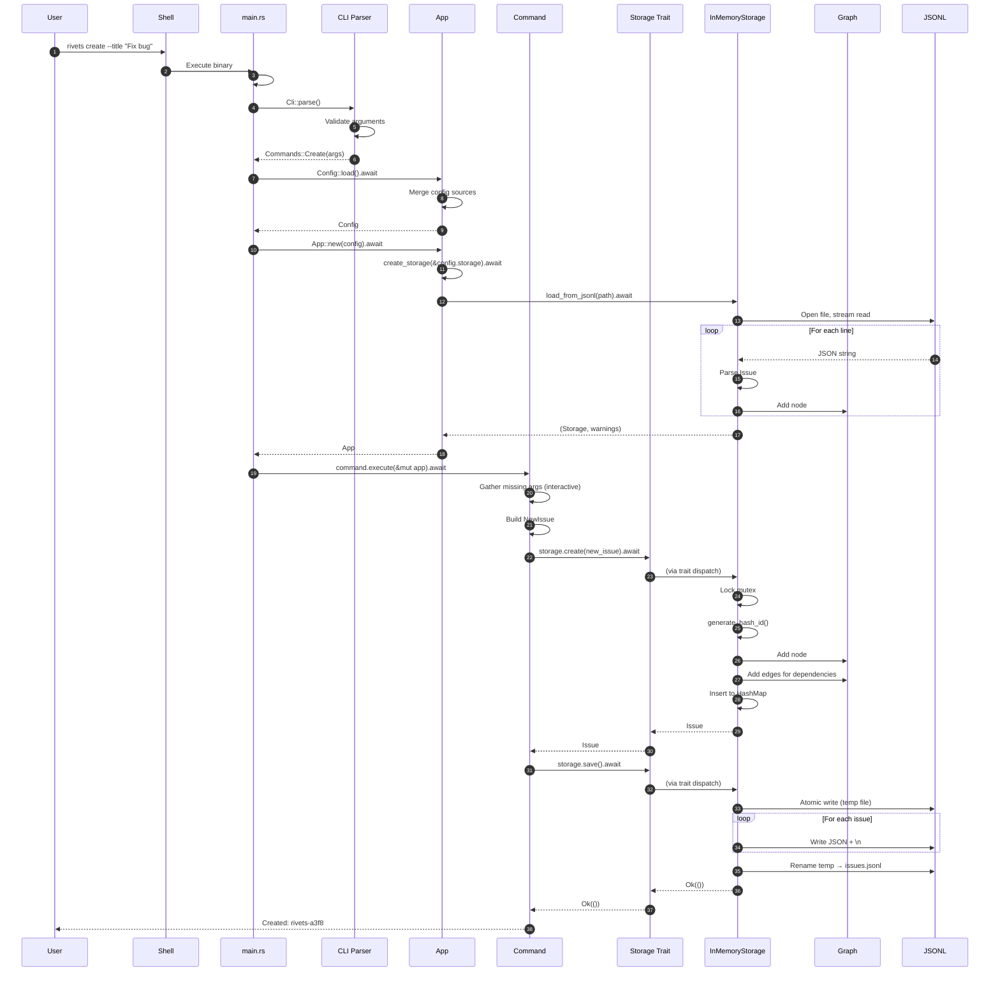

## Initialization Flow (rivets init)

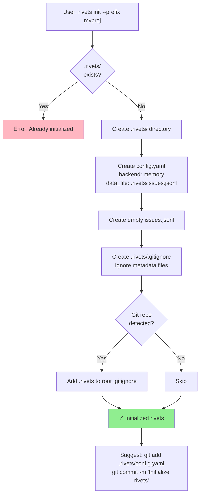

## Create Issue Flow

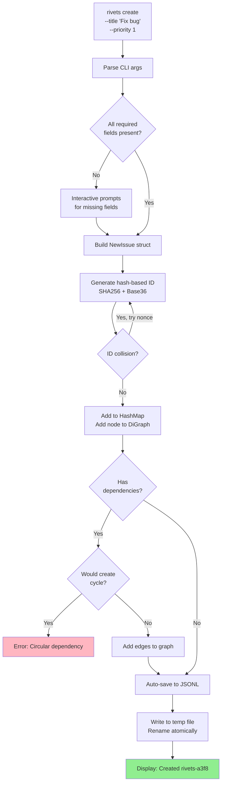

## List/Query Flow

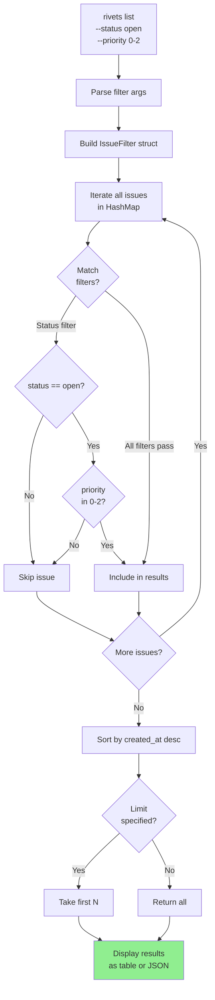

## Ready Work Algorithm Flow

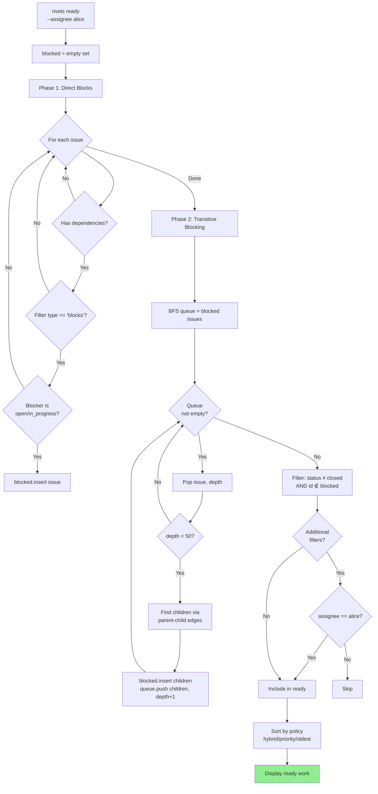

## Dependency Add Flow with Cycle Detection

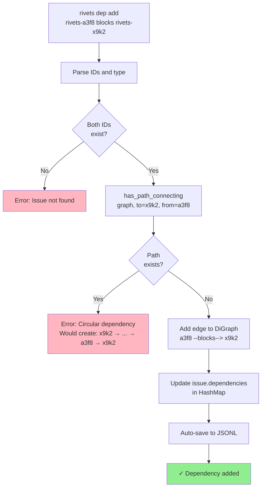

### Example Cycle Detection

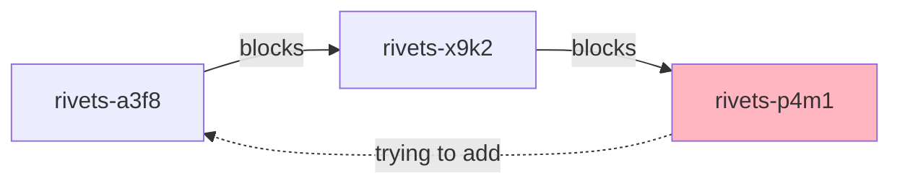

**Detection**: When trying to add `C blocks A`, check `has_path_connecting(graph, A, C)`.
Result: **Yes** (path exists: A → B → C), so reject the edge.

## Delete with Safety Checks Flow

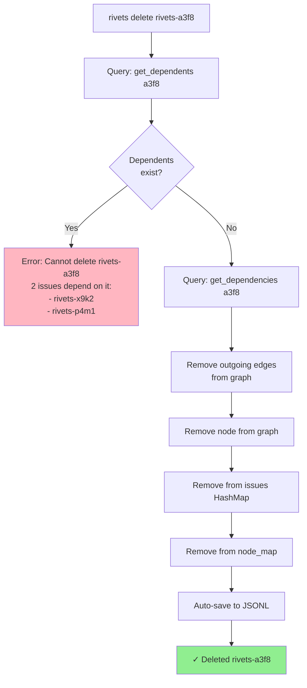

## JSONL Load with Error Recovery

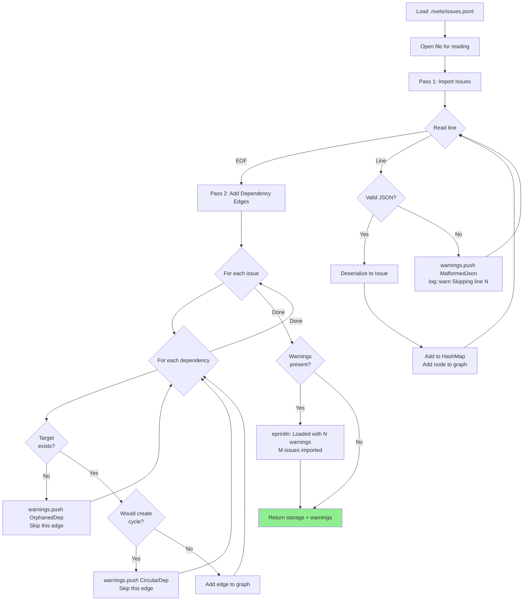

## Configuration Loading and Merging

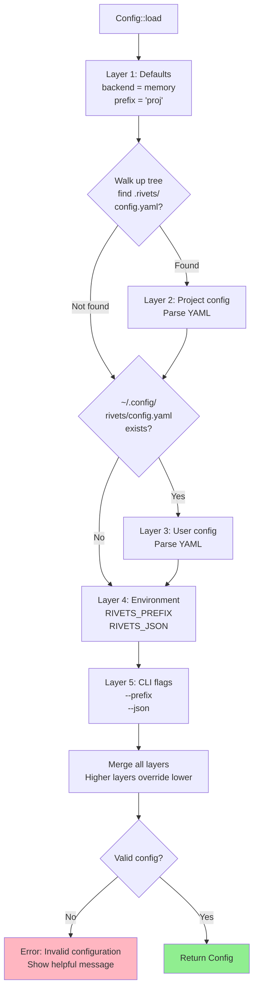

### Configuration Precedence

```
CLI flags          (highest priority)
    ↓
Environment vars
    ↓
~/.config/rivets/config.yaml
    ↓
.rivets/config.yaml
    ↓
Built-in defaults  (lowest priority)
```

## Multi-Command Session (Typical Workflow)

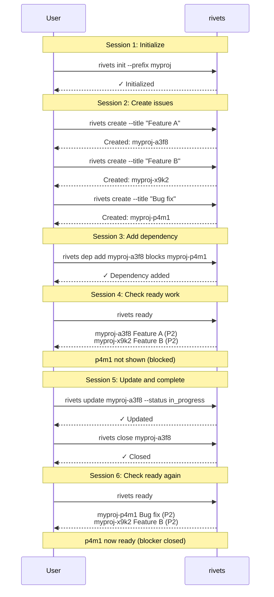

## State Transitions

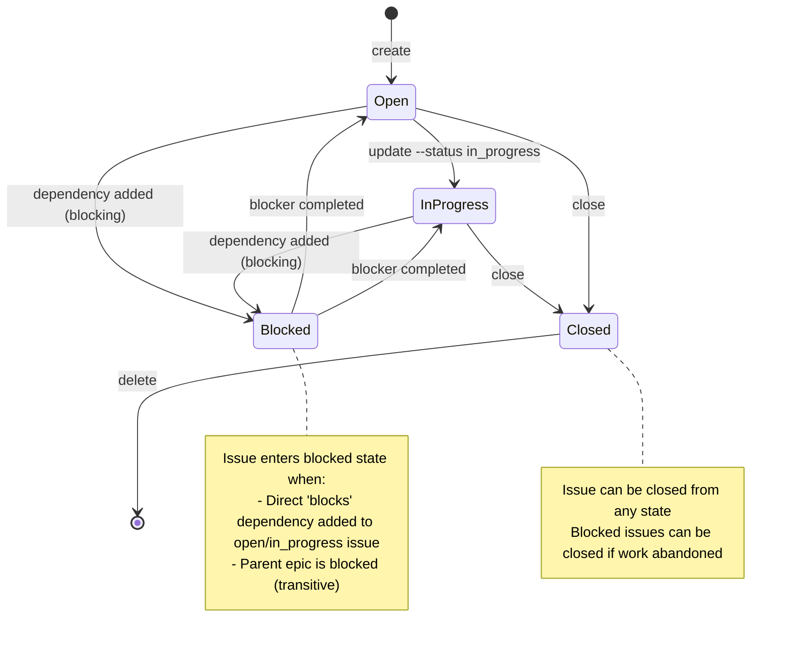

## Data Persistence Points

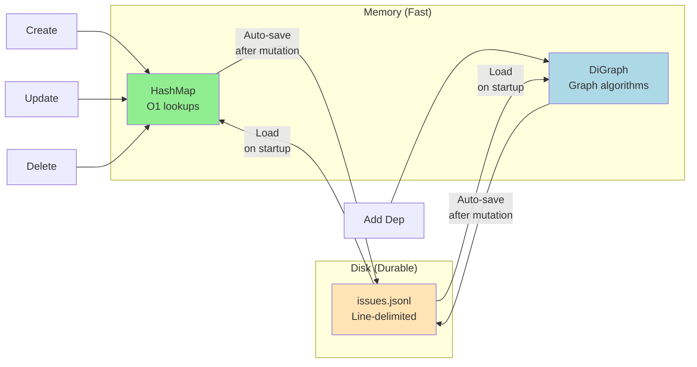

**Auto-save triggers**:
- After `create`
- After `update`
- After `close`
- After `delete`
- After `add_dependency`
- After `remove_dependency`

**NOT triggered** by read-only operations:
- `list`
- `show`
- `ready`
- `blocked`

This ensures durability while minimizing I/O overhead.
