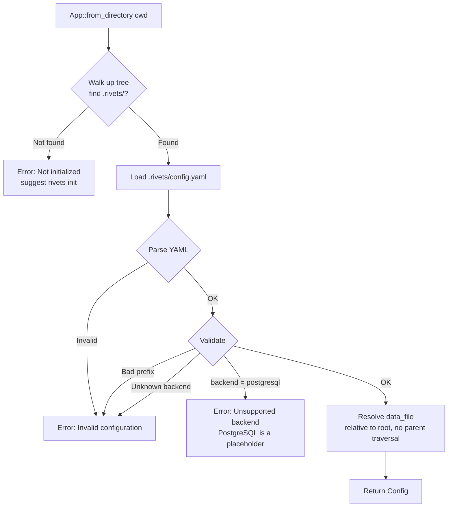
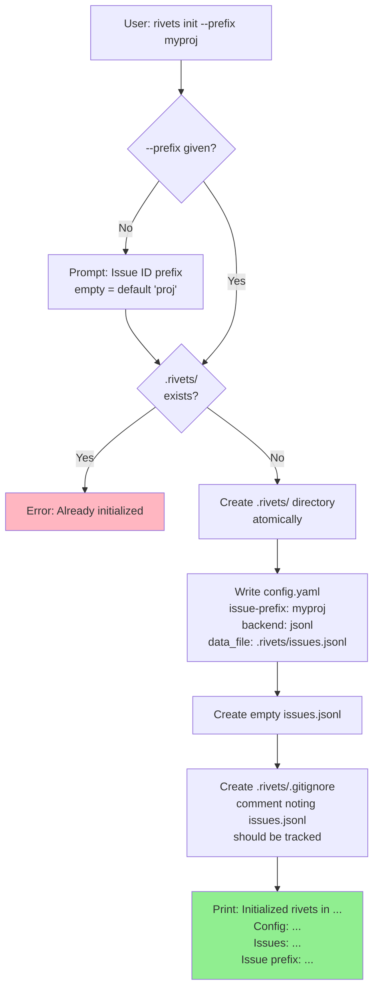
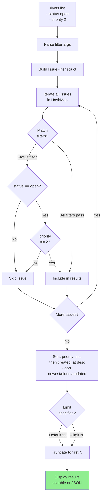
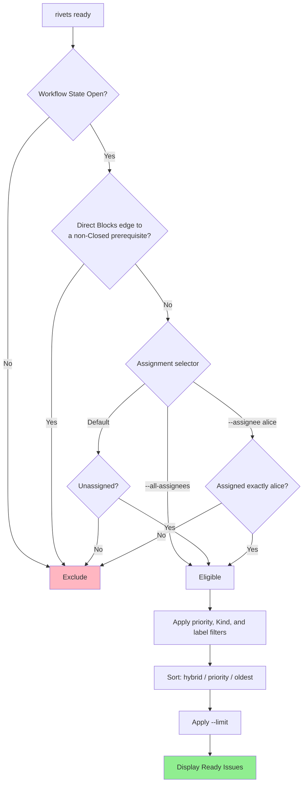
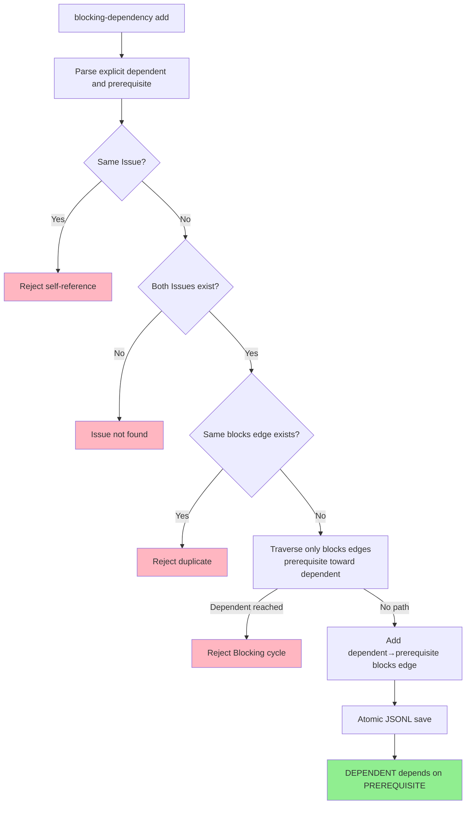
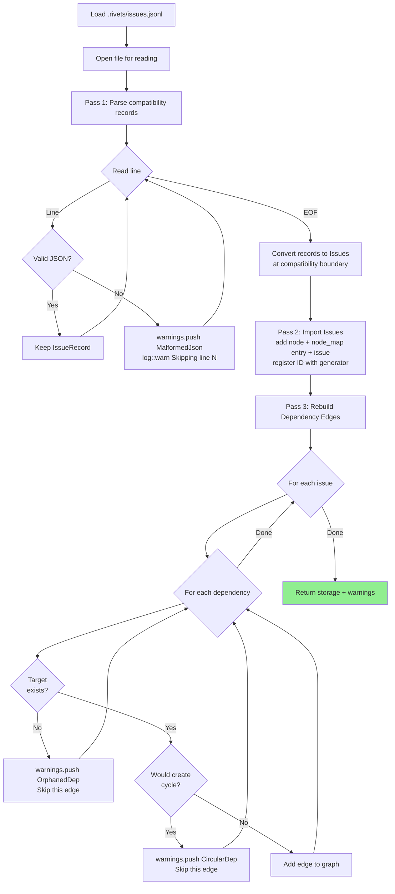
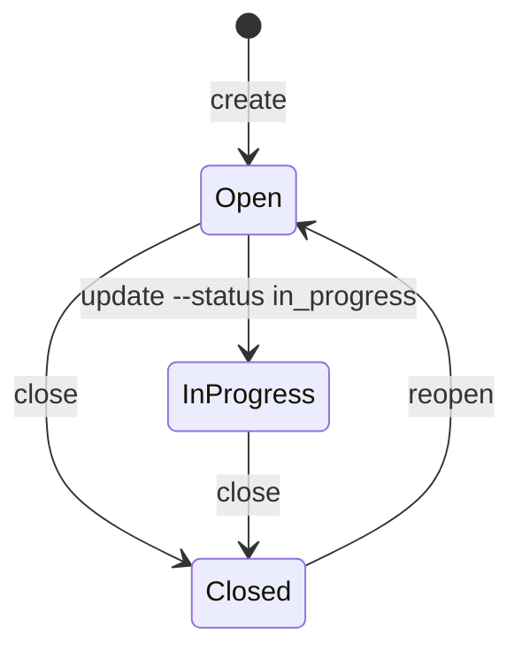
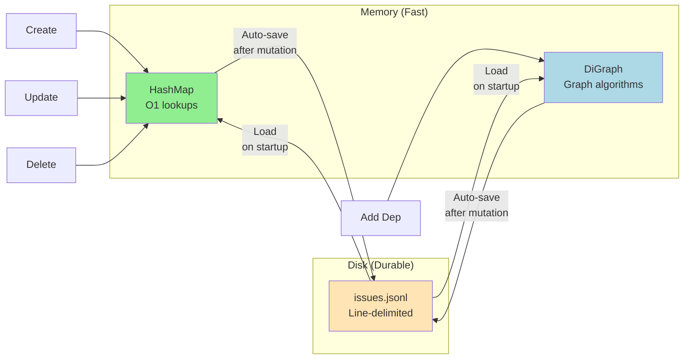

# Rivets Data Flow

## Complete Command Lifecycle

```mermaid
sequenceDiagram
    autonumber
    participant User
    participant Shell
    participant main.rs
    participant CLI Parser
    participant App
    participant Command
    participant WorkspaceLock
    participant Storage Trait
    participant Factory
    participant InMemoryStorage
    participant Graph
    participant JSONL

    User->>Shell: rivets create --title "Fix bug"
    Shell->>main.rs: Execute binary
    main.rs->>main.rs: #[tokio::main(flavor = "current_thread")]
    main.rs->>CLI Parser: Cli::parse_args()
    CLI Parser-->>main.rs: Commands::Create(args)

    main.rs->>App: App::from_directory_for_mutation(current_dir)
    App->>App: find_rivets_root (walk up, max 256 levels)
    App->>WorkspaceLock: try_lock(.rivets/workspace.lock)
    alt Another writer owns the Workspace
        WorkspaceLock-->>User: Workspace Busy (retryable, no load/write)
    else Lock acquired
        App->>App: RivetsConfig::load(.rivets/config.yaml)
        App->>Factory: create_storage(config.storage.to_backend(root), prefix)
    Factory->>InMemoryStorage: load_from_jsonl(path).await
    InMemoryStorage->>JSONL: Open file, read lines
    Note over InMemoryStorage,JSONL: Pass 1: parse compatibility records<br/>Pass 2: import Issues + graph nodes<br/>Pass 3: rebuild dependency edges
    InMemoryStorage-->>Factory: (Storage, warnings)
    Factory->>Factory: Log warnings + wrap in JsonlBackedStorage
    Factory-->>App: Box&lt;dyn IssueStorage&gt;

    main.rs->>Command: command.execute(&mut app).await
    Command->>Command: Prompt for title if missing
    Command->>Command: Build NewIssue
    Command->>Storage Trait: storage.create(new_issue).await
    Storage Trait->>InMemoryStorage: (via trait dispatch)

    InMemoryStorage->>InMemoryStorage: Validate, generate ID (prefix + adaptive hash)
    InMemoryStorage->>Graph: Add node, check cycles
    InMemoryStorage->>Graph: Add edges for dependencies
    InMemoryStorage->>InMemoryStorage: Insert to HashMap
    InMemoryStorage-->>Storage Trait: Issue

    Storage Trait-->>Command: Issue

    Command->>Storage Trait: app.save().await
    Storage Trait->>InMemoryStorage: (via trait dispatch)
    InMemoryStorage->>JSONL: Atomic write (temp file)
    loop For each issue (sorted by id)
        InMemoryStorage->>JSONL: Write JSON + \n
    end
    InMemoryStorage->>JSONL: Rename temp → issues.jsonl
    InMemoryStorage-->>Storage Trait: Ok(())

    Storage Trait-->>Command: Ok(())
    App->>WorkspaceLock: Drop guard after command/save recovery
    end
    Command-->>User: Created issue: rivets-a3f8
```

MCP mutations resolve the same canonical Workspace, acquire the same sidecar
before lazy cache initialization or cached `reload()`, and retain it through
`save_or_reload`. MCP queries and context selection do not acquire the mutation
lock.

## Configuration Loading (single source)

Rivets has exactly **one** configuration source: `.rivets/config.yaml`, found by
walking up the directory tree from the working directory (up to 256 levels).
There is no environment-variable merging, no user-level config under
`~/.config/rivets/`, and no config-related CLI flags.


```mermaid
flowchart TD
    Start[App::from_directory cwd] --> FindRoot{Walk up tree<br/>find .rivets/?}
    FindRoot -->|Not found| Error[Error: Not initialized<br/>suggest rivets init]
    FindRoot -->|Found| Load[Load .rivets/config.yaml]
    Load --> Parse{Parse YAML}
    Parse -->|Invalid| ConfigError[Error: Invalid configuration]
    Parse -->|OK| Validate{Validate}
    Validate -->|Bad prefix| ConfigError
    Validate -->|backend = postgresql| Unsupported[Error: Unsupported backend<br/>PostgreSQL is a placeholder]
    Validate -->|Unknown backend| ConfigError
    Validate -->|OK| Resolve[Resolve data_file<br/>relative to root, no parent traversal]
    Resolve --> Return[Return Config]
```

Example `.rivets/config.yaml` (as written by `rivets init`):

```yaml
issue-prefix: rivets
storage:
  backend: jsonl
  data_file: .rivets/issues.jsonl
```

- `issue-prefix` is validated (2–20 alphanumeric characters).
- `storage.backend` accepts `jsonl`; `postgresql` is a recognized but
  unsupported placeholder that fails with `Unsupported backend`.
- `storage.data_file` must be a relative path with no parent traversal; it is
  resolved against the repository root (the directory containing `.rivets/`).

## Initialization Flow (rivets init)

`rivets init --prefix myproj` creates the repository skeleton. If no prefix is
given (and `--quiet` is not set), the user is prompted; an empty answer uses the
default prefix `proj`.


```mermaid
flowchart TD
    Start[User: rivets init --prefix myproj] --> Prefix{--prefix given?}
    Prefix -->|No| Prompt[Prompt: Issue ID prefix<br/>empty = default 'proj']
    Prompt --> CheckExists
    Prefix -->|Yes| CheckExists{.rivets/<br/>exists?}
    CheckExists -->|Yes| Error[Error: Already initialized]
    CheckExists -->|No| CreateDir[Create .rivets/ directory<br/>atomically]

    CreateDir --> CreateConfig[Write config.yaml<br/>issue-prefix: myproj<br/>backend: jsonl<br/>data_file: .rivets/issues.jsonl]
    CreateConfig --> CreateJSONL[Create empty issues.jsonl]
    CreateJSONL --> CreateGitignore[Create .rivets/.gitignore<br/>comment noting issues.jsonl<br/>should be tracked]

    CreateGitignore --> Print[Print: Initialized rivets in ...<br/>Config: ...<br/>Issues: ...<br/>Issue prefix: ...]

    style Print fill:#90EE90
    style Error fill:#FFB6C1
```

Notes on what `init` does **not** do:

- It does not modify the repository's root `.gitignore` and does not detect git.
- It does not create any other config source; the only config file is
  `.rivets/config.yaml`.

## Create Issue Flow

```mermaid
flowchart TD
    Start[rivets create<br/>--title 'Fix bug'<br/>--priority 1] --> ParseArgs[Parse CLI args]
    ParseArgs --> GatherMissing{Title<br/>provided?}
    GatherMissing -->|No| Interactive[Prompt: Title]
    Interactive --> BuildIssue
    GatherMissing -->|Yes| BuildIssue[Build NewIssue struct]

    BuildIssue --> Validate{Validate fields<br/>+ all prerequisites exist?}
    Validate -->|No| ValidationError[Error: validation failure]
    Validate -->|Yes| Generate[Generate ID: prefix + adaptive hash<br/>SHA256(title|description|creator|timestamp|nonce)<br/>→ base36, length 4-6 by db size]

    Generate --> CheckCollision{ID collision?}
    CheckCollision -->|Yes, retry with nonce| Generate
    CheckCollision -->|No| CheckCycle{Would create a<br/>Blocking cycle?}
    CheckCycle -->|Yes| CycleError[Error: Circular Blocking Dependency<br/>no Issue or edge committed]
    CheckCycle -->|No| Insert[Insert Issue<br/>status: open<br/>add node + Blocking edges]

    Insert --> Save[Auto-save to JSONL]
    Save --> AtomicWrite[Write temp file<br/>Rename atomically]
    AtomicWrite --> Display[Display: Created issue: rivets-a3f8]

    style Display fill:#90EE90
    style CycleError fill:#FFB6C1
    style ValidationError fill:#FFB6C1
```

ID generation is **not** purely content-addressed: the SHA256 input includes the
current timestamp and a nonce, so the hash does not identify the content. The
hash length adapts to database size (4 chars up to 500 issues, 5 up to 1,500,
6 beyond), with nonce retries and a length bump on collision.

Blocking prerequisites passed to `create` use a repeatable, role-specific
`--prerequisite issue-id` option. Creation accepts only Blocking prerequisites;
other relationship kinds have dedicated interfaces in later ADR-0002 slices.

## List/Query Flow


```mermaid
flowchart TD
    Start[rivets list<br/>--status open<br/>--priority 2] --> ParseFilter[Parse filter args]
    ParseFilter --> BuildFilter[Build IssueFilter struct]

    BuildFilter --> IterateIssues[Iterate all issues<br/>in HashMap]

    IterateIssues --> ApplyFilters{Match<br/>filters?}
    ApplyFilters -->|Status filter| CheckStatus{status == open?}
    CheckStatus -->|No| Skip[Skip issue]
    CheckStatus -->|Yes| CheckPriority

    CheckPriority{priority<br/>== 2?} -->|No| Skip
    CheckPriority -->|Yes| Include[Include in results]

    ApplyFilters -->|All filters pass| Include
    Skip --> MoreIssues{More issues?}
    Include --> MoreIssues
    MoreIssues -->|Yes| IterateIssues
    MoreIssues -->|No| Sort

    Sort[Sort: priority asc,<br/>then created_at desc<br/>--sort newest/oldest/updated] --> Limit{Limit<br/>specified?}
    Limit -->|Default 50| TakeN[Truncate to first N]
    Limit -->|--limit N| TakeN

    TakeN --> Display[Display results<br/>as table or JSON]

    style Display fill:#90EE90
```

`--priority` takes a single value 0–4 (not a range); `--status` accepts exactly
`open`, `in_progress`, or `closed`; `--kind` accepts `bug`, `feature`, `task`,
`epic`, or `chore`.

## Ready Work Algorithm Flow

`ready` derives eligibility at query time. It never reads or writes a persisted
Ready or Blocked flag.


```mermaid
flowchart TD
    Start[rivets ready] --> Open{Workflow State Open?}
    Open -->|No| Skip[Exclude]
    Open -->|Yes| Direct{Direct Blocks edge to<br/>a non-Closed prerequisite?}
    Direct -->|Yes| Skip
    Direct -->|No| Assignment{Assignment selector}
    Assignment -->|Default| Unassigned{Unassigned?}
    Assignment -->|--assignee alice| Alice{Assigned exactly alice?}
    Assignment -->|--all-assignees| Include[Eligible]
    Unassigned -->|Yes| Include
    Unassigned -->|No| Skip
    Alice -->|Yes| Include
    Alice -->|No| Skip
    Include --> Filters[Apply priority, Kind, and label filters]
    Filters --> Sort[Sort: hybrid / priority / oldest]
    Sort --> Limit[Apply --limit]
    Limit --> Display[Display Ready Issues]

    style Skip fill:#FFB6C1
    style Display fill:#90EE90
```

Edges point from **dependent → prerequisite**. Only a direct `blocks` edge to a
non-Closed prerequisite derives Blocked. Parentage, Related Associations, and
Discovery Origins never affect Blocked or Ready. Filters, sorting, and limits
operate only after Open/Blocked/Assignment eligibility.

## Blocked Query Flow

`rivets blocked` reports Issues with direct unresolved explicit Blocking
Dependencies, pairing each blocked Issue with its direct prerequisites:

```mermaid
flowchart TD
    Start[rivets blocked] --> Iterate{For each<br/>non-closed issue}

    Iterate --> Outgoing[Inspect outgoing edges]
    Outgoing --> Blocks{Edge type<br/>== 'blocks'?}
    Blocks -->|Yes| BlockerUnclosed{Blocker<br/>not closed?}
    BlockerUnclosed -->|Yes| AddPair[Add (issue, blocker) pair]
    AddPair --> Iterate
    BlockerUnclosed -->|No| Iterate
    Blocks -->|No| Iterate

    Iterate -->|Done| Print[Print: Found N blocked issue(s)<br/>each with Blocked by: list]

    style Print fill:#90EE90
```

This is a read-only query; it does not change any issue's status field.

## Blocking Dependency Add Flow

```bash
rivets blocking-dependency add \
  --dependent rivets-a3f8 \
  --prerequisite rivets-x9k2
```


```mermaid
flowchart TD
    Start[blocking-dependency add] --> Parse[Parse explicit dependent and prerequisite]
    Parse --> Self{Same Issue?}
    Self -->|Yes| ErrorSelf[Reject self-reference]
    Self -->|No| ValidateIDs{Both Issues exist?}
    ValidateIDs -->|No| ErrorNotFound[Issue not found]
    ValidateIDs -->|Yes| Duplicate{Same blocks edge exists?}
    Duplicate -->|Yes| ErrorDuplicate[Reject duplicate]
    Duplicate -->|No| Reach[Traverse only blocks edges<br/>prerequisite toward dependent]
    Reach -->|Dependent reached| ErrorCycle[Reject Blocking cycle]
    Reach -->|No path| Add[Add dependent→prerequisite blocks edge]
    Add --> Save[Atomic JSONL save]
    Save --> Success[DEPENDENT depends on PREREQUISITE]

    style Success fill:#90EE90
    style ErrorSelf fill:#FFB6C1
    style ErrorCycle fill:#FFB6C1
    style ErrorNotFound fill:#FFB6C1
    style ErrorDuplicate fill:#FFB6C1
```

Blocking mutation never changes stored status. Closing the prerequisite keeps
the edge but makes it inactive for blockedness. Parallel legacy relationship
kinds on the same endpoint pair are preserved.

### Query and removal forms

```bash
rivets blocking-dependency remove --dependent rivets-a3f8 --prerequisite rivets-x9k2
rivets blocking-dependency list --dependent rivets-a3f8
rivets blocking-dependency list --prerequisite rivets-x9k2
rivets blocking-dependency tree --dependent rivets-a3f8 --depth 3
```

The MCP tools `blocking_dependency_add`, `blocking_dependency_remove`,
`blocking_dependency_list`, and `blocking_dependency_tree` delegate to the same
storage operations and return role-named structured values.

## Delete with Safety Checks Flow

```mermaid
flowchart TD
    Start[rivets delete rivets-a3f8] --> Confirm{Confirmed?<br/>--force or -y skips}
    Confirm -->|No| Abort[Abort]
    Confirm -->|Yes| GetDependents[Query incoming relationship edges]

    GetDependents --> HasDependents{Dependents<br/>exist?}
    HasDependents -->|Yes| ErrorDependent[Error: Cannot delete rivets-a3f8:<br/>N other issue(s) depend on it.<br/>Dependents: ...]

    HasDependents -->|No| RemoveNode[Remove node from graph]
    RemoveNode --> RemoveHashMap[Remove from issues HashMap]

    RemoveHashMap --> Save[Auto-save to JSONL]
    Save --> Success[Print: Deleted issue: rivets-a3f8]

    style Success fill:#90EE90
    style ErrorDependent fill:#FFB6C1
```

## JSONL Load with Error Recovery

Loading is a three-stage process:

1. **Parse compatibility records** — resiliently parse each line as a
   persistence DTO (`IssueRecord`), collecting `MalformedJson`/`SkippedLine`
   warnings without aborting.
2. **Import Issues** — convert records to domain Issues at the compatibility
   boundary (reporting `MigrationConflict` for legacy fields, and skipping
   issues with `InvalidIssueData`/`InvalidResourceData` warnings), then add
   graph nodes, populate the issues map, and register all IDs with the ID
   generator.
3. **Rebuild relationships** — add dependency edges with cycle detection:
   missing targets produce `OrphanedDependency` warnings (edge skipped),
   cycles produce `CircularDependency` warnings (edge skipped).


```mermaid
flowchart TD
    Start[Load .rivets/issues.jsonl] --> OpenFile[Open file for reading]
    OpenFile --> Pass1[Pass 1: Parse compatibility records]

    Pass1 --> ReadLine1{Read line}
    ReadLine1 -->|EOF| Convert[Convert records to Issues<br/>at compatibility boundary]
    ReadLine1 -->|Line| ParseJSON{Valid JSON?}

    ParseJSON -->|Yes| KeepRecord[Keep IssueRecord]
    KeepRecord --> ReadLine1

    ParseJSON -->|No| LogWarning1[warnings.push MalformedJson<br/>log::warn Skipping line N]
    LogWarning1 --> ReadLine1

    Convert --> ImportIssues[Pass 2: Import Issues<br/>add node + node_map entry + issue<br/>register ID with generator]

    ImportIssues --> Pass3[Pass 3: Rebuild Dependency Edges]
    Pass3 --> IterateIssues{For each issue}

    IterateIssues --> IterateDeps{For each dependency}

    IterateDeps --> CheckTarget{Target<br/>exists?}
    CheckTarget -->|No| OrphanWarning[warnings.push OrphanedDep<br/>Skip this edge]
    OrphanWarning --> IterateDeps

    CheckTarget -->|Yes| CheckCycleLoad{Would create<br/>cycle?}
    CheckCycleLoad -->|Yes| CycleWarning[warnings.push CircularDep<br/>Skip this edge]
    CycleWarning --> IterateDeps

    CheckCycleLoad -->|No| AddEdge[Add edge to graph]
    AddEdge --> IterateDeps

    IterateDeps -->|Done| IterateIssues
    IterateIssues -->|Done| Return[Return storage + warnings]

    style Return fill:#90EE90
```

Saving is atomic: issues are written (sorted by ID for deterministic,
reviewable diffs) to a `.tmp` file, flushed, then renamed over `issues.jsonl`.

## State Transitions

Status changes are **explicit only** — via `update --status`, `close`, or
`reopen`. Dependency operations never change Workflow State. Open, In Progress,
and Closed are the only states; Blocked and Ready are derived and never
serialized on Issue records.

The transition rules are owned by the domain (`IssueStatus::validate_transition`,
ADR-0005) and enforced at the single storage update site. Only two transitions
are rejected:

- `closed → closed` (an Issue cannot be closed twice)
- anything non-Closed → `open` (only a Closed Issue can be reopened)

Every other transition among the three states is allowed.


```mermaid
stateDiagram-v2
    [*] --> Open: create
    Open --> InProgress: update --status in_progress
    Open --> Closed: close
    InProgress --> Closed: close
    Closed --> Open: reopen
```

The `ready` and `blocked` queries derive their conditions from current Workflow
State, Assignment, and explicit Blocking Dependencies. `stats.by_status`
contains exactly the three Workflow States; `ready` and
`blocked_by_dependencies` are separate derived counts.

## Data Persistence Points


```mermaid
flowchart LR
    subgraph "Memory (Fast)"
        HashMap[HashMap<br/>O1 lookups]
        Graph[DiGraph<br/>Graph algorithms]
    end

    subgraph "Disk (Durable)"
        JSONL[issues.jsonl<br/>Line-delimited]
    end

    Create[Create] --> HashMap
    Update[Update] --> HashMap
    Delete[Delete] --> HashMap
    AddDep[Add Dep] --> Graph

    HashMap -->|Auto-save<br/>after mutation| JSONL
    Graph -->|Auto-save<br/>after mutation| JSONL

    JSONL -->|Load<br/>on startup| HashMap
    JSONL -->|Load<br/>on startup| Graph

    style JSONL fill:#FFE4B5
    style HashMap fill:#90EE90
    style Graph fill:#ADD8E6
```

**Auto-save triggers** (`app.save()` → atomic JSONL write after the mutation):
- After `create`
- After `update`
- After `close`
- After `reopen`
- After `delete`
- After `blocking-dependency add`
- After `blocking-dependency remove`
- After `label add` / `label remove`
- After `resource add` / `resource update` / `resource remove`

**NOT triggered** by read-only operations:
- `list`, `show`, `ready`, `blocked`, `stats`, `stale`, `info`
- `blocking-dependency list`, `blocking-dependency tree`
- `label list`, `label list-all`
- `resource list`

This ensures durability while minimizing I/O overhead.

## Storage as a Library: import/export

`import_issues` and `export_all` are methods on the `IssueStorage` trait.
`export_all` is used by the JSONL saver. `import_issues` is a lower-level public
storage API; the production JSONL loader inserts Issues and graph nodes directly
rather than calling it. MCP reaches `export_all` indirectly when its JSONL-backed
storage saves. There are no dedicated MCP import/export tools.

These are **library storage operations, not CLI commands** — there is no
`rivets import` or `rivets export` subcommand. Bulk data movement uses the
library API or copies/version-controls the canonical `.rivets/issues.jsonl`
store.
