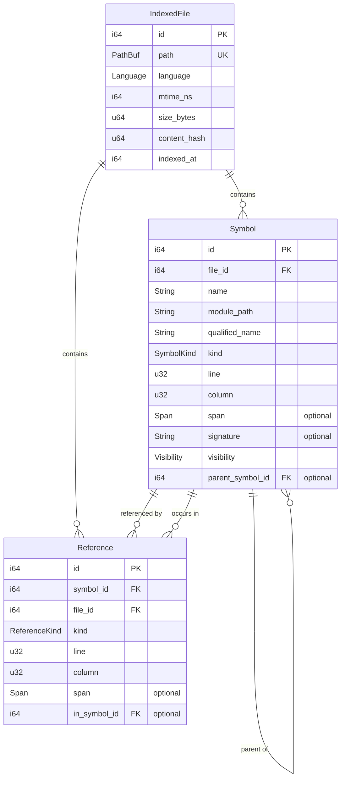

# Tethys: Code Intelligence Library

**Status:** Design
**Last Updated:** 2026-01-22

## Overview

**Tethys is a code intelligence cache and query interface, not a semantic analyzer.**

It uses tree-sitter for fast approximate indexing, delegates to LSPs for precision when needed, and provides a unified API for consumers who don't want to deal with LSP protocol details.

LSPs (rust-analyzer, OmniSharp, etc.) already solve the hard problem of semantic analysis - type inference, name resolution, trait/interface dispatch. There's no point replicating that work. Tethys' value is in what LSPs *don't* provide:

| What Tethys Provides | Why LSPs Don't Cover It |
|---------------------|------------------------|
| **Fast approximate mode** | LSPs require startup time and memory. Tree-sitter is instant. |
| **Persistence** | LSPs are ephemeral. Tethys caches to SQLite. |
| **Unified API across languages** | Each LSP has quirks. Tethys normalizes. |
| **Designed for programmatic use** | LSPs are designed for editors, not CLI/MCP/agents. |
| **Works without LSP running** | Tree-sitter layer works offline, no daemon needed. |

### Consumers

Tethys provides the *data*. What consumers do with it is up to them:

| Consumer | Use Case |
|----------|----------|
| **Rivets** | Enrich issues with code context, show blast radius |
| **Claude Code Hook** | Warn about callers before modifying a function |
| **MCP Server** | Let AI agents query symbol references |
| **Catalyst Agents** | Help `code-refactor-master` track dependencies |

## Why Tethys?

### The Gap in the Landscape

| Tool | Status | Why It Doesn't Fill the Gap |
|------|--------|----------------------------|
| **[Stack Graphs](https://github.com/github/stack-graphs)** | Archived Sept 2025 | GitHub stopped maintaining the open source version |
| **[Kythe](https://kythe.io/)** | Active | Complex, not incremental, Google-scale infrastructure |
| **[OpenGrok](https://oracle.github.io/opengrok/)** | Active | Search/browse only, no programmatic API for callers |
| **rust-analyzer / OmniSharp** | Active | LSP servers, not embeddable libraries |
| **tree-sitter** | Active | Parsing only, no semantic analysis |

AI agent tooling (aider, OpenHands) evaluated stack-graphs and rejected it due to limited language support and maintenance concerns. Now it's archived entirely.

**The need is real, but nothing fills it.** Tethys aims to be the lightweight, embeddable answer to "who calls this function?" that works across languages.

## Design Principles

1. **Cache, not analyzer** - Tethys indexes and caches; LSPs do the hard semantic work
2. **Layered accuracy** - Fast approximate results (tree-sitter), optional precision (LSP delegation)
3. **Language extensible** - Start with Rust + C#, design for adding more
4. **Embeddable** - Library first, CLI second, MCP optional
5. **Intelligence, not policy** - Tethys reports facts ("12 callers"), not judgments ("too risky")

## Architecture

### Conceptual Model

```
┌─────────────────────────────────────────────────────────────────┐
│                          Consumers                              │
│   (Rivets, Claude Code Hooks, MCP Server, Catalyst Agents)      │
└─────────────────────────────┬───────────────────────────────────┘
                              │
                              ▼
┌─────────────────────────────────────────────────────────────────┐
│                           Tethys                                │
│                   (Cache + Query Interface)                     │
├─────────────────────────────────────────────────────────────────┤
│                                                                 │
│  ┌─────────────────────────────────────────────────────────┐   │
│  │  L1+L2: Tree-sitter Layer                               │   │
│  │  • Fast (~30 sec for 10K files)                         │   │
│  │  • No daemon required                                   │   │
│  │  • ~85% accuracy                                        │   │
│  │  • Persists to SQLite (.rivets/index/tethys.db)         │   │
│  └─────────────────────────────────────────────────────────┘   │
│                              │                                  │
│                              │ ambiguous cases only             │
│                              ▼                                  │
│  ┌─────────────────────────────────────────────────────────┐   │
│  │  L3: LSP Delegation (Optional)                          │   │
│  │  • Delegates to rust-analyzer, OmniSharp, etc.          │   │
│  │  • ~98% accuracy                                        │   │
│  │  • Tethys asks, LSP answers                             │   │
│  └─────────────────────────────────────────────────────────┘   │
│                                                                 │
└─────────────────────────────────────────────────────────────────┘
                              │
                              │ L3 only
                              ▼
┌─────────────────────────────────────────────────────────────────┐
│                    External LSP Servers                         │
│            (rust-analyzer, OmniSharp, csharp-ls)                │
│                                                                 │
│   These do the actual semantic analysis. Tethys just asks.     │
└─────────────────────────────────────────────────────────────────┘
```

### Workspace Structure

```
rivets/
├── crates/
│   ├── rivets/           # Issue tracking (depends on tethys)
│   ├── tethys/           # Code intelligence (standalone)
│   │   ├── src/
│   │   │   ├── lib.rs
│   │   │   ├── db.rs           # SQLite storage layer
│   │   │   ├── parser.rs       # tree-sitter parsing
│   │   │   ├── symbols.rs      # Symbol extraction per language
│   │   │   ├── resolver.rs     # Module/import resolution
│   │   │   ├── graph.rs        # petgraph operations (blast radius, cycles)
│   │   │   ├── lsp.rs          # Optional LSP refinement
│   │   │   └── languages/
│   │   │       ├── mod.rs
│   │   │       ├── rust.rs
│   │   │       └── csharp.rs
│   │   └── Cargo.toml
│   └── rivets-mcp/       # MCP server (uses both)
├── .rivets/
│   └── index/
│       └── tethys.db     # SQLite database (git-ignored)
```

### Domain Model



### Domain Model Decisions

| Decision | Choice | Rationale |
|----------|--------|-----------|
| **Language representation** | Enum (`Language::Rust`, `Language::CSharp`) | Type-safe; adding a language requires implementing `LanguageSupport` trait anyway |
| **Module path** | Separate `module_path` field alongside `qualified_name` | Enables "what's exported from this module" queries without string parsing |
| **Full path** | Computed on read from `module_path` + `qualified_name` | No redundancy; concatenation is cheap |
| **File representation** | Separate `IndexedFile` (stored) vs `FileAnalysis` (transient) | Clear separation between database entity and parsing result |
| **Symbol extent** | `Option<Span>` for start/end positions | Tree-sitter provides spans, but optional allows flexibility |
| **Reference tracking** | `in_symbol_id` tracks containing symbol | Enables "who calls X?" at symbol granularity, not just file |
| **Index/DependencyGraph** | Internal types, not public | Users interact through `Tethys` API; storage is implementation detail |
| **LspRefinement** | Opaque placeholder for Phase 6 | Preserves design intent without premature implementation |
| **Query options** | Simple parameters for MVP | Builder pattern preferred when options are added later |
| **Error categorization** | `IndexErrorKind` distinguishes input vs internal errors | Similar to HTTP 4xx vs 5xx; helps with debugging and triage |

### Core Types

```rust
// === Enums ===

/// Supported programming languages
#[derive(Debug, Clone, Copy, PartialEq, Eq, Serialize, Deserialize)]
pub enum Language {
    Rust,
    CSharp,
}

/// Symbol kinds we track
#[derive(Debug, Clone, Copy, PartialEq, Eq, Serialize, Deserialize)]
pub enum SymbolKind {
    Function,
    Method,
    Struct,
    Class,
    Enum,
    Trait,
    Interface,
    Const,
    Static,
    Module,
    TypeAlias,
    Macro,
}

/// Visibility levels (normalized across languages)
#[derive(Debug, Clone, Copy, PartialEq, Eq, Serialize, Deserialize)]
pub enum Visibility {
    Public,
    Crate,      // pub(crate) in Rust, internal in C#
    Module,     // pub(super), pub(in path) in Rust
    Private,
}

/// Reference kinds
#[derive(Debug, Clone, Copy, PartialEq, Eq, Serialize, Deserialize)]
pub enum ReferenceKind {
    Import,      // use statement, using directive
    Call,        // function/method invocation
    Type,        // type annotation
    Inherit,     // trait impl, class inheritance
    Construct,   // struct literal, new ClassName()
    FieldAccess, // struct field access
}

/// Indexing error categories
#[derive(Debug, Clone, Copy, PartialEq, Eq)]
pub enum IndexErrorKind {
    // Input problems (analogous to HTTP 4xx)
    ParseFailed,        // syntax error in source code
    UnsupportedLanguage,// file type not supported
    EncodingError,      // not valid UTF-8

    // Internal problems (analogous to HTTP 5xx)
    IoError,            // couldn't read file
    DatabaseError,      // SQLite error
}

// === Core Entities ===

/// A source/end position span in a file
#[derive(Debug, Clone, Copy, PartialEq, Eq, Serialize, Deserialize)]
pub struct Span {
    pub start_line: u32,
    pub start_column: u32,
    pub end_line: u32,
    pub end_column: u32,
}

/// A source file in the index (stored in database)
#[derive(Debug, Clone, Serialize, Deserialize)]
pub struct IndexedFile {
    pub id: i64,
    pub path: PathBuf,
    pub language: Language,
    pub mtime_ns: i64,
    pub size_bytes: u64,
    pub content_hash: Option<u64>,
    pub indexed_at: i64,
}

/// A code symbol definition (function, struct, trait, class, etc.)
#[derive(Debug, Clone, Serialize, Deserialize)]
pub struct Symbol {
    pub id: i64,
    pub file_id: i64,
    pub name: String,              // simple name: "save"
    pub module_path: String,       // module location: "crate::storage::issue"
    pub qualified_name: String,    // symbol hierarchy: "IssueStorage::save"
    pub kind: SymbolKind,
    pub line: u32,
    pub column: u32,
    pub span: Option<Span>,
    pub signature: Option<String>, // e.g., "fn save(&self, issue: &Issue) -> Result<()>"
    pub visibility: Visibility,
    pub parent_symbol_id: Option<i64>,
}

impl Symbol {
    /// Compute the full path: module_path + qualified_name
    /// e.g., "crate::storage::issue::IssueStorage::save"
    pub fn full_path(&self) -> String {
        if self.module_path.is_empty() {
            self.qualified_name.clone()
        } else {
            format!("{}::{}", self.module_path, self.qualified_name)
        }
    }
}

/// A reference to a symbol (usage, not definition)
#[derive(Debug, Clone, Serialize, Deserialize)]
pub struct Reference {
    pub id: i64,
    pub symbol_id: i64,            // which symbol is being referenced
    pub file_id: i64,              // file containing the reference
    pub kind: ReferenceKind,
    pub line: u32,
    pub column: u32,
    pub span: Option<Span>,
    pub in_symbol_id: Option<i64>, // which symbol contains this reference
}

// === Transient Types (not stored) ===

/// Analysis results from parsing a single file
#[derive(Debug, Clone)]
pub struct FileAnalysis {
    pub path: PathBuf,
    pub language: Language,
    pub mtime_ns: i64,
    pub size_bytes: u64,
    pub content_hash: Option<u64>,
    pub symbols: Vec<Symbol>,
    pub references: Vec<Reference>,
}

// === Operation Results ===

/// Statistics from a full index operation
#[derive(Debug, Clone)]
pub struct IndexStats {
    pub files_indexed: usize,
    pub symbols_found: usize,
    pub references_found: usize,
    pub duration: std::time::Duration,
    pub files_skipped: usize,
    pub errors: Vec<IndexError>,
}

/// Statistics from an incremental update
#[derive(Debug, Clone)]
pub struct IndexUpdate {
    pub files_changed: usize,
    pub files_unchanged: usize,
    pub duration: std::time::Duration,
    pub errors: Vec<IndexError>,
}

/// An error encountered during indexing
#[derive(Debug, Clone)]
pub struct IndexError {
    pub path: PathBuf,
    pub kind: IndexErrorKind,
    pub message: String,
}

// === Query Results ===

/// Result of blast radius analysis
#[derive(Debug, Clone)]
pub struct BlastRadius {
    pub target: PathBuf,
    pub direct_dependents: Vec<Dependent>,
    pub transitive_dependents: Vec<Dependent>,
}

/// A file that depends on the target
#[derive(Debug, Clone)]
pub struct Dependent {
    pub file: PathBuf,
    pub symbols_used: Vec<String>,
    pub line_count: usize,
}

/// A circular dependency detected in the codebase
#[derive(Debug, Clone)]
pub struct Cycle {
    pub files: Vec<PathBuf>,
}

// === Internal Types (not public, noted for design clarity) ===

// Index: Wraps SQLite connection, manages schema and queries
// DependencyGraph: Wraps petgraph, lazily loaded from SQLite for graph operations
// LspRefinement: Placeholder for Phase 6 LSP delegation
```

### Public API

```rust
// tethys/src/lib.rs

pub struct Tethys {
    index: Index,
    graph: DependencyGraph,
    lsp: Option<LspRefinement>,
}

impl Tethys {
    /// Create a new Tethys instance for a workspace
    pub fn new(workspace_root: &Path) -> Result<Self>;

    /// Create with LSP refinement enabled
    pub fn with_lsp(workspace_root: &Path, lsp_command: &str) -> Result<Self>;

    // === Indexing ===

    /// Index all source files in the workspace
    pub fn index(&mut self) -> Result<IndexStats>;

    /// Incrementally update index for changed files
    pub fn update(&mut self) -> Result<IndexUpdate>;

    /// Check if index is stale
    pub fn is_stale(&self) -> bool;

    // === Symbol Queries ===

    /// Search for symbols by name (fuzzy matching)
    pub fn search_symbols(&self, query: &str) -> Vec<Symbol>;

    /// Get all symbols in a file
    pub fn symbols_in_file(&self, path: &Path) -> Vec<Symbol>;

    /// Find symbol definition by name
    pub fn find_symbol(&self, name: &str) -> Option<Symbol>;

    // === Dependency Queries ===

    /// Get all files that depend on the given file
    pub fn get_dependents(&self, path: &Path) -> Vec<PathBuf>;

    /// Get all files that the given file depends on
    pub fn get_dependencies(&self, path: &Path) -> Vec<PathBuf>;

    /// Get callers of a specific symbol
    pub fn get_callers(&self, symbol: &str) -> Vec<Dependent>;

    /// Get full blast radius (transitive dependents)
    pub fn get_blast_radius(&self, path: &Path) -> BlastRadius;

    /// Get blast radius for a specific symbol
    pub fn get_symbol_blast_radius(&self, symbol: &str) -> BlastRadius;

    /// Detect circular dependencies in the codebase
    pub fn detect_cycles(&self) -> Vec<Cycle>;

    // === Database ===

    /// Get path to the SQLite database
    pub fn db_path(&self) -> &Path;

    /// Rebuild the entire index from scratch
    pub fn rebuild(&mut self) -> Result<IndexStats>;

    /// Vacuum the database to reclaim space
    pub fn vacuum(&self) -> Result<()>;
}
```

## Dependency Detection Strategy

Tree-sitter provides syntax, not semantics. Detecting dependencies requires multiple strategies with increasing accuracy.

### Level 1: Use Statement Parsing (~70% accuracy)

Parse import/use statements and resolve them to file paths.

```rust
/// A parsed use statement
#[derive(Debug)]
struct UseStatement {
    path: Vec<String>,           // ["crate", "auth", "middleware"]
    imported_names: Vec<String>, // ["AuthMiddleware", "authenticate"]
    is_glob: bool,               // use foo::*
}

fn extract_use_statements(tree: &Tree, content: &[u8]) -> Vec<UseStatement>;

/// Resolve module path to file path
/// Handles: crate::, self::, super::, and Rust's module resolution rules
fn resolve_module_path(
    module_path: &[String],
    current_file: &Path,
    crate_root: &Path,
) -> Option<PathBuf> {
    let mut path = match module_path.first().map(|s| s.as_str()) {
        Some("crate") => crate_root.to_path_buf(),
        Some("self") => current_file.parent()?.to_path_buf(),
        Some("super") => current_file.parent()?.parent()?.to_path_buf(),
        Some(_extern) => return None, // External crate - can't analyze
        None => return None,
    };

    for segment in module_path.iter().skip(1) {
        // Try Rust's resolution rules: foo.rs, foo/mod.rs, foo/
        let candidates = [
            path.join(format!("{}.rs", segment)),
            path.join(segment).join("mod.rs"),
            path.join(segment),
        ];

        path = candidates.into_iter()
            .find(|p| p.exists() || p.with_extension("rs").exists())?;
    }

    normalize_to_rs_file(path)
}
```

**Limitations:**
- Misses type annotations without explicit `use`
- Can't resolve glob imports (`use foo::*`)
- Misses method calls on imported types

### Level 2: Use + Call Site Cross-Reference (~85% accuracy)

Cross-reference imports with actual usage in code. Only record a dependency if the symbol is actually used, not just imported.

```rust
/// Maps symbol names to their source files
struct SymbolOriginMap {
    origins: HashMap<String, (PathBuf, Vec<String>)>,
}

impl SymbolOriginMap {
    fn from_uses(uses: &[UseStatement], current_file: &Path, crate_root: &Path) -> Self;
    fn lookup(&self, symbol: &str) -> Option<&(PathBuf, Vec<String>)>;
}

/// A reference to a symbol in code
#[derive(Debug)]
struct SymbolRef {
    name: String,
    kind: RefKind,
    line: u32,
}

#[derive(Debug)]
enum RefKind {
    Call,        // foo(), Bar::new()
    Type,        // x: Foo, Vec<Bar>
    Constructor, // Foo { }, new Bar()
    Scoped,      // crate::foo::bar
}

/// Extract all symbol references from code
fn extract_symbol_references(tree: &Tree, content: &[u8]) -> Vec<SymbolRef> {
    let mut refs = Vec::new();

    visit_nodes(tree, |node| {
        match node.kind() {
            "call_expression" => { /* extract function name */ }
            "type_identifier" => { /* extract type name */ }
            "scoped_identifier" => { /* extract qualified path */ }
            "struct_expression" => { /* extract constructor */ }
            _ => {}
        }
    });

    refs
}

/// Build dependencies by cross-referencing imports with usage
fn build_dependencies_l2(
    file: &Path,
    tree: &Tree,
    content: &[u8],
    crate_root: &Path,
) -> Vec<Dependency> {
    let uses = extract_use_statements(tree, content);
    let origin_map = SymbolOriginMap::from_uses(&uses, file, crate_root);
    let refs = extract_symbol_references(tree, content);

    let mut deps = Vec::new();

    for sym_ref in refs {
        if let Some((source_file, _)) = origin_map.lookup(&sym_ref.name) {
            deps.push(Dependency {
                from_file: file.to_path_buf(),
                to_file: source_file.clone(),
                symbol: sym_ref.name,
                kind: ref_kind_to_dep_kind(sym_ref.kind),
                line: sym_ref.line,
            });
        }
    }

    dedup_dependencies(deps)
}
```

**What L2 catches that L1 misses:**

| Scenario | L1 | L2 |
|----------|----|----|
| Import but never use | ❌ False positive | ✅ Correctly ignored |
| Glob import `use foo::*` | ❌ Can't track | ✅ Tracks actual usage |
| Type in function signature | ❌ Misses | ✅ Catches |
| Struct literal `Foo { }` | ❌ Misses | ✅ Catches |

**Remaining gaps:**
- Method calls on variables: `x.authenticate()` - don't know type of `x`
- Trait methods from imported traits
- Macro expansions

### Level 3: LSP Delegation (~98% accuracy)

**Tethys doesn't do semantic analysis - it delegates to LSPs.**

For ambiguous cases that tree-sitter can't resolve, Tethys queries the LSP server (rust-analyzer, OmniSharp, etc.) that already has a complete semantic model. This is delegation, not reimplementation.

```rust
/// Cases where tree-sitter can't determine the dependency
#[derive(Debug)]
enum AmbiguousRef {
    /// Method call on unknown type: `x.foo()`
    MethodCall { receiver: String, method: String, line: u32 },

    /// Trait method could come from multiple traits
    TraitMethod { method: String, line: u32 },

    /// Fully qualified path without use statement
    QualifiedPath { path: String, line: u32 },
}

/// Identify references that need LSP to resolve
fn find_ambiguous_refs(
    file: &Path,
    tree: &Tree,
    content: &[u8],
    origin_map: &SymbolOriginMap,
) -> Vec<AmbiguousRef>;

/// Minimal LSP client for dependency resolution
pub struct LspClient {
    process: Child,
    request_id: u64,
}

impl LspClient {
    pub async fn start(command: &str, workspace: &Path) -> Result<Self>;

    /// Ask LSP: "What is the definition of the symbol at this position?"
    pub async fn goto_definition(&mut self, file: &Path, line: u32, col: u32)
        -> Result<Option<Location>>;

    /// Ask LSP: "What references this symbol?"
    pub async fn find_references(&mut self, file: &Path, line: u32, col: u32)
        -> Result<Vec<Location>>;
}

/// Resolve ambiguous references using LSP
async fn refine_with_lsp(
    lsp: &mut LspClient,
    ambiguous: &[AmbiguousRef],
    file: &Path,
) -> Vec<Dependency> {
    let mut refined = Vec::new();

    for amb in ambiguous {
        let (line, col) = amb.position();
        if let Ok(Some(location)) = lsp.goto_definition(file, line, col).await {
            refined.push(Dependency {
                from_file: file.to_path_buf(),
                to_file: uri_to_path(&location.uri),
                symbol: extract_symbol_at(&location),
                kind: DependencyKind::Call,
                line,
            });
        }
    }

    refined
}
```

**When to use LSP:**

| Scenario | Tree-sitter | LSP |
|----------|-------------|-----|
| `use foo::Bar; Bar::new()` | ✅ | |
| `let x: Bar = ...` | ✅ | |
| `x.authenticate()` | ❌ | ✅ |
| `impl Trait for Foo` | Partial | ✅ |
| Method chaining `a.b().c()` | ❌ | ✅ |

**Performance trade-off:**

```
L1+L2 only:  ~30 seconds / 10K files
L1+L2+L3:    ~2-5 minutes / 10K files (LSP startup + queries)
```

### Recommended Implementation

```rust
impl Tethys {
    pub fn analyze_file(&mut self, file: &Path) -> Result<FileAnalysis> {
        let content = std::fs::read(file)?;
        let tree = self.parser.parse(file, &content)?;

        // L1 + L2: Fast tree-sitter analysis
        let symbols = extract_symbols(&tree, &content, self.language(file)?);
        let deps = build_dependencies_l2(file, &tree, &content, &self.crate_root);

        // L3: Optional LSP refinement
        let deps = if let Some(lsp) = &mut self.lsp {
            let ambiguous = find_ambiguous_refs(file, &tree, &content, &origin_map);
            if !ambiguous.is_empty() {
                let refined = refine_with_lsp(lsp, &ambiguous, file).await;
                merge_dependencies(deps, refined)
            } else {
                deps
            }
        } else {
            deps
        };

        Ok(FileAnalysis { path: file.to_path_buf(), symbols, dependencies: deps, ... })
    }
}
```

## Dependency Graph

Uses petgraph for graph operations:

```rust
use petgraph::graph::{DiGraph, NodeIndex};
use petgraph::Direction;

pub struct DependencyGraph {
    graph: DiGraph<PathBuf, DependencyKind>,
    node_map: HashMap<PathBuf, NodeIndex>,
}

impl DependencyGraph {
    pub fn new() -> Self;

    pub fn add_file(&mut self, path: PathBuf) -> NodeIndex;

    pub fn add_dependency(&mut self, from: &Path, to: &Path, kind: DependencyKind);

    /// Files that depend on this file (reverse dependencies)
    pub fn get_dependents(&self, path: &Path) -> Vec<PathBuf> {
        let Some(&node) = self.node_map.get(path) else { return vec![] };

        self.graph
            .neighbors_directed(node, Direction::Incoming)
            .map(|n| self.graph[n].clone())
            .collect()
    }

    /// Files this file depends on
    pub fn get_dependencies(&self, path: &Path) -> Vec<PathBuf> {
        let Some(&node) = self.node_map.get(path) else { return vec![] };

        self.graph
            .neighbors_directed(node, Direction::Outgoing)
            .map(|n| self.graph[n].clone())
            .collect()
    }

    /// Transitive dependents (full blast radius)
    pub fn get_blast_radius(&self, path: &Path) -> Vec<PathBuf> {
        let Some(&start) = self.node_map.get(path) else { return vec![] };

        let mut visited = HashSet::new();
        let mut queue = VecDeque::from([start]);

        while let Some(node) = queue.pop_front() {
            for neighbor in self.graph.neighbors_directed(node, Direction::Incoming) {
                if visited.insert(neighbor) {
                    queue.push_back(neighbor);
                }
            }
        }

        visited.iter()
            .map(|&n| self.graph[n].clone())
            .collect()
    }
}
```

## Language Support

Tethys uses a trait-based design for language support:

```rust
pub trait LanguageSupport: Send + Sync {
    /// File extensions this language handles
    fn extensions(&self) -> &[&str];

    /// tree-sitter language
    fn tree_sitter_language(&self) -> tree_sitter::Language;

    /// Extract symbols from a parsed tree
    fn extract_symbols(&self, tree: &Tree, content: &[u8]) -> Vec<Symbol>;

    /// Extract use/import statements
    fn extract_imports(&self, tree: &Tree, content: &[u8]) -> Vec<UseStatement>;

    /// Resolve import path to file path
    fn resolve_import(&self, import_path: &[String], current_file: &Path, root: &Path)
        -> Option<PathBuf>;

    /// Extract symbol references (calls, type usage, etc.)
    fn extract_references(&self, tree: &Tree, content: &[u8]) -> Vec<SymbolRef>;

    /// LSP server command (if available)
    fn lsp_command(&self) -> Option<&str>;
}

// Implementations
pub struct RustLanguage;
pub struct CSharpLanguage;

impl LanguageSupport for RustLanguage {
    fn extensions(&self) -> &[&str] { &["rs"] }
    fn tree_sitter_language(&self) -> tree_sitter::Language { tree_sitter_rust::LANGUAGE.into() }
    fn lsp_command(&self) -> Option<&str> { Some("rust-analyzer") }
    // ...
}

impl LanguageSupport for CSharpLanguage {
    fn extensions(&self) -> &[&str] { &["cs"] }
    fn tree_sitter_language(&self) -> tree_sitter::Language { tree_sitter_c_sharp::LANGUAGE.into() }
    fn lsp_command(&self) -> Option<&str> { Some("csharp-ls") }
    // ...
}
```

## Storage

Tethys uses a **SQLite + petgraph hybrid** approach:

- **SQLite** is the source of truth for all indexed data
- **petgraph** is used for graph algorithms (blast radius, cycle detection)
- Data is loaded from SQLite into petgraph on-demand for graph operations

### Why Not JSONL?

Unlike rivets issues (which are shared, versioned, and synced), Tethys indexes are:
- **Local** - derived from source code, not shared between machines
- **Regenerable** - can be rebuilt from source at any time
- **Query-heavy** - need efficient lookups by symbol name, file, etc.

SQLite provides indexed queries that JSONL can't match, while petgraph provides graph algorithms that SQL can't express efficiently.

### Database Location

```
.rivets/
├── index/
│   └── tethys.db          # SQLite database (git-ignored)
```

### Schema

```sql
-- Indexed source files
CREATE TABLE files (
    id INTEGER PRIMARY KEY,
    path TEXT NOT NULL UNIQUE,
    language TEXT NOT NULL,          -- 'rust', 'csharp'
    mtime_ns INTEGER NOT NULL,
    size_bytes INTEGER NOT NULL,
    content_hash INTEGER,
    indexed_at INTEGER NOT NULL
);

CREATE INDEX idx_files_path ON files(path);
CREATE INDEX idx_files_language ON files(language);

-- Symbol definitions
CREATE TABLE symbols (
    id INTEGER PRIMARY KEY,
    file_id INTEGER NOT NULL REFERENCES files(id) ON DELETE CASCADE,
    name TEXT NOT NULL,              -- simple name: "save"
    module_path TEXT NOT NULL,       -- module location: "crate::storage::issue"
    qualified_name TEXT NOT NULL,    -- symbol hierarchy: "IssueStorage::save"
    kind TEXT NOT NULL,
    line INTEGER NOT NULL,
    column INTEGER NOT NULL,
    end_line INTEGER,                -- optional span end
    end_column INTEGER,
    signature TEXT,
    visibility TEXT NOT NULL,
    parent_symbol_id INTEGER REFERENCES symbols(id) ON DELETE CASCADE
);

CREATE INDEX idx_symbols_name ON symbols(name);
CREATE INDEX idx_symbols_module_path ON symbols(module_path);
CREATE INDEX idx_symbols_qualified ON symbols(qualified_name);
CREATE INDEX idx_symbols_file ON symbols(file_id);
CREATE INDEX idx_symbols_kind ON symbols(kind);

-- References (usages of symbols)
CREATE TABLE refs (
    id INTEGER PRIMARY KEY,
    symbol_id INTEGER NOT NULL REFERENCES symbols(id) ON DELETE CASCADE,
    file_id INTEGER NOT NULL REFERENCES files(id) ON DELETE CASCADE,
    kind TEXT NOT NULL,
    line INTEGER NOT NULL,
    column INTEGER NOT NULL,
    end_line INTEGER,                -- optional span end
    end_column INTEGER,
    in_symbol_id INTEGER REFERENCES symbols(id) ON DELETE CASCADE
);

CREATE INDEX idx_refs_symbol ON refs(symbol_id);
CREATE INDEX idx_refs_file ON refs(file_id);
CREATE INDEX idx_refs_in_symbol ON refs(in_symbol_id);

-- File-level dependencies (denormalized for fast queries)
CREATE TABLE file_deps (
    from_file_id INTEGER NOT NULL REFERENCES files(id) ON DELETE CASCADE,
    to_file_id INTEGER NOT NULL REFERENCES files(id) ON DELETE CASCADE,
    ref_count INTEGER NOT NULL DEFAULT 1,
    PRIMARY KEY (from_file_id, to_file_id)
);

CREATE INDEX idx_file_deps_to ON file_deps(to_file_id);
```

### Query Strategy

| Operation | Approach | Reason |
|-----------|----------|--------|
| Symbol search | SQL | Simple filtering, indices |
| List references | SQL | Direct foreign key lookup |
| Direct callers | SQL | Single JOIN |
| File dependencies | SQL | Denormalized table |
| **Blast radius** | petgraph | Transitive closure |
| **Cycle detection** | petgraph | Graph algorithm |
| **Shortest path** | petgraph | Graph algorithm |

For graph operations, Tethys loads the relevant subgraph from SQLite into petgraph, computes the result, and returns it. This avoids loading the entire codebase graph for a single query.

See [SQLite + petgraph spike](../spikes/2026-01-22-tethys-sqlite-petgraph.md) for detailed implementation examples

## CLI (Optional)

Tethys can include a CLI for standalone use:

```bash
# Index a workspace
tethys index

# Rebuild index from scratch
tethys index --rebuild

# Search for symbols
tethys search "authenticate"

# Get callers of a symbol
tethys callers "AuthMiddleware::new"

# Get blast radius for a file
tethys blast-radius src/auth.rs

# Get blast radius for a symbol
tethys blast-radius --symbol "authenticate"

# Detect circular dependencies
tethys cycles

# Show index stats
tethys stats

# Use LSP for precision
tethys index --lsp
tethys callers "validate" --lsp
```

## Consumer Examples

### Rivets Integration

```rust
// In rivets, when showing an issue
fn show_issue_with_context(issue: &Issue, tethys: &Tethys) {
    println!("{}: {}", issue.id, issue.title);

    if let Some(files) = &issue.related_files {
        for file in files {
            let blast = tethys.get_blast_radius(file);
            println!("\nBlast radius for {}:", file.display());
            println!("  Direct: {} files", blast.direct_dependents.len());
            println!("  Transitive: {} files", blast.transitive_dependents.len());
        }
    }
}
```

### Claude Code Hook

```rust
// Hook that warns about callers before editing
fn pre_edit_hook(file: &Path, function_name: &str, tethys: &Tethys) -> HookResult {
    let callers = tethys.get_callers(function_name);

    if !callers.is_empty() {
        let warning = format!(
            "⚠️  `{}` has {} callers across {} files:\n{}",
            function_name,
            callers.iter().map(|c| c.line_count).sum::<usize>(),
            callers.len(),
            callers.iter()
                .take(5)
                .map(|c| format!("  • {}", c.file.display()))
                .collect::<Vec<_>>()
                .join("\n")
        );

        HookResult::Continue { message: Some(warning) }
    } else {
        HookResult::Continue { message: None }
    }
}
```

### MCP Server

```rust
// MCP tool: get_callers
async fn handle_get_callers(params: GetCallersParams, tethys: &Tethys) -> McpResult {
    let callers = tethys.get_callers(&params.symbol);

    McpResult::json(json!({
        "symbol": params.symbol,
        "caller_count": callers.len(),
        "callers": callers.iter().map(|c| json!({
            "file": c.file,
            "symbols_used": c.symbols_used,
            "line_count": c.line_count,
        })).collect::<Vec<_>>()
    }))
}
```

## Implementation Phases

### Phase 1: Core Infrastructure
- [ ] Workspace crate structure
- [ ] SQLite database setup with schema
- [ ] `Symbol`, `Reference`, `FileAnalysis` types
- [ ] tree-sitter integration
- [ ] Rust symbol extraction
- [ ] Basic `Tethys` struct with `index()` and `symbols_in_file()`

### Phase 2: Dependency Detection (L1 + L2)
- [ ] Use statement parsing for Rust
- [ ] Module path resolution
- [ ] Symbol reference extraction (with `in_symbol_id` tracking)
- [ ] Cross-reference to build dependencies
- [ ] `get_dependents()`, `get_dependencies()`

### Phase 3: Graph Operations
- [ ] petgraph integration for graph algorithms
- [ ] SQLite → petgraph loading for subgraphs
- [ ] `get_blast_radius()` with BFS
- [ ] `get_callers()` for symbol-level queries
- [ ] `detect_cycles()` with Tarjan's SCC

### Phase 4: CLI
- [ ] `tethys index` / `tethys index --rebuild`
- [ ] `tethys search`
- [ ] `tethys callers`
- [ ] `tethys blast-radius`
- [ ] `tethys cycles`
- [ ] `tethys stats`

### Phase 5: C# Support
- [ ] tree-sitter-c-sharp integration
- [ ] C# symbol extraction
- [ ] C# using directive parsing
- [ ] Namespace resolution

### Phase 6: LSP Refinement (L3)
- [ ] Minimal LSP client
- [ ] Ambiguous reference detection
- [ ] `--lsp` flag for precision mode
- [ ] rust-analyzer integration
- [ ] OmniSharp/csharp-ls integration

### Phase 7: Rivets Integration
- [ ] Rivets depends on tethys
- [ ] `rivets show --code-context`
- [ ] Issue ↔ file linking

## Dependencies

```toml
[dependencies]
tree-sitter = "0.24"
tree-sitter-rust = "0.23"
tree-sitter-c-sharp = "0.23"
rusqlite = { version = "0.32", features = ["bundled"] }
petgraph = "0.8"
serde = { version = "1.0", features = ["derive"] }
serde_json = "1.0"
thiserror = "2.0"
tracing = "0.1"

[dev-dependencies]
tempfile = "3"
rstest = "0.23"
```

**Note:** `rusqlite` with `bundled` feature compiles SQLite from source, ensuring consistent behavior across platforms. `petgraph` 0.8 is actively maintained (releases in 2025).

## References

- [tree-sitter](https://tree-sitter.github.io/) - Incremental parsing library
- [petgraph](https://docs.rs/petgraph/) - Graph data structure library
- [LSP Specification](https://microsoft.github.io/language-server-protocol/) - Language Server Protocol
- [rust-analyzer](https://rust-analyzer.github.io/) - Rust LSP server
- [ra_ap_ide](https://docs.rs/ra_ap_ide/) - rust-analyzer as a library
