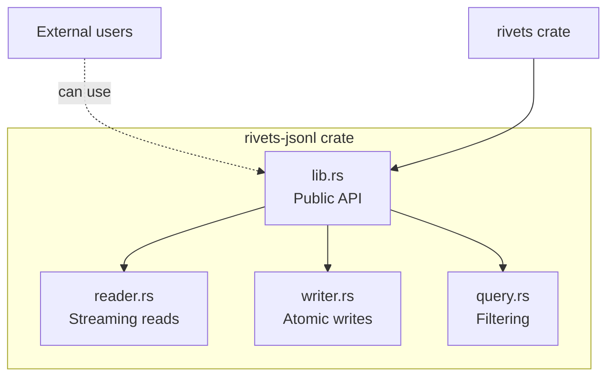
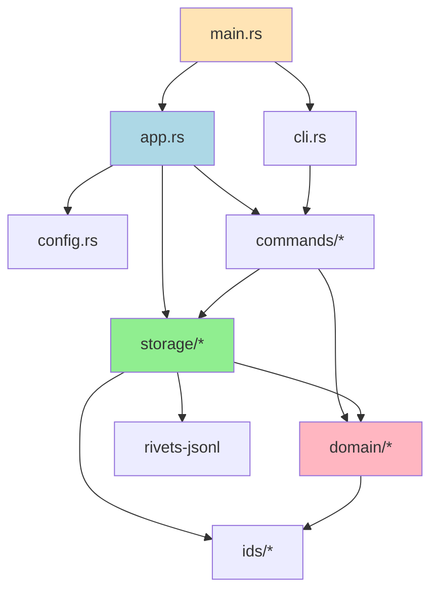
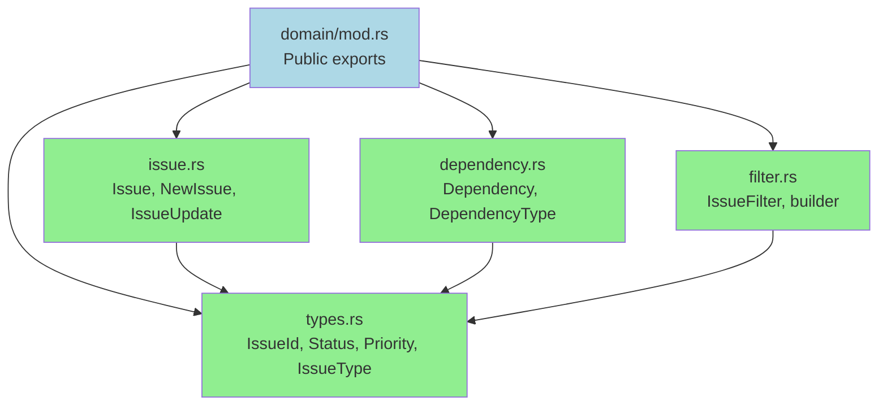
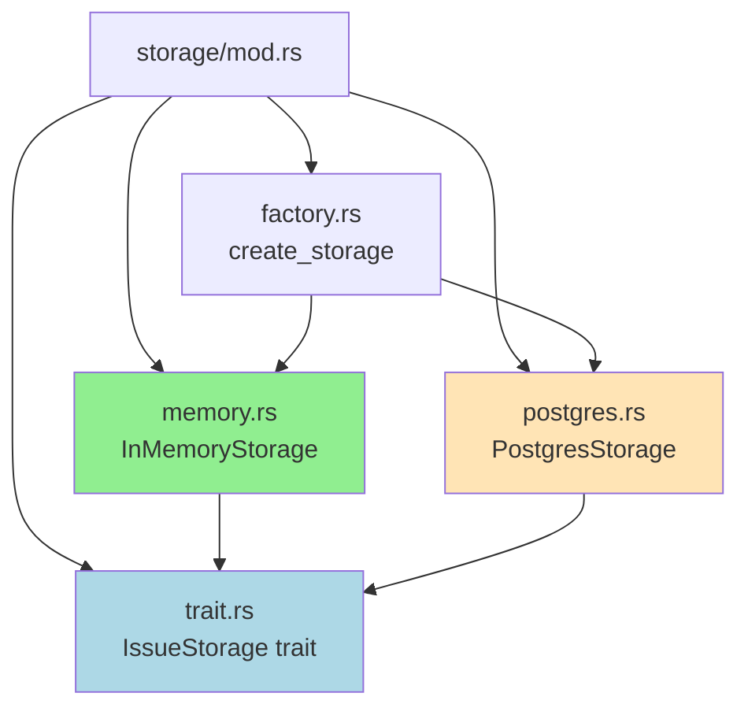
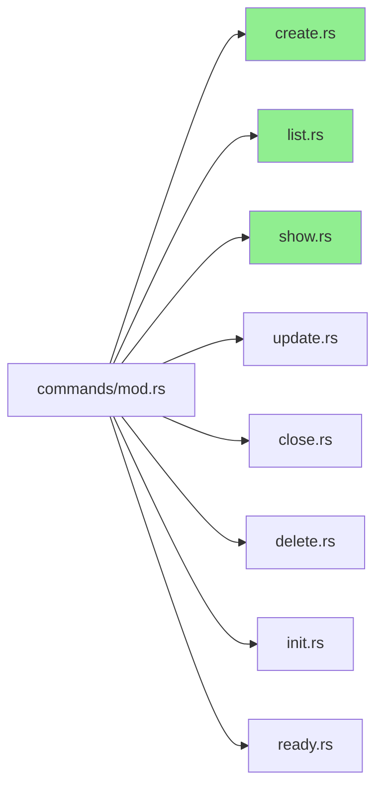
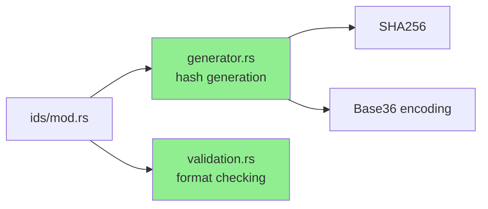
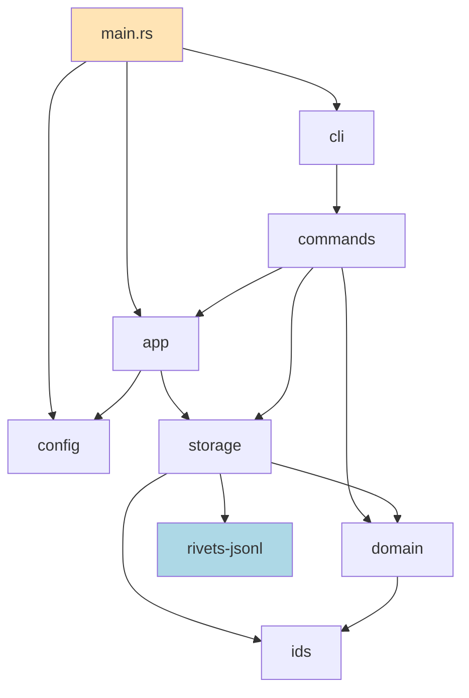

# Rivets Module Structure

## Workspace Organization

```
rivets/
├── Cargo.toml                 # Workspace definition
├── crates/
│   ├── rivets-jsonl/         # General-purpose JSONL library
│   │   ├── Cargo.toml
│   │   ├── src/
│   │   │   ├── lib.rs
│   │   │   ├── reader.rs
│   │   │   ├── writer.rs
│   │   │   └── query.rs
│   │   └── tests/
│   │       └── integration_tests.rs
│   │
│   └── rivets/               # Main CLI application
│       ├── Cargo.toml
│       ├── src/
│       │   ├── main.rs
│       │   ├── lib.rs
│       │   ├── cli.rs
│       │   ├── app.rs
│       │   ├── config.rs
│       │   ├── error.rs
│       │   ├── domain/
│       │   │   ├── mod.rs
│       │   │   ├── issue.rs
│       │   │   ├── dependency.rs
│       │   │   ├── filter.rs
│       │   │   └── types.rs
│       │   ├── storage/
│       │   │   ├── mod.rs
│       │   │   ├── trait.rs
│       │   │   ├── memory.rs
│       │   │   ├── postgres.rs      # Phase 3
│       │   │   └── factory.rs
│       │   ├── commands/
│       │   │   ├── mod.rs
│       │   │   ├── create.rs
│       │   │   ├── list.rs
│       │   │   ├── show.rs
│       │   │   ├── update.rs
│       │   │   ├── close.rs
│       │   │   ├── delete.rs
│       │   │   ├── init.rs
│       │   │   └── ready.rs
│       │   └── ids/
│       │       ├── mod.rs
│       │       ├── generator.rs
│       │       └── validation.rs
│       └── tests/
│           ├── cli_tests.rs
│           └── integration_tests.rs
│
├── docs/
│   ├── architecture.md
│   ├── storage-architecture.md
│   ├── module-structure.md      # This file
│   ├── data-flow.md
│   └── terminology.md
│
└── .rivets/                      # User workspace (created by init)
    ├── issues.jsonl
    ├── config.yaml
    └── .gitignore
```

## Crate: rivets-jsonl

**Purpose**: General-purpose JSONL library for efficient reading, writing, and querying



### Public API (rivets-jsonl/src/lib.rs)

```rust
pub struct JsonlReader<R: AsyncBufRead> {
    reader: BufReader<R>,
}

impl<R: AsyncBufRead> JsonlReader<R> {
    pub fn new(reader: R) -> Self;
    pub async fn read_line<T: DeserializeOwned>(&mut self) -> Result<Option<T>>;
    pub fn stream<T: DeserializeOwned>(self) -> impl Stream<Item = Result<T>>;
}

pub struct JsonlWriter<W: AsyncWrite> {
    writer: BufWriter<W>,
}

impl<W: AsyncWrite> JsonlWriter<W> {
    pub fn new(writer: W) -> Self;
    pub async fn write<T: Serialize>(&mut self, value: &T) -> Result<()>;
    pub async fn flush(&mut self) -> Result<()>;
}

// Atomic file operations
pub async fn atomic_write<T: Serialize>(
    path: &Path,
    items: impl Iterator<Item = &T>
) -> Result<()>;
```

### Design Goals
- **Generic**: Works with any serde-compatible type
- **Async**: Non-blocking I/O with tokio
- **Streaming**: Memory-efficient for large files
- **Atomic**: Safe concurrent access via temp files
- **Standalone**: No rivets-specific dependencies

## Crate: rivets (Main Application)

### Dependency Graph



## Module: main.rs

**Responsibility**: CLI entry point and async runtime setup

```rust
use clap::Parser;
use rivets::{cli::Cli, app::App, config::Config};

#[tokio::main(flavor = "current_thread")]
async fn main() -> anyhow::Result<()> {
    // Parse command-line arguments
    let cli = Cli::parse();

    // Load configuration
    let config = Config::load().await?;

    // Create application
    let mut app = App::new(config).await?;

    // Execute command
    if let Some(command) = cli.command {
        command.execute(&mut app).await?;
    } else {
        // No command: show default (ready work or help)
        println!("Run 'rivets --help' for usage");
    }

    Ok(())
}
```

## Module: cli.rs

**Responsibility**: Argument parsing and validation

```rust
use clap::{Parser, Subcommand, ValueEnum};

#[derive(Parser)]
#[command(name = "rivets", version, about)]
pub struct Cli {
    #[arg(long, global = true)]
    pub json: bool,

    #[command(subcommand)]
    pub command: Option<Commands>,
}

#[derive(Subcommand)]
pub enum Commands {
    Init(init::Args),
    Create(create::Args),
    List(list::Args),
    Show(show::Args),
    Update(update::Args),
    Close(close::Args),
    Delete(delete::Args),
    Ready(ready::Args),
}

impl Commands {
    pub async fn execute(&self, app: &mut App) -> Result<()> {
        match self {
            Self::Init(args) => init::execute(args, app).await,
            Self::Create(args) => create::execute(args, app).await,
            // ... other commands
        }
    }
}
```

## Module: app.rs

**Responsibility**: Application state and lifecycle

```rust
use crate::{config::Config, storage::IssueStorage};

pub struct App {
    storage: Box<dyn IssueStorage>,
    config: Config,
}

impl App {
    pub async fn new(config: Config) -> Result<Self> {
        let storage = storage::create_storage(&config.storage).await?;
        Ok(Self { storage, config })
    }

    pub fn storage(&mut self) -> &mut dyn IssueStorage {
        &mut *self.storage
    }

    pub fn config(&self) -> &Config {
        &self.config
    }
}
```

## Module: domain/

**Responsibility**: Core business types and logic



### domain/types.rs

```rust
use serde::{Deserialize, Serialize};
use std::fmt;

// Newtype for type safety
#[derive(Debug, Clone, PartialEq, Eq, Hash, Serialize, Deserialize)]
pub struct IssueId(String);

impl IssueId {
    pub fn new(s: impl Into<String>) -> Self {
        Self(s.into())
    }

    pub fn as_str(&self) -> &str {
        &self.0
    }
}

impl fmt::Display for IssueId {
    fn fmt(&self, f: &mut fmt::Formatter<'_>) -> fmt::Result {
        write!(f, "{}", self.0)
    }
}

#[derive(Debug, Clone, Copy, PartialEq, Eq, Serialize, Deserialize)]
#[serde(rename_all = "lowercase")]
pub enum Status {
    Open,
    InProgress,
    Blocked,
    Closed,
}

#[derive(Debug, Clone, Copy, PartialEq, Eq, PartialOrd, Ord, Serialize, Deserialize)]
pub struct Priority(u8);  // 0-4

impl Priority {
    pub fn new(p: u8) -> Result<Self> {
        if p <= 4 {
            Ok(Self(p))
        } else {
            Err(Error::InvalidPriority(p))
        }
    }

    pub fn value(&self) -> u8 {
        self.0
    }
}

#[derive(Debug, Clone, Copy, PartialEq, Eq, Serialize, Deserialize)]
#[serde(rename_all = "lowercase")]
pub enum IssueType {
    Bug,
    Feature,
    Task,
    Epic,
    Chore,
}

#[derive(Debug, Clone, Copy, PartialEq, Eq, Serialize, Deserialize)]
#[serde(rename_all = "kebab-case")]
pub enum DependencyType {
    Blocks,
    Related,
    ParentChild,
    DiscoveredFrom,
}
```

### domain/issue.rs

```rust
use chrono::{DateTime, Utc};
use serde::{Deserialize, Serialize};
use super::{IssueId, Status, Priority, IssueType, Dependency};

#[derive(Debug, Clone, Serialize, Deserialize)]
pub struct Issue {
    pub id: IssueId,
    pub title: String,
    pub description: String,
    pub design: Option<String>,
    pub acceptance_criteria: Option<String>,
    pub notes: Option<String>,
    pub status: Status,
    pub priority: Priority,
    pub issue_type: IssueType,
    pub assignee: Option<String>,
    pub created_at: DateTime<Utc>,
    pub updated_at: DateTime<Utc>,
    pub closed_at: Option<DateTime<Utc>>,
    pub labels: Vec<String>,
    pub dependencies: Vec<Dependency>,
}

#[derive(Debug, Clone)]
pub struct NewIssue {
    pub title: String,
    pub description: String,
    pub design: Option<String>,
    pub acceptance_criteria: Option<String>,
    pub notes: Option<String>,
    pub priority: Priority,
    pub issue_type: IssueType,
    pub assignee: Option<String>,
    pub labels: Vec<String>,
    pub dependencies: Vec<Dependency>,
}

#[derive(Debug, Clone, Default)]
pub struct IssueUpdate {
    pub title: Option<String>,
    pub description: Option<String>,
    pub design: Option<String>,
    pub acceptance_criteria: Option<String>,
    pub notes: Option<String>,
    pub status: Option<Status>,
    pub priority: Option<Priority>,
    pub assignee: Option<String>,
}
```

### domain/filter.rs

```rust
use super::{Status, Priority, IssueType, IssueId};
use chrono::{DateTime, Utc};

#[derive(Debug, Clone, Default)]
pub struct IssueFilter {
    pub ids: Option<Vec<IssueId>>,
    pub status: Option<Vec<Status>>,
    pub priority_min: Option<Priority>,
    pub priority_max: Option<Priority>,
    pub issue_type: Option<Vec<IssueType>>,
    pub assignee: Option<String>,
    pub labels_all: Option<Vec<String>>,   // AND
    pub labels_any: Option<Vec<String>>,   // OR
    pub created_after: Option<DateTime<Utc>>,
    pub created_before: Option<DateTime<Utc>>,
    pub title_contains: Option<String>,
    pub limit: Option<usize>,
}

impl IssueFilter {
    pub fn builder() -> IssueFilterBuilder {
        IssueFilterBuilder::default()
    }
}

#[derive(Default)]
pub struct IssueFilterBuilder {
    filter: IssueFilter,
}

impl IssueFilterBuilder {
    pub fn status(mut self, status: Vec<Status>) -> Self {
        self.filter.status = Some(status);
        self
    }

    pub fn priority_range(mut self, min: u8, max: u8) -> Result<Self> {
        self.filter.priority_min = Some(Priority::new(min)?);
        self.filter.priority_max = Some(Priority::new(max)?);
        Ok(self)
    }

    // ... more builder methods

    pub fn build(self) -> IssueFilter {
        self.filter
    }
}
```

## Module: storage/

**Responsibility**: Storage abstraction and implementations



### storage/trait.rs

```rust
use async_trait::async_trait;
use crate::domain::*;

#[async_trait]
pub trait IssueStorage: Send + Sync {
    // CRUD
    async fn create(&mut self, issue: NewIssue) -> Result<Issue>;
    async fn get(&self, id: &IssueId) -> Result<Option<Issue>>;
    async fn update(&mut self, id: &IssueId, updates: IssueUpdate) -> Result<Issue>;
    async fn delete(&mut self, id: &IssueId) -> Result<()>;

    // Dependencies
    async fn add_dependency(
        &mut self,
        from: &IssueId,
        to: &IssueId,
        dep_type: DependencyType
    ) -> Result<()>;
    async fn remove_dependency(&mut self, from: &IssueId, to: &IssueId) -> Result<()>;
    async fn get_dependencies(&self, id: &IssueId) -> Result<Vec<Dependency>>;
    async fn get_dependents(&self, id: &IssueId) -> Result<Vec<Dependency>>;
    async fn has_cycle(&self, from: &IssueId, to: &IssueId) -> Result<bool>;

    // Queries
    async fn list(&self, filter: &IssueFilter) -> Result<Vec<Issue>>;
    async fn ready_to_work(&self, filter: Option<&IssueFilter>) -> Result<Vec<Issue>>;
    async fn blocked_issues(&self) -> Result<Vec<(Issue, Vec<Issue>)>>;

    // Persistence
    async fn save(&self) -> Result<()>;
}
```

### storage/memory.rs

```rust
use petgraph::graph::{DiGraph, NodeIndex};
use std::collections::HashMap;
use std::sync::Arc;
use tokio::sync::Mutex;

pub struct InMemoryStorageInner {
    issues: HashMap<IssueId, Issue>,
    graph: DiGraph<IssueId, DependencyType>,
    node_map: HashMap<IssueId, NodeIndex>,
    config: InMemoryConfig,
}

pub type InMemoryStorage = Arc<Mutex<InMemoryStorageInner>>;

impl InMemoryStorageInner {
    pub fn new() -> Self {
        Self {
            issues: HashMap::new(),
            graph: DiGraph::new(),
            node_map: HashMap::new(),
            config: InMemoryConfig::default(),
        }
    }
}

#[async_trait]
impl IssueStorage for InMemoryStorage {
    async fn create(&mut self, new: NewIssue) -> Result<Issue> {
        let mut inner = self.lock().await;
        // Implementation...
    }

    // ... other trait methods
}

impl InMemoryStorage {
    pub async fn load_from_jsonl(path: &Path) -> Result<(Self, Vec<LoadWarning>)> {
        // Two-pass loading with error recovery
    }

    pub async fn save_to_jsonl(&self, path: &Path) -> Result<()> {
        // Atomic write via temp file
    }
}
```

## Module: commands/

**Responsibility**: CLI command implementations



### Command Structure Pattern

Each command module follows this pattern:

```rust
// commands/create.rs

use clap::Parser;
use crate::{app::App, domain::*};

#[derive(Parser)]
pub struct Args {
    #[arg(short, long)]
    pub title: Option<String>,

    #[arg(short, long)]
    pub description: Option<String>,

    #[arg(short, long, value_parser = clap::value_parser!(u8).range(0..=4))]
    pub priority: Option<u8>,

    // ... more fields
}

pub async fn execute(args: &Args, app: &mut App) -> Result<()> {
    // 1. Gather input (interactive if needed)
    let title = args.title.clone()
        .or_else(|| prompt_string("Title"));

    // 2. Build domain object
    let new_issue = NewIssue {
        title,
        description: args.description.clone().unwrap_or_default(),
        priority: Priority::new(args.priority.unwrap_or(2))?,
        // ...
    };

    // 3. Execute via storage
    let issue = app.storage().create(new_issue).await?;

    // 4. Auto-save
    app.storage().save().await?;

    // 5. Display result
    println!("Created: {}", issue.id);

    Ok(())
}

fn prompt_string(label: &str) -> String {
    // Interactive prompt implementation
}
```

## Module: ids/

**Responsibility**: Hash-based ID generation and validation



### ids/generator.rs

```rust
use sha2::{Sha256, Digest};
use crate::domain::IssueId;

pub struct IdGenerator {
    prefix: String,
    issue_count: usize,
}

impl IdGenerator {
    pub fn new(prefix: String) -> Self {
        Self { prefix, issue_count: 0 }
    }

    pub fn generate(&self, new_issue: &NewIssue) -> IssueId {
        let length = self.adaptive_length();

        for nonce in 0..100 {
            let hash = self.hash_content(new_issue, nonce);
            let encoded = base36_encode(&hash, length);
            let id = format!("{}-{}", self.prefix, encoded);

            if !self.exists(&id) {
                return IssueId::new(id);
            }
        }

        // All nonces collided, increase length
        self.generate_with_length(new_issue, length + 1)
    }

    fn adaptive_length(&self) -> usize {
        match self.issue_count {
            0..=500 => 4,
            501..=1500 => 5,
            _ => 6,
        }
    }

    fn hash_content(&self, issue: &NewIssue, nonce: u32) -> Vec<u8> {
        let mut hasher = Sha256::new();
        hasher.update(issue.title.as_bytes());
        hasher.update(issue.description.as_bytes());
        hasher.update(&nonce.to_le_bytes());
        hasher.finalize().to_vec()
    }
}

fn base36_encode(bytes: &[u8], length: usize) -> String {
    const CHARSET: &[u8] = b"0123456789abcdefghijklmnopqrstuvwxyz";
    // Base36 encoding implementation
}
```

## Testing Structure

```
tests/
├── cli_tests.rs              # CLI argument parsing tests
├── integration_tests.rs      # End-to-end tests
├── storage_tests.rs          # Storage backend tests
└── fixtures/
    ├── sample.jsonl
    ├── corrupted.jsonl
    └── circular-deps.jsonl
```

### Integration Test Example

```rust
// tests/integration_tests.rs

#[tokio::test]
async fn test_create_list_workflow() {
    let temp = TempDir::new().unwrap();
    let config = Config {
        storage: StorageConfig {
            backend: StorageBackend::InMemory,
            data_file: Some(temp.path().join("issues.jsonl")),
        },
        // ...
    };

    let mut app = App::new(config).await.unwrap();

    // Create issue
    let issue = app.storage().create(NewIssue {
        title: "Test issue".into(),
        // ...
    }).await.unwrap();

    // List issues
    let issues = app.storage().list(&IssueFilter::default()).await.unwrap();
    assert_eq!(issues.len(), 1);
    assert_eq!(issues[0].id, issue.id);

    // Verify persisted
    app.storage().save().await.unwrap();
    let (loaded, warnings) = InMemoryStorage::load_from_jsonl(
        &temp.path().join("issues.jsonl")
    ).await.unwrap();
    assert!(warnings.is_empty());
}
```

## Import Relationships



**Key Design Principles**:
- **No circular dependencies**: Module graph is a DAG
- **Domain at core**: No dependencies on other modules
- **Storage abstraction**: Commands use trait, not concrete types
- **External library**: rivets-jsonl is standalone and reusable
