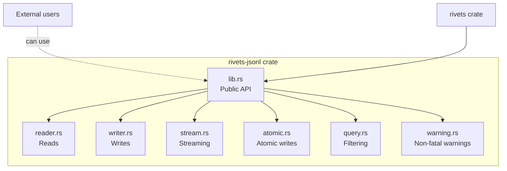
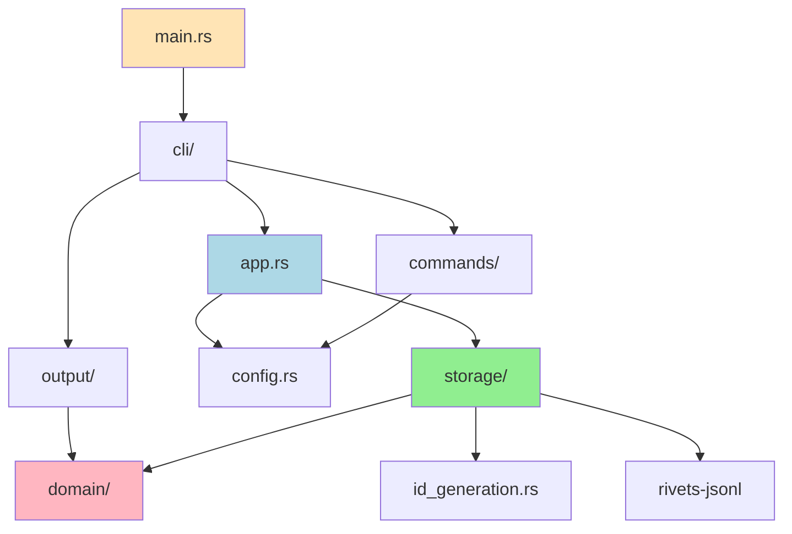
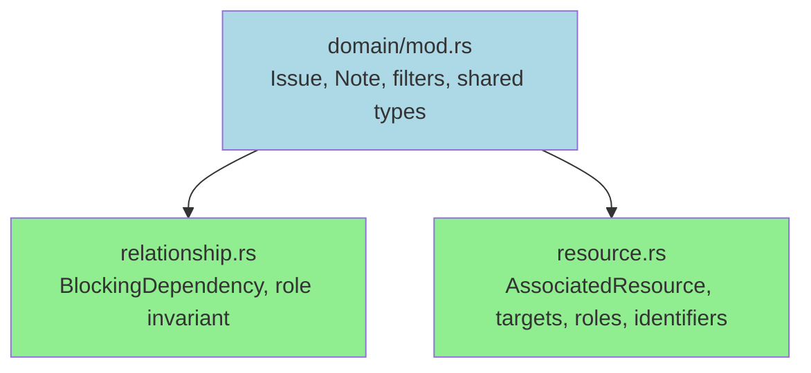
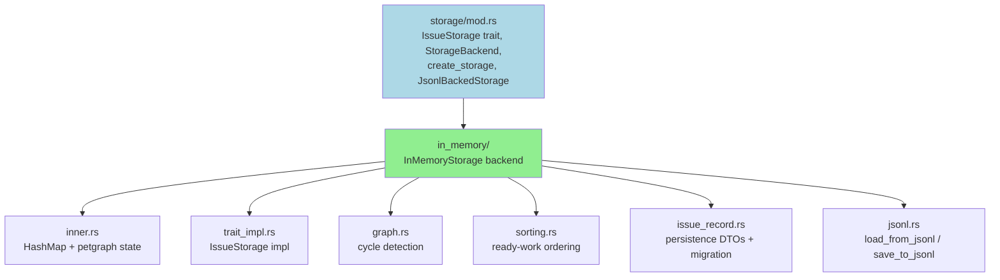
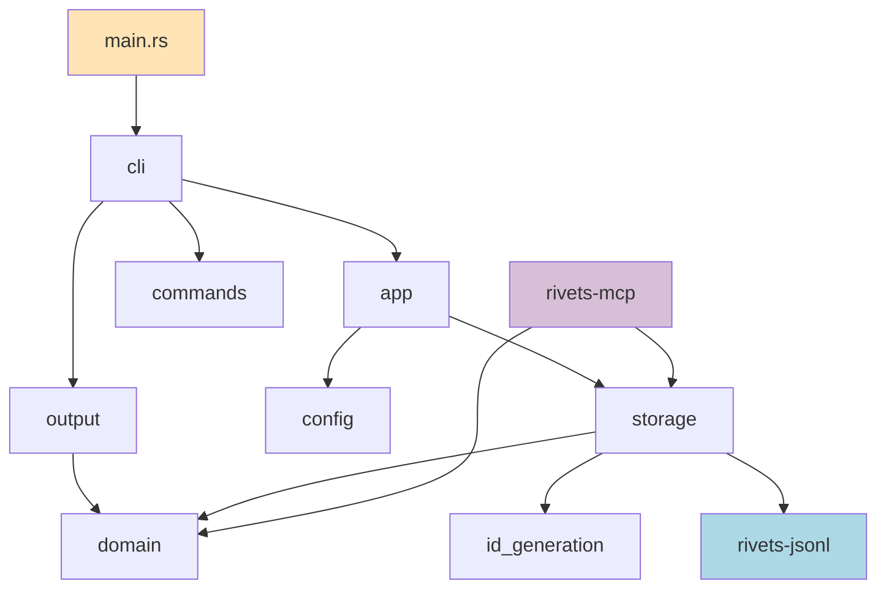

# Rivets Module Structure

## Workspace Organization

```
rivets/
├── Cargo.toml                     # Workspace definition
├── crates/
│   ├── rivets-jsonl/              # General-purpose JSONL library
│   │   ├── src/
│   │   │   ├── lib.rs             # Public API
│   │   │   ├── reader.rs          # JSONL reading operations
│   │   │   ├── writer.rs          # JSONL writing operations
│   │   │   ├── stream.rs          # Streaming operations
│   │   │   ├── atomic.rs          # Atomic write operations
│   │   │   ├── query.rs           # Query and filter operations
│   │   │   ├── warning.rs         # Non-fatal warning types
│   │   │   └── error.rs           # Error types
│   │   └── tests/
│   │       ├── resilient_loading.rs
│   │       └── roundtrip.rs
│   │
│   ├── rivets/                    # Core issue tracker + CLI (bin + lib)
│   │   ├── src/
│   │   │   ├── main.rs            # CLI entry point
│   │   │   ├── lib.rs             # Library root
│   │   │   ├── app.rs             # Application context for command execution
│   │   │   ├── config.rs          # Configuration management
│   │   │   ├── error.rs           # Error types
│   │   │   ├── id_generation.rs   # Hash-based ID generation
│   │   │   ├── workspace_lock.rs  # Durable Workspace mutation ownership
│   │   │   ├── cli/
│   │   │   │   ├── mod.rs         # Argument parsing and command dispatch
│   │   │   │   ├── args.rs        # Argument structs for all commands
│   │   │   │   ├── execute.rs     # Command execution logic
│   │   │   │   ├── types.rs       # Value enums and domain type conversions
│   │   │   │   └── validators.rs  # Input validation functions
│   │   │   ├── commands/
│   │   │   │   ├── mod.rs
│   │   │   │   └── init.rs        # `rivets init` implementation
│   │   │   ├── domain/
│   │   │   │   ├── mod.rs         # Issue, Note, filters, and shared domain types
│   │   │   │   └── resource.rs    # Associated Resource domain types
│   │   │   ├── output/
│   │   │   │   ├── mod.rs         # Output formatting for CLI commands
│   │   │   │   ├── color.rs       # Color and styling helpers
│   │   │   │   ├── json.rs        # JSON output formatting
│   │   │   │   └── tree.rs        # Dependency tree rendering
│   │   │   └── storage/
│   │   │       ├── mod.rs         # IssueStorage trait, backends, factory, JSONL guard
│   │   │       └── in_memory/
│   │   │           ├── mod.rs     # In-memory backend (HashMap + petgraph)
│   │   │           ├── inner.rs   # Core data structures
│   │   │           ├── trait_impl.rs  # IssueStorage implementation
│   │   │           ├── graph.rs   # Dependency graph operations
│   │   │           ├── sorting.rs # Ready-work sort policies
│   │   │           ├── issue_record.rs  # Persisted-record compatibility DTOs
│   │   │           └── jsonl.rs   # JSONL load/save for the backend
│   │   └── tests/
│   │       ├── cli_tests.rs
│   │       ├── init_integration.rs
│   │       ├── in_memory_storage.rs
│   │       ├── in_memory_resilient_loading.rs
│   │       └── common/
│   │
│   └── rivets-mcp/                # MCP server (bin + lib)
│       ├── src/
│       │   ├── main.rs            # Server entry point
│       │   ├── lib.rs             # Library root
│       │   ├── server.rs          # MCP server implementation
│       │   ├── tools.rs           # MCP tool implementations
│       │   ├── context.rs         # Workspace context management
│       │   ├── models.rs          # MCP models
│       │   └── error.rs           # Error types
│       └── tests/
│           └── integration.rs
│
├── docs/                          # Architecture, design, and agent docs
│
└── .rivets/                       # User workspace (created by init)
    ├── issues.jsonl               # Git-tracked source of truth
    ├── config.yaml
    ├── workspace.lock             # Persistent, ignored OS-lock sidecar
    └── .gitignore
```

> **Tethys** (code intelligence engine) has moved to its own repository and is
> no longer part of this workspace.

## Crate: rivets-jsonl

**Purpose**: General-purpose JSONL library for efficient reading, writing, and querying


```mermaid
graph TD
    subgraph "rivets-jsonl crate"
        Lib[lib.rs<br/>Public API]
        Reader[reader.rs<br/>Reads]
        Writer[writer.rs<br/>Writes]
        Stream[stream.rs<br/>Streaming]
        Atomic[atomic.rs<br/>Atomic writes]
        Query[query.rs<br/>Filtering]
        Warning[warning.rs<br/>Non-fatal warnings]

        Lib --> Reader
        Lib --> Writer
        Lib --> Stream
        Lib --> Atomic
        Lib --> Query
        Lib --> Warning
    end

    External[External users] -.can use.-> Lib
    Rivets[rivets crate] --> Lib
```

The resilient entry point used by the rivets storage layer is
`read_jsonl_resilient_with_line_numbers`, which returns successfully parsed
records alongside `Warning` values (from `warning.rs`) for lines it skipped.

### Design Goals

- **Generic**: Works with any serde-compatible type
- **Async**: Non-blocking I/O with tokio
- **Streaming**: Memory-efficient for large files
- **Atomic**: Safe writes via temp-file-then-rename
- **Standalone**: No rivets-specific dependencies

## Crate: rivets (Main Application)

### Dependency Graph


```mermaid
graph TD
    Main[main.rs] --> CLI[cli/]

    CLI --> App[app.rs]
    CLI --> Commands[commands/]
    CLI --> Output[output/]

    App --> Config[config.rs]
    App --> Storage[storage/]

    Commands --> Config
    Output --> Domain[domain/]

    Storage --> Domain
    Storage --> IDs[id_generation.rs]
    Storage --> JSONL[rivets-jsonl]

    style Main fill:#FFE4B5
    style App fill:#ADD8E6
    style Storage fill:#90EE90
    style Domain fill:#FFB6C1
```

### main.rs

CLI entry point. Initializes the `tracing` subscriber (controlled via
`RUST_LOG`), parses arguments with `Cli::parse_args()`, and dispatches through
`cli.execute()` on a current-thread tokio runtime.

### cli/

Argument parsing and command dispatch, split by responsibility:

- `args.rs` — clap argument structs for every subcommand
- `execute.rs` — command execution logic (create, list, show, update, close, dependencies, labels, resources, …)
- `types.rs` — CLI value enums and conversions into domain types
- `validators.rs` — input validation functions

### app.rs

Application context for CLI command execution: locates the Workspace and
constructs its storage. Read-only construction remains unlocked; mutation
construction owns `WorkspaceMutationLock` before configuration/storage load and
retains it for the App lifetime.

### workspace_lock.rs

Owns canonical Workspace identity and the persistent, nonblocking mutation
sidecar. `WorkspaceMutationLock::try_acquire` uses Rust's typed standard-library
file lock, distinguishes retryable contention from causal I/O, and releases on
guard drop without deleting the sidecar.

### commands/

Command implementations that do not go through storage-backed dispatch.
Currently holds `init.rs`, which creates the Workspace, empty lock sidecar, and
metadata ignore entry.

### domain/

**Responsibility**: Core business types and logic


```mermaid
graph TD
    ModRS[domain/mod.rs<br/>Issue, Note, filters, shared types] --> Relationship[relationship.rs<br/>BlockingDependency, role invariant]
    ModRS --> Resource[resource.rs<br/>AssociatedResource, targets, roles, identifiers]

    style ModRS fill:#ADD8E6
    style Relationship fill:#90EE90
    style Resource fill:#90EE90
```

#### domain/mod.rs

Central domain types include `IssueId`, `IssueStatus`, `IssueKind`,
`BlockingDependency`, `IssueFilter`, Notes, and the Issue aggregate.
`Dependency` / `DependencyType` remain compatibility record types only:

```rust
#[derive(Debug, Clone, PartialEq, Eq, Serialize)]
pub struct Note {
    content: String,
    created_at: DateTime<Utc>,
}

#[derive(Debug, Clone, PartialEq, Eq)]
pub struct NoteContent(String);

#[derive(Debug, Clone, Serialize)]
pub struct Issue {
    pub id: IssueId,
    pub title: String,
    pub description: String,
    pub status: IssueStatus,
    pub priority: u8,
    pub issue_kind: IssueKind,
    pub assignee: Option<String>,
    pub labels: Vec<String>,
    pub design: Option<String>,
    pub acceptance_criteria: Option<String>,
    pub(crate) notes: Vec<Note>,
    pub(crate) resources: Vec<AssociatedResource>,
    #[serde(skip)]
    pub(crate) next_resource_id: u64,
    #[serde(skip)]
    pub dependencies: Vec<Dependency>, // JSONL compatibility only
    pub created_at: DateTime<Utc>,
    pub updated_at: DateTime<Utc>,
    pub closed_at: Option<DateTime<Utc>>,
}

#[derive(Debug, Clone)]
pub struct NewIssue {
    pub title: String,
    pub description: String,
    pub priority: u8,
    pub issue_kind: IssueKind,
    pub assignee: Option<String>,
    pub labels: Vec<String>,
    pub design: Option<String>,
    pub acceptance_criteria: Option<String>,
    pub initial_note: Option<NoteContent>,
    pub prerequisites: Vec<IssueId>,
}

#[derive(Debug, Clone, Default)]
pub struct IssueUpdate {
    pub title: Option<String>,
    pub description: Option<String>,
    pub status: Option<IssueStatus>,
    pub priority: Option<u8>,
    pub issue_kind: Option<IssueKind>,
    pub assignee: Option<Option<String>>,
    pub design: Option<String>,
    pub acceptance_criteria: Option<String>,
    pub note: Option<NoteContent>,
    pub labels: Option<Vec<String>>,
}
```

`Issue` and `Note` intentionally do not implement `Deserialize`. JSONL loading
uses the compatibility `IssueRecord` DTO in `storage/in_memory/issue_record.rs`,
then converts validated records into the domain model.

#### domain/resource.rs

Associated Resource types: `AssociatedResource`, `NewResource`,
`ResourceTarget`/`WebUrl`, `ResourceRole`, `ResourceId`, `ResourceLabel`, and
the typed `ResourceError` enum covering every resource invariant violation.

### storage/

**Responsibility**: Storage abstraction and implementations


```mermaid
graph TD
    ModRS[storage/mod.rs<br/>IssueStorage trait, StorageBackend,<br/>create_storage, JsonlBackedStorage] --> InMem[in_memory/<br/>InMemoryStorage backend]

    InMem --> Inner[inner.rs<br/>HashMap + petgraph state]
    InMem --> TraitImpl[trait_impl.rs<br/>IssueStorage impl]
    InMem --> Graph[graph.rs<br/>cycle detection]
    InMem --> Sorting[sorting.rs<br/>ready-work ordering]
    InMem --> Record[issue_record.rs<br/>persistence DTOs + migration]
    InMem --> Jsonl[jsonl.rs<br/>load_from_jsonl / save_to_jsonl]

    style ModRS fill:#ADD8E6
    style InMem fill:#90EE90
```

#### storage/mod.rs

Defines the `IssueStorage` trait (CRUD, role-named Blocking Dependency
operations, labels, resources, queries, import/export, `save`, `reload`), the `StorageBackend` enum
(`InMemory`, `Jsonl(PathBuf)`, `PostgreSQL` placeholder), and the
`create_storage` factory.

It also contains `JsonlBackedStorage`, a wrapper that adds guarded file
persistence to the in-memory backend. It tracks the raw JSONL source with a
SHA-256 revision, reloads a completed external change before mutation, and
returns `StorageError::ExternalChange` if the source changes after mutation but
before save. After a resilient partial load, reads remain available but every
mutation and save fails with `StorageError::UnsafePartialLoad` (a typed
`PartialLoadError` carrying one `SkippedIssueRecordCause` per omitted record)
until the file is repaired.

#### storage/in_memory/

The only fully implemented backend. `inner.rs` holds issues in a `HashMap`
with a petgraph dependency graph; `issue_record.rs` is the compatibility
boundary that decodes persisted records, applies legacy migrations
(`issue_type` → `issue_kind`, `external_ref` → resource or migration Note),
and revalidates before anything reaches the domain; `jsonl.rs` performs
resilient loads (returning `LoadWarning`s) and atomic saves.

### output/

CLI output formatting: human-readable rendering with color support
(`color.rs`), machine-readable JSON (`json.rs`), and dependency tree rendering
(`tree.rs`).

### id_generation.rs

Hash-based ID generation: SHA-256 over issue content, base36-encoded with an
adaptive length and nonce-based collision retry, registered against all loaded
IDs to prevent collisions.

## Crate: rivets-mcp

**Purpose**: MCP server exposing rivets issue tracking to AI assistants.

| Module | Responsibility |
|--------|----------------|
| `server.rs` | MCP server implementation and protocol wiring |
| `tools.rs` | MCP tool implementations (create, list, show, update, …) |
| `context.rs` | Workspace context management |
| `models.rs` | MCP request/response models |
| `error.rs` | MCP error types; classifies storage errors via `StorageError::try_into_resource_error` |

## Testing Structure

```
crates/rivets/tests/
├── cli_tests.rs                    # End-to-end CLI tests
├── init_integration.rs             # `rivets init` integration tests
├── in_memory_storage.rs            # Storage backend behavior
├── in_memory_resilient_loading.rs  # Corrupted-file loading and warnings
└── common/                         # Shared test helpers

crates/rivets-jsonl/tests/
├── resilient_loading.rs
└── roundtrip.rs

crates/rivets-mcp/tests/
└── integration.rs
```

Unit tests live in `#[cfg(test)]` modules next to the code they cover.

## Import Relationships


```mermaid
graph TD
    Main[main.rs] --> CLI[cli]

    CLI --> App[app]
    CLI --> Commands[commands]
    CLI --> Output[output]

    App --> Config[config]
    App --> Storage[storage]

    Output --> Domain[domain]

    Storage --> Domain
    Storage --> IDs[id_generation]
    Storage --> JSONL[rivets-jsonl]

    MCP[rivets-mcp] --> Storage
    MCP --> Domain

    style Main fill:#FFE4B5
    style JSONL fill:#ADD8E6
    style MCP fill:#D8BFD8
```

**Key Design Principles**:

- **No circular dependencies**: Module graph is a DAG
- **Domain at core**: No dependencies on other modules
- **Storage abstraction**: Commands use the `IssueStorage` trait, not concrete types
- **External library**: rivets-jsonl is standalone and reusable
