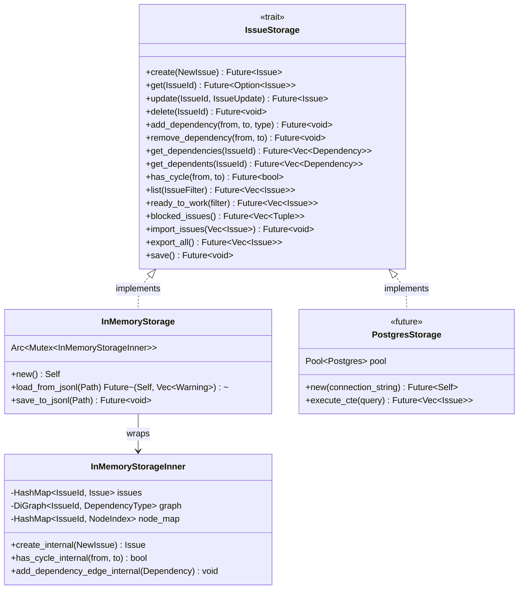
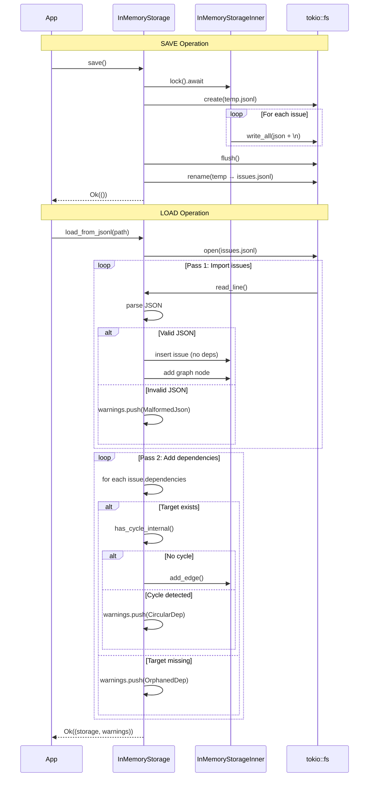
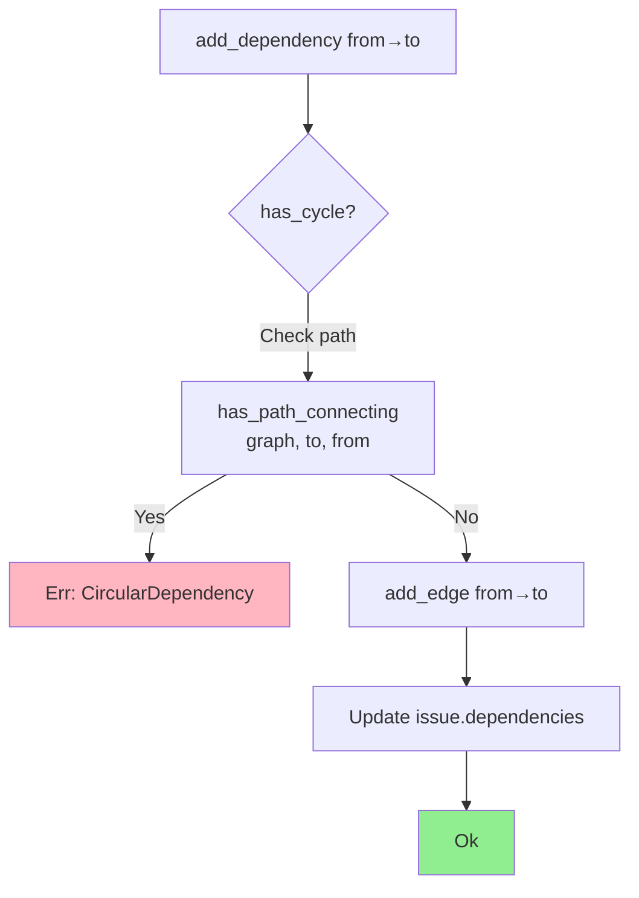
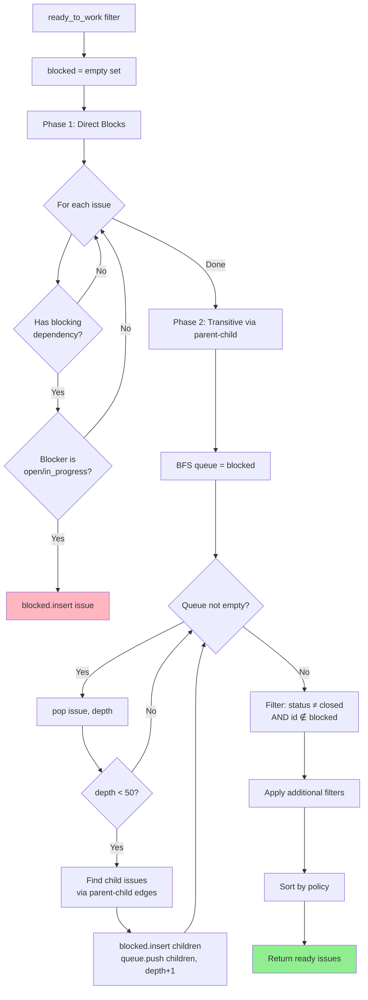
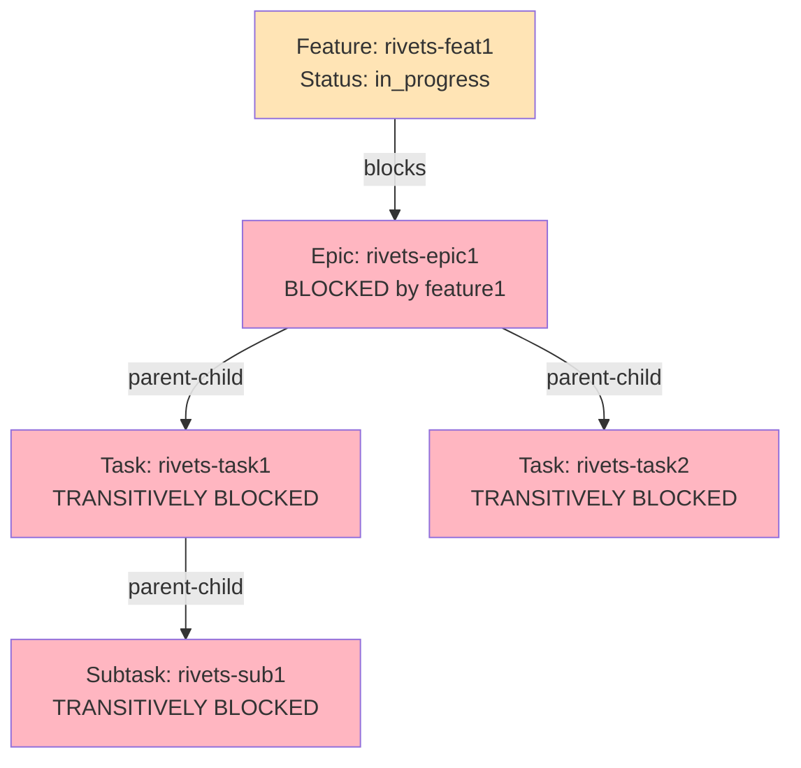
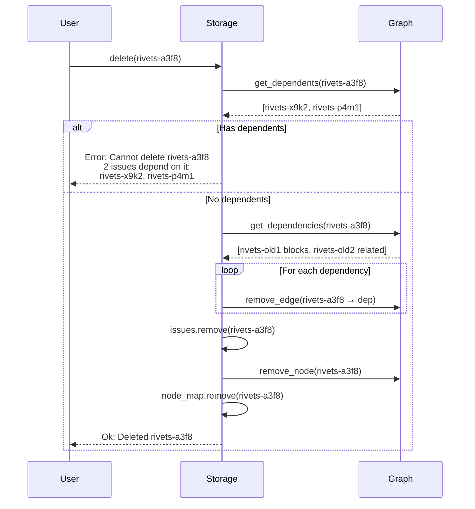
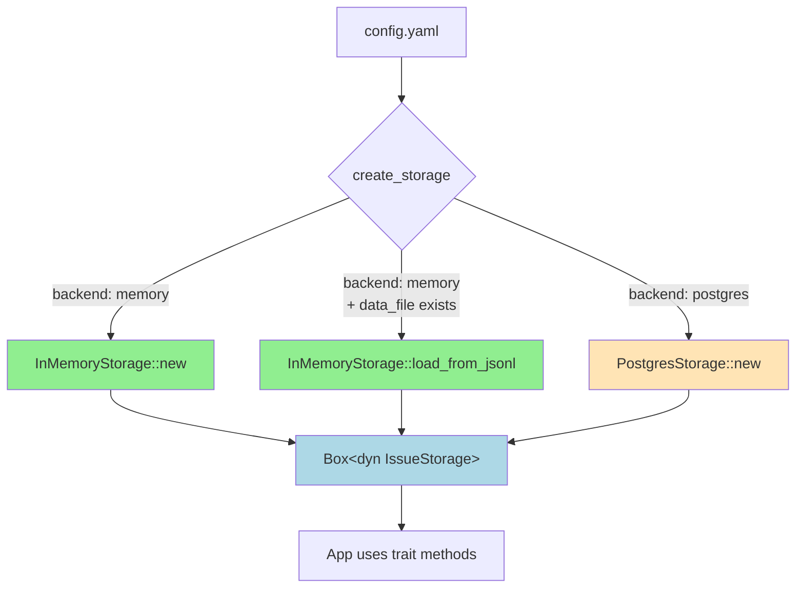

# Storage Layer Architecture

## Storage Trait Hierarchy



## InMemoryStorage Structure

```mermaid
graph TB
    subgraph "Thread-Safe Wrapper"
        Arc[Arc&lt;Mutex&lt;InMemoryStorageInner&gt;&gt;]
    end

    subgraph "Inner Storage (Private)"
        HashMap[HashMap&lt;IssueId, Issue&gt;<br/>Fast O(1) lookups]
        DiGraph[DiGraph&lt;IssueId, DependencyType&gt;<br/>Directed graph for dependencies]
        NodeMap[HashMap&lt;IssueId, NodeIndex&gt;<br/>ID to graph node mapping]
    end

    subgraph "Graph Structure"
        Node1((rivets-a3f8))
        Node2((rivets-x9k2))
        Node3((rivets-p4m1))

        Node1 -->|blocks| Node2
        Node1 -->|parent-child| Node3
    end

    Arc --> HashMap
    Arc --> DiGraph
    Arc --> NodeMap
    DiGraph -.represents.-> Node1
    DiGraph -.represents.-> Node2
    DiGraph -.represents.-> Node3

    style Arc fill:#FFE4B5
    style HashMap fill:#90EE90
    style DiGraph fill:#ADD8E6
    style NodeMap fill:#FFB6C1
```

### Data Structure Details

#### HashMap<IssueId, Issue>
- **Purpose**: Fast O(1) lookup by ID
- **Contains**: Full issue data (title, description, status, dependencies, etc.)
- **Memory**: ~1KB per issue average

#### DiGraph<IssueId, DependencyType>
- **Purpose**: Efficient graph algorithms (cycle detection, traversal)
- **Nodes**: Issue IDs
- **Edges**: Dependency type (blocks, related, parent-child, discovered-from)
- **Library**: petgraph 0.6
- **Algorithms**: `has_path_connecting`, `edges_directed`

#### HashMap<IssueId, NodeIndex>
- **Purpose**: Map issue IDs to graph node indices
- **Needed**: petgraph uses numeric NodeIndex, we use IssueId strings
- **Synchronization**: Must stay in sync with DiGraph and issues HashMap

## JSONL Persistence Layer



### JSONL Format Example

```json
{"id":"rivets-a3f8","title":"Implement feature X","description":"...","status":"open","priority":2,"issue_type":"feature","created_at":"2025-11-17T10:00:00Z","updated_at":"2025-11-17T10:00:00Z","dependencies":[{"depends_on_id":"rivets-x9k2","dep_type":"blocks"}],"labels":["backend","api"]}
{"id":"rivets-x9k2","title":"Fix bug Y","description":"...","status":"in_progress","priority":1,"issue_type":"bug","created_at":"2025-11-17T09:00:00Z","updated_at":"2025-11-17T11:00:00Z","dependencies":[],"labels":["urgent"]}
```

### Error Recovery Strategies

#### Malformed JSON Line
```
Line 42: Invalid JSON, skipping: expected ',' at line 1 column 234
Warning: Loaded with 1 errors. 99 issues imported.
```
- **Action**: Skip line, log warning, continue
- **Result**: Partial data loss (that one issue)
- **Recovery**: User can manually fix JSONL file

#### Orphaned Dependency
```
Issue rivets-a3f8 depends on rivets-MISSING (not found in file)
Warning: 1 orphaned dependencies skipped
```
- **Action**: Skip dependency edge, import issue without that dep
- **Result**: Issue exists but missing one dependency
- **Recovery**: Resilient to partial exports/imports

#### Circular Dependency
```
Cycle detected: rivets-a3f8 → rivets-x9k2 → rivets-a3f8
Warning: 1 circular dependencies skipped
```
- **Action**: Skip edge that would create cycle
- **Result**: Breaks cycle, maintains graph integrity
- **Prevention**: Runtime operations prevent cycle creation

## Cycle Detection Algorithm



### Implementation Details

```rust
async fn has_cycle(&self, from: &IssueId, to: &IssueId) -> Result<bool> {
    let inner = self.lock().await;

    // Get graph node indices
    let from_node = inner.node_map.get(from)
        .ok_or_else(|| Error::IssueNotFound(from.clone()))?;
    let to_node = inner.node_map.get(to)
        .ok_or_else(|| Error::IssueNotFound(to.clone()))?;

    // Check if path exists from 'to' back to 'from'
    // If adding edge from→to creates this path, we have a cycle
    Ok(petgraph::algo::has_path_connecting(
        &inner.graph,
        *to_node,      // Start at 'to'
        *from_node,    // Try to reach 'from'
        None           // No edge filter
    ))
}
```

**Time Complexity**: O(V + E) worst case (full graph traversal)
**Space Complexity**: O(V) for visited set
**Optimization**: Early termination when path found

## Ready Work Algorithm



### Blocking Propagation Example



**Result**: None of these issues appear in "ready work" because they're all blocked (directly or transitively)

## Delete Operation with Referential Integrity



### Safety Guarantees

1. **No orphaned dependents**: Cannot delete if other issues depend on it
2. **Clean outgoing deps**: Automatically removes all outgoing dependency edges
3. **Graph consistency**: Maintains sync between HashMap, DiGraph, and node_map
4. **Clear errors**: Lists all dependent issues preventing deletion

## Backend Factory Pattern



### Configuration Example

```yaml
# .rivets/config.yaml
issue-prefix: "rivets"

storage:
  backend: "memory"
  data_file: ".rivets/issues.jsonl"

  # Future Phase 3
  # backend: "postgres"
  # postgres:
  #   host: "localhost"
  #   port: 5432
  #   database: "rivets"
  #   user: "rivets"
```

## Performance Characteristics

| Operation | Time Complexity | Space Complexity | Notes |
|-----------|----------------|------------------|-------|
| create | O(1) | O(1) | HashMap insert + graph node |
| get | O(1) | O(1) | HashMap lookup |
| update | O(1) | O(1) | HashMap update |
| delete | O(D) | O(D) | D = number of dependencies |
| add_dependency | O(V + E) | O(V) | Cycle detection via path search |
| has_cycle | O(V + E) | O(V) | DFS/BFS traversal |
| list (no filter) | O(N) | O(N) | Iterate all issues |
| ready_to_work | O(V + E) | O(V) | BFS for transitive blocks |
| save_to_jsonl | O(N) | O(1) | Streaming write |
| load_from_jsonl | O(N * E) | O(N) | N issues, E edges per issue |

Where:
- V = number of vertices (issues)
- E = number of edges (dependencies)
- N = total issues
- D = dependencies per issue

## Memory Layout (1000 Issues)

```
Total: ~2-3 MB

- HashMap<IssueId, Issue>: ~1 MB
  └─ Issue struct: ~1 KB each
     ├─ Strings: title (50), description (200), notes (100)
     ├─ Timestamps: 24 bytes each
     ├─ Enums: 1 byte each
     └─ Vec<Dependency>: ~8 bytes per dep

- DiGraph: ~200 KB
  └─ Nodes: 1000 × 8 bytes (NodeIndex)
  └─ Edges: ~500 × 24 bytes (from, to, weight)

- HashMap<IssueId, NodeIndex>: ~64 KB
  └─ 1000 entries × 64 bytes (String + u64)

- Arc + Mutex overhead: ~100 bytes
```

**Scales linearly** with number of issues and dependencies.
