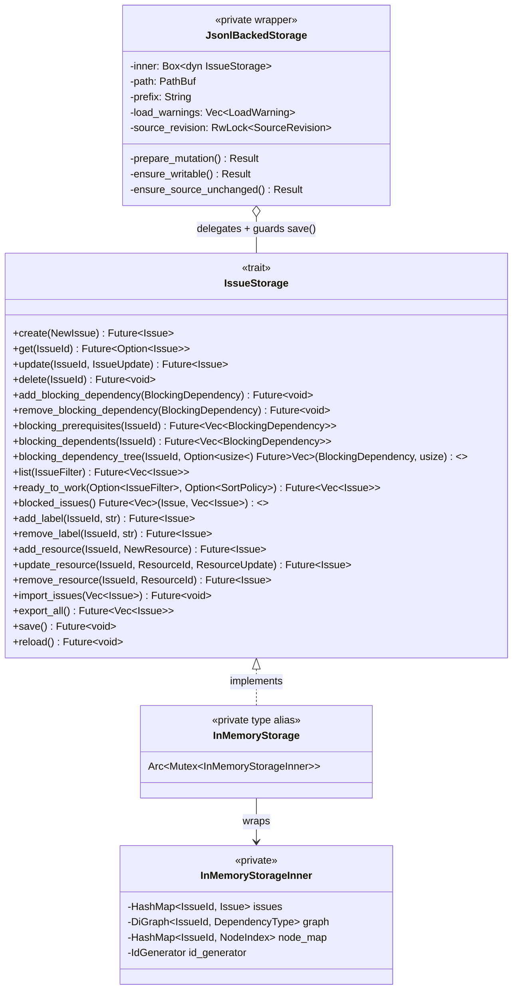
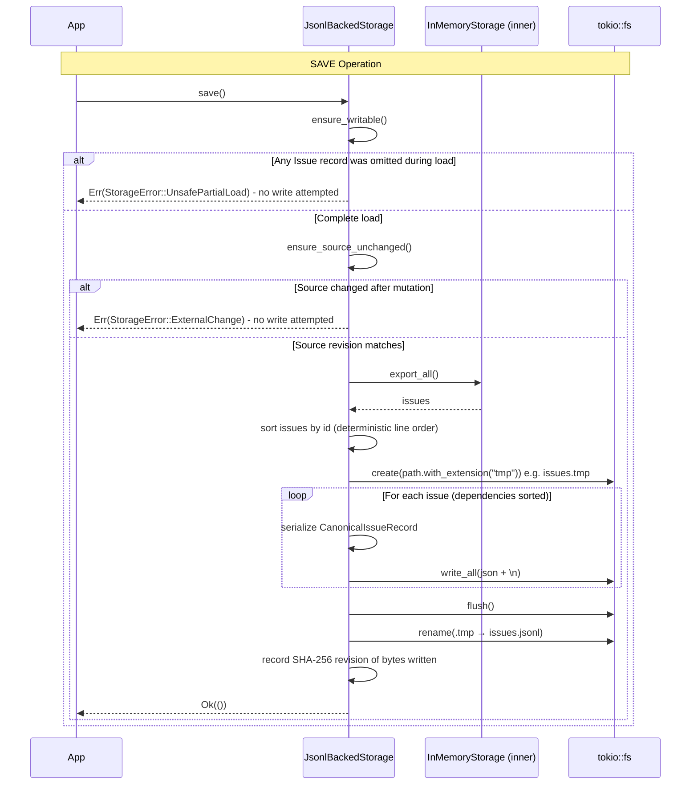
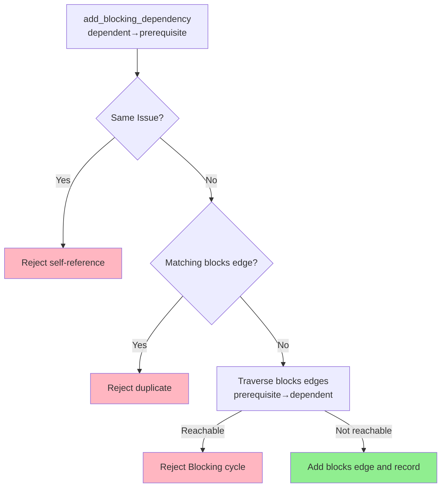
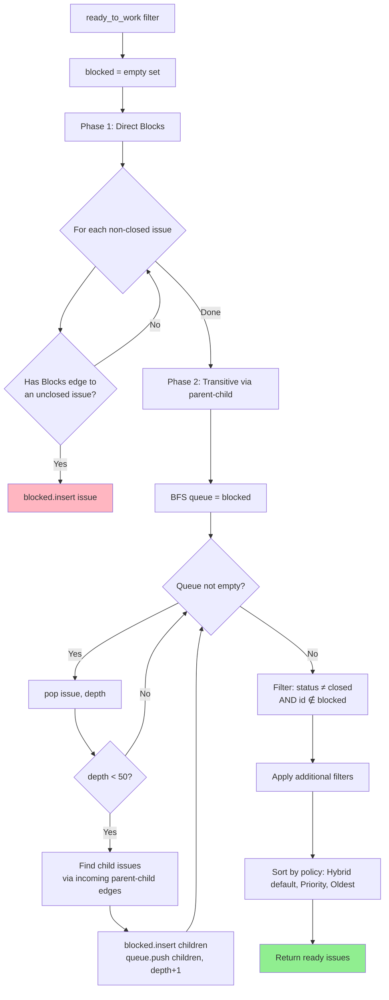
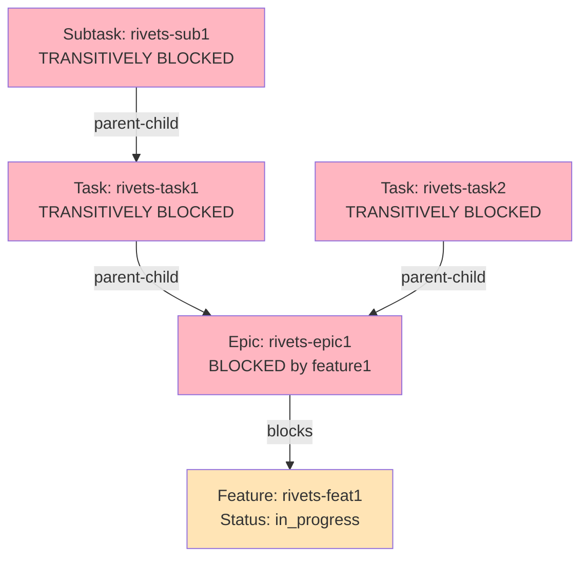
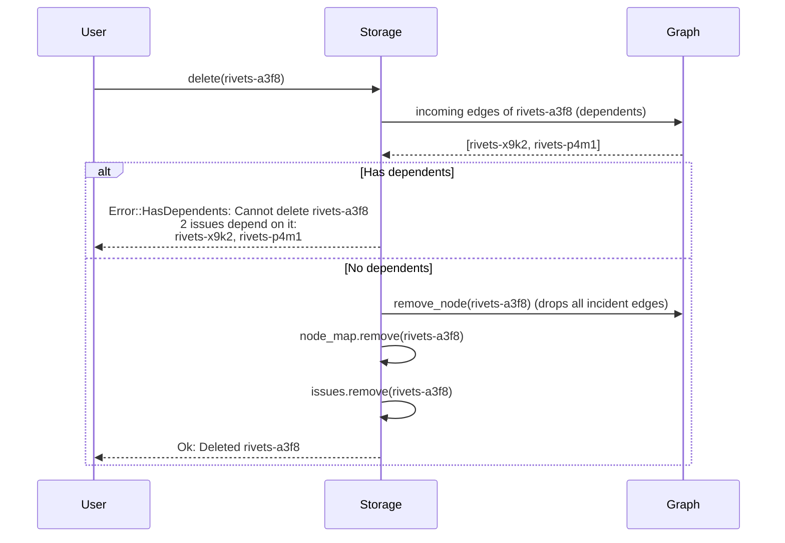
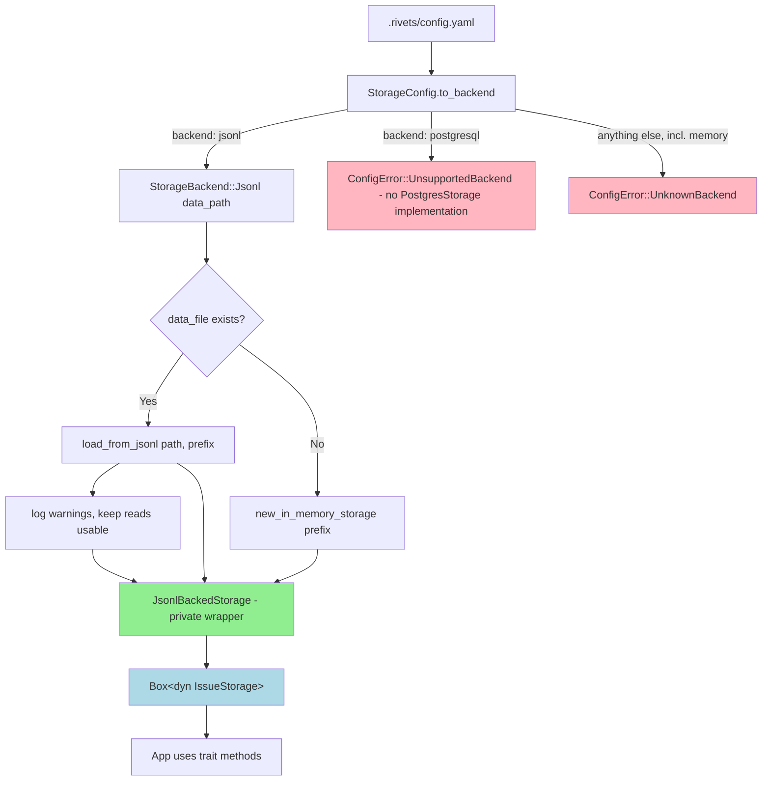

# Storage Layer Architecture

Rivets persists issues to a JSONL file (`.rivets/issues.jsonl` by default) and serves all reads and mutations from an in-memory engine that holds the full dataset plus a dependency graph. The JSONL file is the single persisted source of truth; `jsonl` is the default (and only implemented) persisted backend. PostgreSQL exists only as a config/enum placeholder that returns "unsupported" — there is no `PostgresStorage` implementation.

## Storage Trait Hierarchy


```mermaid
classDiagram
    class IssueStorage {
        <<trait>>
        +create(NewIssue) Future~Issue~
        +get(IssueId) Future~Option~Issue~~
        +update(IssueId, IssueUpdate) Future~Issue~
        +delete(IssueId) Future~void~
        +add_blocking_dependency(BlockingDependency) Future~void~
        +remove_blocking_dependency(BlockingDependency) Future~void~
        +blocking_prerequisites(IssueId) Future~Vec~BlockingDependency~~
        +blocking_dependents(IssueId) Future~Vec~BlockingDependency~~
        +blocking_dependency_tree(IssueId, Option~usize~) Future~Vec~(BlockingDependency, usize)~~
        +list(IssueFilter) Future~Vec~Issue~~
        +ready_to_work(Option~IssueFilter~, Option~SortPolicy~) Future~Vec~Issue~~
        +blocked_issues() Future~Vec~(Issue, Vec~Issue~)~~
        +add_label(IssueId, str) Future~Issue~
        +remove_label(IssueId, str) Future~Issue~
        +add_resource(IssueId, NewResource) Future~Issue~
        +update_resource(IssueId, ResourceId, ResourceUpdate) Future~Issue~
        +remove_resource(IssueId, ResourceId) Future~Issue~
        +import_issues(Vec~Issue~) Future~void~
        +export_all() Future~Vec~Issue~~
        +save() Future~void~
        +reload() Future~void~
    }

    class InMemoryStorage {
        <<private type alias>>
        Arc~Mutex~InMemoryStorageInner~~
    }

    class InMemoryStorageInner {
        <<private>>
        -HashMap~IssueId, Issue~ issues
        -DiGraph~IssueId, DependencyType~ graph
        -HashMap~IssueId, NodeIndex~ node_map
        -IdGenerator id_generator
    }

    class JsonlBackedStorage {
        <<private wrapper>>
        -inner: Box~dyn IssueStorage~
        -path: PathBuf
        -prefix: String
        -load_warnings: Vec~LoadWarning~
        -source_revision: RwLock~SourceRevision~
        -prepare_mutation() Result
        -ensure_writable() Result
        -ensure_source_unchanged() Result
    }

    IssueStorage <|.. InMemoryStorage : implements
    InMemoryStorage --> InMemoryStorageInner : wraps
    JsonlBackedStorage o-- IssueStorage : delegates + guards save()
```

### Public and private seams

- **Public API** (`rivets::storage`): the `IssueStorage` trait, the `StorageBackend` enum, the `create_storage(backend, prefix)` factory, and the `in_memory` module's free functions `new_in_memory_storage(prefix)`, `load_from_jsonl(path, prefix)`, `save_to_jsonl(storage, path)`, plus `LoadWarning` and `MigrationField`. `MockStorage` (a stateless test double returning hardcoded data for `test-1`) is available under `cfg(test)` or the `test-util` feature.
- **Private implementation**: `InMemoryStorage` is a `pub(crate)` type alias (`Arc<Mutex<InMemoryStorageInner>>`), not a public struct; there is no public `InMemoryStorage::new()` / `load_from_jsonl()` / `save_to_jsonl()` method pair. The persistence guard `JsonlBackedStorage`, the inner storage struct, the `IssueRecord`/`CanonicalIssueRecord` DTOs, and the graph helpers (`has_cycle_impl`, `find_blocked_issues`) are all private.
- **No `PostgresStorage`**: the `StorageBackend::PostgreSQL(String)` enum variant is a placeholder (`#[allow(dead_code)]`); both config resolution (`StorageConfig::to_backend`) and `create_storage` reject it with `ConfigError::UnsupportedBackend("PostgreSQL")`.

## InMemoryStorage Structure

```mermaid
graph TB
    subgraph "Thread-Safe Wrapper"
        Arc[Arc&lt;Mutex&lt;InMemoryStorageInner&gt;&gt;]
    end

    subgraph "Inner Storage (Private)"
        HashMap[HashMap&lt;IssueId, Issue&gt;<br/>Fast O(1) lookups]
        DiGraph[DiGraph&lt;IssueId, DependencyType&gt;<br/>Directed graph for dependencies]
        NodeMap[HashMap&lt;IssueId, NodeIndex&gt;<br/>ID to graph node mapping]
        IdGen[IdGenerator<br/>collision-resistant ID set]
    end

    subgraph "Graph Structure"
        Node1((rivets-a3f8))
        Node2((rivets-x9k2))
        Node3((rivets-p4m1))

        Node1 -->|blocks| Node2
        Node1 -->|parent-child| Node3
    end

    Arc --> HashMap
    Arc --> DiGraph
    Arc --> NodeMap
    Arc --> IdGen
    DiGraph -.represents.-> Node1
    DiGraph -.represents.-> Node2
    DiGraph -.represents.-> Node3

    style Arc fill:#FFE4B5
    style HashMap fill:#90EE90
    style DiGraph fill:#ADD8E6
    style NodeMap fill:#FFB6C1
    style IdGen fill:#DDA0DD
```

The in-memory engine is the runtime engine for every backend, including the persisted JSONL backend. It is also what tests and library callers get from `create_storage(StorageBackend::InMemory, prefix)` — ephemeral, lost on process exit, with `save()`/`reload()` as no-ops. There is no `memory` value in the config vocabulary: `.rivets/config.yaml` selects the persisted backend (`jsonl` or the unsupported placeholder `postgresql`), not the in-memory runtime.

### Data Structure Details

#### HashMap<IssueId, Issue>
- **Purpose**: Fast O(1) lookup by ID
- **Contains**: Full Issue data plus compatibility-only relationship records used by JSONL persistence.
- **Note**: The graph is the source of truth for runtime relationship queries. Canonical Blocking operations update only the matching `blocks` record. Orphaned or invalid legacy records remain a compatibility-loader concern until `rivets-vio8`.

#### DiGraph<IssueId, DependencyType>
- **Purpose**: Shared compatibility infrastructure while each relationship kind gains a typed interface
- **Nodes**: Issue IDs
- **Edges**: Legacy persisted kind weights
- **Direction convention**: Blocking edges are dependent -> prerequisite
- **Blocking algorithms**: edge-kind-filtered duplicate lookup, reachability, deterministic BFS tree, incoming/outgoing role queries
- **Library**: petgraph 0.6

#### HashMap<IssueId, NodeIndex>
- **Purpose**: Map issue IDs to graph node indices
- **Needed**: petgraph uses numeric NodeIndex, we use IssueId strings
- **Synchronization**: Must stay in sync with DiGraph and issues HashMap

## JSONL Persistence Layer

The persisted backend is `StorageBackend::Jsonl(path)`: the factory loads the file into the in-memory engine and wraps it in the private `JsonlBackedStorage`. The wrapper tracks the raw source revision with SHA-256, reloads a completed external change before mutation, rejects a post-mutation external change before save, and retains the partial-load guard (see Error Recovery below).


```mermaid
sequenceDiagram
    participant App
    participant Storage as JsonlBackedStorage
    participant Inner as InMemoryStorage (inner)
    participant FS as tokio::fs

    Note over App,FS: SAVE Operation

    App->>Storage: save()
    Storage->>Storage: ensure_writable()
    alt Any Issue record was omitted during load
        Storage-->>App: Err(StorageError::UnsafePartialLoad) - no write attempted
    else Complete load
        Storage->>Storage: ensure_source_unchanged()
        alt Source changed after mutation
            Storage-->>App: Err(StorageError::ExternalChange) - no write attempted
        else Source revision matches
            Storage->>Inner: export_all()
            Inner-->>Storage: issues
            Storage->>Storage: sort issues by id (deterministic line order)
            Storage->>FS: create(path.with_extension("tmp")) e.g. issues.tmp
            loop For each issue (dependencies sorted)
                Storage->>Storage: serialize CanonicalIssueRecord
                Storage->>FS: write_all(json + \n)
            end
            Storage->>FS: flush()
            Storage->>FS: rename(.tmp → issues.jsonl)
            Storage->>Storage: record SHA-256 revision of bytes written
            Storage-->>App: Ok(())
        end
    end
```

The write is atomic on POSIX: content goes to a temporary sibling whose extension is replaced with `.tmp` (`issues.jsonl` becomes `issues.tmp`), which is then renamed over the target. A crash or interruption leaves the original file untouched. Issues are sorted by ID (and each issue's dependencies sorted) before serialization so unchanged data produces byte-identical, reviewable diffs in git.

```mermaid
sequenceDiagram
    participant App
    participant Factory as create_storage(Jsonl(path))
    participant Parser as resilient JSONL reader
    participant Record as IssueRecord conversion
    participant Inner as InMemoryStorageInner

    Note over App,Inner: LOAD Operation (load_from_jsonl)

    App->>Factory: create_storage(StorageBackend::Jsonl(path))
    Factory->>Parser: read lines of issues.jsonl

    rect rgb(240,248,255)
    Note over Parser,Record: Stage 1 - Parse compatibility records
    loop Each line
        Parser->>Parser: decode persisted IssueRecord DTO (not a domain Issue)
        alt Malformed JSON / unparseable line
            Parser->>Parser: LoadWarning::MalformedJson - line skipped
        else Valid record
            Parser-->>Record: IssueRecord
            Record->>Record: into_domain(): convert + validate + migrate
            alt canonical issue_kind vs legacy issue_type conflict
                Record->>Record: LoadWarning::MigrationConflict - canonical wins, issue loads
            else Invalid issue data
                Record->>Record: LoadWarning::InvalidIssueData - record omitted
            else Invalid Associated Resource
                Record->>Record: LoadWarning::InvalidResourceData - record omitted
            else Valid
                Record-->>Inner: domain Issue (with dependencies attached)
            end
        end
    end
    end

    rect rgb(240,248,255)
    Note over Factory,Inner: Stage 2 - Import issues
    loop Each converted Issue
        Inner->>Inner: graph.add_node(id)
        Inner->>Inner: node_map.insert(id)
        Inner->>Inner: issues.insert(id)
        Inner->>Inner: id_generator.register_id(id)
    end
    end

    rect rgb(240,248,255)
    Note over Factory,Inner: Stage 3 - Rebuild relationships
    loop Each issue's dependencies
        alt Target not in node_map
            Inner->>Inner: LoadWarning::OrphanedDependency - edge skipped
        else has_cycle_impl detects a cycle
            Inner->>Inner: LoadWarning::CircularDependency - edge skipped
        else
            Inner->>Inner: graph.add_edge(from, to, dep_type)
        end
    end
    end

    Inner-->>Factory: (Box&lt;dyn IssueStorage&gt;, warnings)
    Factory->>Factory: log warnings and wrap storage in JsonlBackedStorage
    Factory-->>App: Ok(Box&lt;dyn IssueStorage&gt;)
```

The three stages never interleave: parsing and validation complete for every line before any issue is inserted, and all issues are inserted before any dependency edge is rebuilt. This guarantees that a dependency whose target appears later in the file still resolves, and that cycle checks run against the complete node set.

### JSONL Format Example

Each line is a canonical record written by `CanonicalIssueRecord` (the persisted DTO, distinct from the domain `Issue`):

```json
{"id":"rivets-014n","title":"Implement feature X","description":"...","status":"open","priority":2,"issue_kind":"feature","assignee":null,"labels":["backend","api"],"design":null,"acceptance_criteria":null,"notes":[],"resources":[],"dependencies":[{"depends_on_id":"rivets-x9k2","dep_type":"blocks"}],"created_at":"2025-11-17T10:00:00Z","updated_at":"2025-11-17T10:00:00Z","closed_at":null}
{"id":"rivets-x9k2","title":"Fix bug Y","description":"...","status":"in_progress","priority":1,"issue_kind":"bug","assignee":"alice","labels":["urgent"],"design":null,"acceptance_criteria":null,"notes":[],"resources":[],"dependencies":[],"created_at":"2025-11-17T09:00:00Z","updated_at":"2025-11-17T11:00:00Z","closed_at":null}
```

- `notes` and `resources` are ordered collections. `next_resource_id` is omitted while its value is the default `1`; after any resource ID is allocated it remains serialized even if all resources are later removed.
- On read, two legacy fields are accepted and never written back: `issue_type` (migration alias for `issue_kind`) and `external_ref` (migrated to a Reference resource or a migration Note).
- Issue IDs are `{prefix}-{adaptive base36 hash}`; the hash inputs include content plus timestamp/nonce material, so IDs are not purely content-addressed.

### Error Recovery Strategies

The loader is resilient: a bad line never aborts the whole load. Every problem becomes a typed `LoadWarning` and the affected record or edge is skipped. Reads are served from the successfully loaded issues; the warnings are returned alongside the storage.

#### Durable Workspace Mutation Ownership

- **Sidecar**: `.rivets/workspace.lock` is persistent and ignored. Its file handle owns a standard-library nonblocking exclusive lock; file existence is not ownership.
- **Scope**: existing-Workspace CLI and MCP mutations acquire before storage load/reload and hold through validation, mutation, save, and save-failure recovery.
- **Contention**: `WorkspaceBusy` is typed and retryable; no Issue bytes are read for authoritative mutation or written by the contender.
- **Independence and release**: canonical Workspace roots use distinct sidecars; dropping or terminating the holder releases the OS lock without deleting the file.

#### Skipped Issue Record
```
Line 42: Invalid JSON, skipping: expected ',' at line 1 column 234
Warning: Loaded with 1 errors. 99 issues available for read-only access.
```
- **Trigger**: Malformed JSON, an unparseable line, Issue data that fails domain validation (`InvalidIssueData`), or an invalid Associated Resource (`InvalidResourceData`). These omit an entire Issue record.
- **Action**: The JSONL-backed wrapper (`JsonlBackedStorage`) keeps reads available, but `ensure_writable()` rejects every mutation and `save()` with `StorageError::UnsafePartialLoad` before any state change — an incomplete in-memory representation can never replace the source file.
- **Result**: The original JSONL bytes remain unchanged rather than replacing the skipped record
- **Recovery**: Manually repair the JSONL file, then restart or call `reload()`; there is no implicit force-repair path

#### External Source Change

- **Before mutation**: a changed SHA-256 source revision triggers `reload()` while the caller still holds the storage write lock; the mutation then runs against the latest complete state.
- **After mutation, before save**: a changed revision returns typed `StorageError::ExternalChange` before the temporary output is opened. MCP save recovery reloads the external state, and the source bytes remain unchanged.
- **Scope**: source revisions protect completed non-cooperating edits; the durable Workspace sidecar additionally serializes cooperating CLI/MCP load→mutate→save transactions.

#### Migration Conflict (warning-only)
```
Line 12: Issue rivets-a3f8 has legacy field issue_type conflicting with canonical issue_kind
```
- **Trigger**: A record carries both `issue_kind` and legacy `issue_type`, and they disagree.
- **Action**: The canonical field wins; the issue loads normally with a `LoadWarning::MigrationConflict`.
- **Note**: Unlike record-omitting warnings, migration conflicts never trigger `UnsafePartialLoad`.

#### Orphaned Dependency
```
Issue rivets-a3f8 depends on rivets-MISSING (not found in file)
Warning: 1 orphaned dependencies skipped
```
- **Action**: Skip the runtime graph edge; retain the dependency entry in the loaded Issue's persistence vector.
- **Result**: Runtime relationship queries omit the dependency, but a later save serializes the retained entry, so the warning recurs on reload.
- **Recovery**: Repair or remove the orphaned entry in the JSONL source.

#### Circular Dependency
```
Cycle detected: rivets-a3f8 → rivets-x9k2 → rivets-a3f8
Warning: 1 circular dependencies skipped
```
- **Action**: Skip the cycle-forming runtime graph edge; retain the dependency entry in the loaded Issue's persistence vector.
- **Result**: The runtime graph remains acyclic, but a later save serializes the retained entry, so the warning recurs on reload.
- **Prevention**: Runtime dependency operations reject cycle creation before mutation.

## Blocking Cycle Detection

Blocking cycle checks traverse only edges whose persisted kind is `blocks`.
Starting at the proposed prerequisite, storage performs reachability toward the
proposed dependent. Reaching the dependent rejects the new edge. Related,
Parentage, and Discovery records cannot create or suppress a Blocking cycle.


```mermaid
graph TD
    Start[add_blocking_dependency<br/>dependent→prerequisite] --> Self{Same Issue?}
    Self -->|Yes| RejectSelf[Reject self-reference]
    Self -->|No| Duplicate{Matching blocks edge?}
    Duplicate -->|Yes| RejectDuplicate[Reject duplicate]
    Duplicate -->|No| Reach[Traverse blocks edges<br/>prerequisite→dependent]
    Reach -->|Reachable| RejectCycle[Reject Blocking cycle]
    Reach -->|Not reachable| Add[Add blocks edge and record]

    style RejectSelf fill:#FFB6C1
    style RejectDuplicate fill:#FFB6C1
    style RejectCycle fill:#FFB6C1
    style Add fill:#90EE90
```

The corresponding tree query is deterministic breadth-first traversal over
Blocking edges only. Each result carries explicit dependent and prerequisite
identifiers plus one-based depth.
**Time Complexity**: O(V + E) over the Blocking-only projection
**Space Complexity**: O(V) for the visited set
**Optimization**: Early termination when the dependent is reached

## Ready Work Algorithm


```mermaid
graph TD
    Start[ready_to_work filter] --> Init[blocked = empty set]

    Init --> Phase1[Phase 1: Direct Blocks]
    Phase1 --> Loop1{For each non-closed issue}
    Loop1 --> Check1{Has Blocks edge to<br/>an unclosed issue?}
    Check1 -->|Yes| AddBlocked[blocked.insert issue]
    Check1 -->|No| Loop1
    Loop1 -->|Done| Phase2

    Phase2[Phase 2: Transitive via parent-child] --> BFS[BFS queue = blocked]
    BFS --> Loop2{Queue not empty?}
    Loop2 -->|Yes| Pop[pop issue, depth]
    Pop --> DepthCheck{depth < 50?}
    DepthCheck -->|Yes| Children[Find child issues<br/>via incoming parent-child edges]
    Children --> AddChildren[blocked.insert children<br/>queue.push children, depth+1]
    AddChildren --> Loop2
    DepthCheck -->|No| Loop2
    Loop2 -->|No| Filter

    Filter[Filter: status ≠ closed<br/>AND id ∉ blocked] --> ApplyFilter[Apply additional filters]
    ApplyFilter --> Sort[Sort by policy: Hybrid default, Priority, Oldest]
    Sort --> Result[Return ready issues]

    style AddBlocked fill:#FFB6C1
    style Result fill:#90EE90
```

Blocking is entirely graph-derived: Phase 1 collects issues with a `Blocks` edge to any unclosed issue, and Phase 2 propagates through parent-child edges (children of a blocked parent are blocked) up to a BFS depth of 50. The legacy `blocked` status value still exists in the domain for compatibility, but `ready_to_work` and `blocked_issues` never consult it — only graph edges decide blocking.

### Blocking Propagation Example


```mermaid
graph TD
    Task1[Task: rivets-task1<br/>TRANSITIVELY BLOCKED] -->|parent-child| Epic[Epic: rivets-epic1<br/>BLOCKED by feature1]
    Task2[Task: rivets-task2<br/>TRANSITIVELY BLOCKED] -->|parent-child| Epic
    Subtask1[Subtask: rivets-sub1<br/>TRANSITIVELY BLOCKED] -->|parent-child| Task1

    Epic -->|blocks| Feature1[Feature: rivets-feat1<br/>Status: in_progress]

    style Epic fill:#FFB6C1
    style Task1 fill:#FFB6C1
    style Task2 fill:#FFB6C1
    style Subtask1 fill:#FFB6C1
    style Feature1 fill:#FFE4B5
```

**Result**: None of these issues appear in "ready work" because they're all blocked (directly or transitively)

## Delete Operation with Referential Integrity


```mermaid
sequenceDiagram
    participant User
    participant Storage
    participant Graph

    User->>Storage: delete(rivets-a3f8)
    Storage->>Graph: incoming edges of rivets-a3f8 (dependents)
    Graph-->>Storage: [rivets-x9k2, rivets-p4m1]

    alt Has dependents
        Storage-->>User: Error::HasDependents: Cannot delete rivets-a3f8<br/>2 issues depend on it:<br/>rivets-x9k2, rivets-p4m1
    else No dependents
        Storage->>Graph: remove_node(rivets-a3f8) (drops all incident edges)
        Storage->>Storage: node_map.remove(rivets-a3f8)
        Storage->>Storage: issues.remove(rivets-a3f8)
        Storage-->>User: Ok: Deleted rivets-a3f8
    end
```

### Safety Guarantees

1. **No orphaned dependents**: Cannot delete if other issues depend on it
2. **Clean outgoing deps**: petgraph's `remove_node` removes all incident edges, so outgoing dependencies disappear with the node
3. **Graph consistency**: Maintains sync between HashMap, DiGraph, and node_map
4. **Clear errors**: Lists all dependent issues preventing deletion

## Backend Factory Pattern

`.rivets/config.yaml` is the single configuration source — there is no layering or environment merge. `App::from_directory(working_dir)` resolves it through `StorageConfig::to_backend(root_dir)`, which validates that `data_file` is a relative path without parent traversal, then hands the resulting `StorageBackend` to `create_storage`.


```mermaid
graph TD
    Config[.rivets/config.yaml] --> Parse[StorageConfig.to_backend]

    Parse -->|backend: jsonl| Jsonl[StorageBackend::Jsonl data_path]

    Jsonl --> Exists{data_file exists?}
    Exists -->|Yes| Load[load_from_jsonl path, prefix]
    Exists -->|No| Empty[new_in_memory_storage prefix]
    Load --> Warnings[log warnings, keep reads usable]
    Load --> Wrap
    Empty --> Wrap
    Warnings --> Wrap[JsonlBackedStorage - private wrapper]
    Wrap --> Box[Box&lt;dyn IssueStorage&gt;]

    Parse -->|backend: postgresql| Unsupported[ConfigError::UnsupportedBackend - no PostgresStorage implementation]
    Parse -->|anything else, incl. memory| Unknown[ConfigError::UnknownBackend]

    Box --> App[App uses trait methods]

    style Wrap fill:#90EE90
    style Unsupported fill:#FFB6C1
    style Unknown fill:#FFB6C1
    style Box fill:#ADD8E6
```

### Configuration Example

```yaml
# .rivets/config.yaml
issue-prefix: rivets

storage:
  backend: jsonl
  data_file: .rivets/issues.jsonl
```

### Backend Availability

| Config value | Enum variant | Availability |
|--------------|--------------|--------------|
| `jsonl` | `StorageBackend::Jsonl(PathBuf)` | **Implemented** (default; `DEFAULT_BACKEND = "jsonl"`). In-memory engine wrapped in the private `JsonlBackedStorage` guard. |
| `postgresql` | `StorageBackend::PostgreSQL(String)` | **Placeholder only.** Recognized but rejected with `ConfigError::UnsupportedBackend("PostgreSQL")` at both config resolution and `create_storage`. No `PostgresStorage` type exists. |
| anything else (e.g. `memory`) | — | `ConfigError::UnknownBackend`. There is no `memory` config value. |

The `StorageBackend::InMemory` variant exists for library/test use (`create_storage(StorageBackend::InMemory, prefix)`); it has no config string and no persistence.

## Performance Characteristics

| Operation | Time Complexity | Space Complexity | Notes |
|-----------|----------------|------------------|-------|
| create | O(1) | O(1) | HashMap insert + graph node |
| get | O(1) | O(1) | HashMap lookup |
| update | O(1) | O(1) | HashMap update |
| delete | O(D) | O(D) | D = number of dependents checked |
| add/remove Blocking Dependency | O(outdegree) plus O(V + E) cycle validation on add | O(V) | Only Blocking edges participate |
| Blocking prerequisite tree | O(V + E) | O(V) | Deterministic BFS over Blocking edges |
| list (no filter) | O(N) | O(N) | Iterate all issues |
| ready_to_work | O(V + E) | O(V) | BFS for transitive blocks |
| blocked_issues | O(V + E) | O(V) | Edge scan for direct blockers |
| save_to_jsonl | O(N log N) | O(N) | Export, sort, streaming write, atomic rename |
| load_from_jsonl | O(N + E·(V+E)) worst case | O(N) | Parse all lines, import, per-edge cycle checks |

Where:
- V = number of vertices (issues)
- E = number of edges (dependencies)
- N = total issues
- D = dependencies per issue

These are asymptotic analyses of the algorithms, not benchmark measurements.

## Memory Layout

The in-memory engine holds the entire dataset:

```
- HashMap<IssueId, Issue>: dominates memory
  └─ Issue struct per record
     ├─ Strings: title, description, Note content, resource targets
     ├─ Enums: status, issue kind, dependency types
     ├─ Timestamps: created_at, updated_at, closed_at, per-Note timestamps
     └─ Collections: Vec<Note>, Vec<AssociatedResource>, Vec<Dependency>

- DiGraph: nodes (one per issue) plus edges (one per dependency) with DependencyType weight
- HashMap<IssueId, NodeIndex>: one entry per issue (String key + u64 value)
- IdGenerator: hash set of registered IDs
- Arc + Mutex: fixed overhead per storage instance
```

Memory scales linearly with the number of issues and dependencies.
