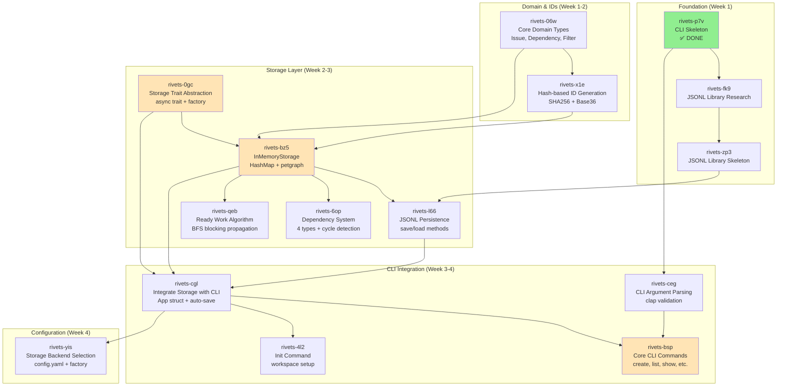
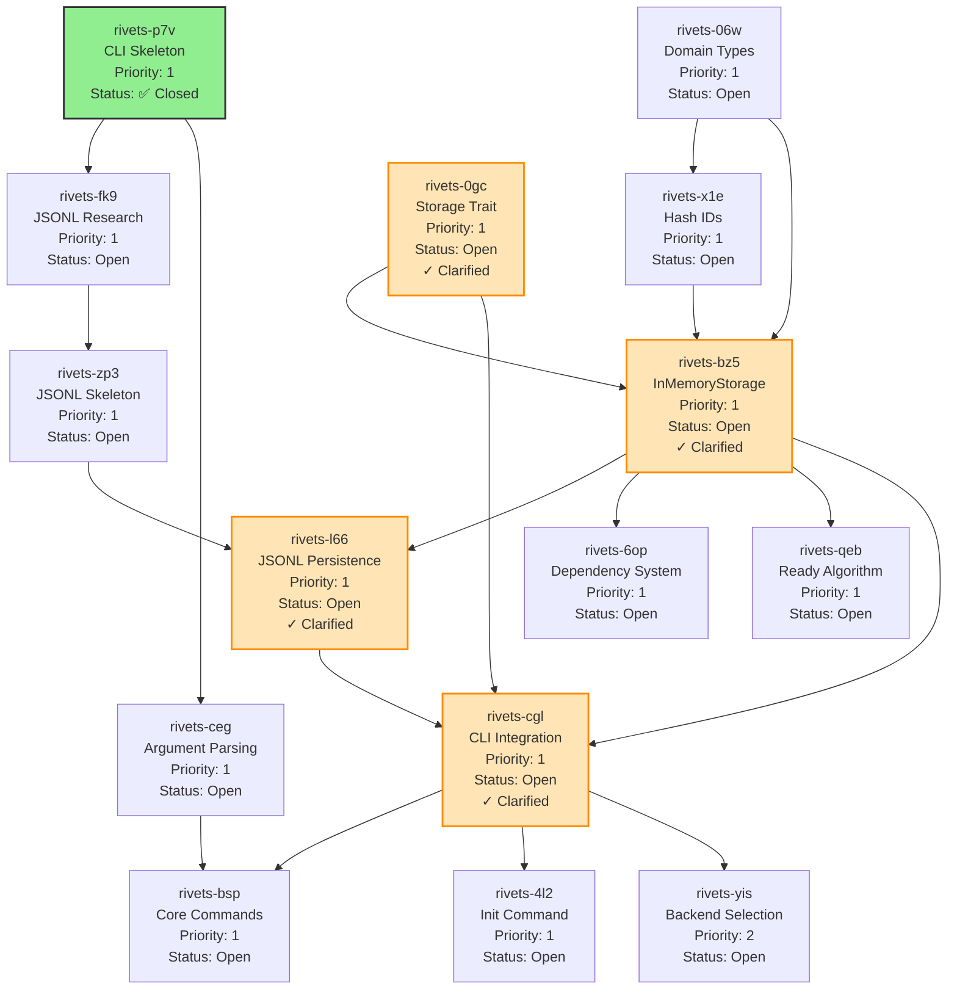

# Rivets Task Dependency Graph

## Implementation Order (Phase 1 MVP)

This document shows the dependency relationships between tasks and the suggested implementation order.

## Critical Path (MVP)



## Detailed Dependency Graph



**Legend**:
- 🟢 Green: Completed
- 🟡 Orange: Clarified (ready to implement)
- ⚪ White: Not yet started

## Implementation Sequence

### Iteration 1: Foundation (Days 1-3)
**Goal**: Establish library foundation and domain model

1. **rivets-fk9**: Research JSONL libraries
   - Evaluate existing Rust JSONL crates
   - Decision: build on serde_json or create custom
   - Output: Architecture decision document

2. **rivets-zp3**: Create JSONL library skeleton
   - Basic reader/writer structs
   - Async I/O with tokio
   - Depends on: rivets-fk9

3. **rivets-06w**: Implement domain types
   - Issue, NewIssue, IssueUpdate
   - Dependency, DependencyType
   - IssueFilter with builder
   - Status, Priority, IssueType enums
   - **No dependencies**

4. **rivets-x1e**: Implement hash-based IDs
   - SHA256 hashing algorithm
   - Base36 encoding
   - Collision handling with nonces
   - Adaptive length (4-6 chars)
   - Depends on: rivets-06w

### Iteration 2: Storage Core (Days 4-7)
**Goal**: Implement storage abstraction and in-memory backend

5. **rivets-0gc**: Define storage trait ✓ Clarified
   - async-trait based IssueStorage
   - All CRUD and query methods
   - save() method for persistence
   - Backend factory pattern
   - **Depends on**: rivets-06w

6. **rivets-bz5**: Implement InMemoryStorage ✓ Clarified
   - Arc<Mutex<InMemoryStorageInner>> structure
   - HashMap for issues
   - petgraph DiGraph for dependencies
   - HashMap for node mapping
   - **Depends on**: rivets-0gc, rivets-06w, rivets-x1e

7. **rivets-6op**: Implement dependency system
   - 4 dependency types (blocks, related, parent-child, discovered-from)
   - Cycle detection via petgraph
   - add_dependency, remove_dependency
   - **Depends on**: rivets-bz5

8. **rivets-qeb**: Implement ready work algorithm
   - Direct blocking detection
   - Transitive blocking via BFS
   - Sort policies (hybrid, priority, oldest)
   - **Depends on**: rivets-bz5

9. **rivets-l66**: Implement JSONL persistence ✓ Clarified
   - async load_from_jsonl with two-pass loading
   - async save_to_jsonl with atomic writes
   - Error recovery (orphans, cycles, malformed JSON)
   - **Depends on**: rivets-bz5, rivets-zp3

### Iteration 3: CLI Commands (Days 8-12)
**Goal**: Build command layer and integrate with storage

10. **rivets-ceg**: Implement argument parsing
    - Clap derive API for all commands
    - Validation (priority 0-4, enums, ID format)
    - Help text generation
    - **Depends on**: rivets-p7v ✅

11. **rivets-cgl**: Integrate storage with CLI ✓ Clarified
    - Async App struct
    - Storage initialization
    - Auto-save after mutations
    - Backend factory usage
    - **Depends on**: rivets-0gc, rivets-bz5, rivets-l66

12. **rivets-4l2**: Implement init command
    - Create .rivets/ directory
    - Generate config.yaml
    - Create empty issues.jsonl
    - Git integration suggestions
    - **Depends on**: rivets-cgl

13. **rivets-bsp**: Implement core commands
    - create: Interactive + flags
    - list: Filtering and display
    - show: Full issue details
    - update: Field modifications
    - close: Mark completed
    - delete: Safe deletion
    - **Depends on**: rivets-ceg, rivets-cgl

### Iteration 4: Configuration (Days 13-14)
**Goal**: Add configuration system for backend selection

14. **rivets-yis**: Implement backend selection
    - Parse config.yaml
    - Environment variable support
    - CLI flag overrides
    - Backend factory pattern
    - **Depends on**: rivets-cgl

## Phase 1 MVP Completion Criteria

### Must Have (Critical Path)
- ✅ rivets-p7v: CLI skeleton
- ⏳ rivets-fk9: JSONL research
- ⏳ rivets-zp3: JSONL library
- ⏳ rivets-06w: Domain types
- ⏳ rivets-x1e: Hash IDs
- ✓ rivets-0gc: Storage trait (clarified)
- ✓ rivets-bz5: InMemoryStorage (clarified)
- ✓ rivets-l66: JSONL persistence (clarified)
- ⏳ rivets-6op: Dependency system
- ⏳ rivets-qeb: Ready work
- ✓ rivets-cgl: CLI integration (clarified)
- ⏳ rivets-ceg: Argument parsing
- ⏳ rivets-bsp: Core commands
- ⏳ rivets-4l2: Init command

### Should Have (Important)
- ⏳ rivets-yis: Backend selection
- ⏳ Configuration system
- ⏳ Filtering improvements

### Nice to Have (Future)
- Labels and comments (rivets-37y)
- Advanced filtering (rivets-6tl)
- RPC system (rivets-bi2)
- Daemon (rivets-9mh)
- Documentation (rivets-azn)

## Parallel Work Opportunities

Tasks that can be worked on in parallel (no dependencies between them):

### Week 1 Parallel Tracks
- **Track A**: rivets-fk9 → rivets-zp3 (JSONL library)
- **Track B**: rivets-06w → rivets-x1e (Domain + IDs)

### Week 2 Parallel Tracks
After rivets-0gc and rivets-bz5 are complete:
- **Track A**: rivets-6op (Dependency system)
- **Track B**: rivets-qeb (Ready algorithm)
- **Track C**: rivets-l66 (JSONL persistence)

### Week 3 Parallel Tracks
After rivets-cgl is complete:
- **Track A**: rivets-ceg → rivets-bsp (CLI commands)
- **Track B**: rivets-4l2 (Init command)
- **Track C**: rivets-yis (Backend config)

## Risk Mitigation

### High-Risk Dependencies
1. **rivets-0gc** → Everything else
   - **Risk**: Trait design affects all storage implementations
   - **Mitigation**: ✓ Comprehensive clarification completed
   - **Status**: Design stable, ready for implementation

2. **rivets-bz5** → Most features
   - **Risk**: Core storage bugs affect everything
   - **Mitigation**: ✓ Clarified structure and patterns
   - **Status**: Architecture defined, ready for TDD approach

3. **rivets-cgl** → All CLI commands
   - **Risk**: Integration issues block command work
   - **Mitigation**: ✓ Async patterns clarified, save() added to trait
   - **Status**: Ready for implementation

### Suggested Approach
1. **Implement in order**: Follow the critical path
2. **Test thoroughly**: Each task should have comprehensive tests
3. **Integrate continuously**: Don't defer integration to end
4. **Use TDD**: Write tests first for core logic
5. **Benchmark early**: Verify performance targets as you go

## Estimated Timeline

| Week | Iteration | Tasks | Deliverable |
|------|-----------|-------|-------------|
| 1 | Foundation | fk9, zp3, 06w, x1e | Domain + IDs + JSONL library |
| 2 | Storage | 0gc, bz5, 6op, qeb, l66 | Working storage with persistence |
| 3 | CLI (Part 1) | ceg, cgl, 4l2 | Init working, storage integrated |
| 4 | CLI (Part 2) | bsp, yis | All core commands working |

**Total**: ~4 weeks for MVP (Phase 1)

## Verification Checkpoints

### After Iteration 1
```bash
cargo test --package rivets-jsonl
cargo test --package rivets -- domain::
cargo test --package rivets -- ids::
```

### After Iteration 2
```bash
cargo test --package rivets -- storage::
cargo run --package rivets -- --help
# Should show storage initialized
```

### After Iteration 3
```bash
rivets init --prefix test
rivets create --title "Test issue"
rivets list
rivets ready
# All commands should work end-to-end
```

### After Iteration 4
```bash
# Test backend configuration
cat .rivets/config.yaml
rivets create --title "Backend test"
# Verify JSONL saved correctly
cat .rivets/issues.jsonl | wc -l
```

## Success Metrics

- [ ] All P1 tasks completed
- [ ] All unit tests passing
- [ ] All integration tests passing
- [ ] Performance targets met:
  - [ ] 1000 issues created in <1s
  - [ ] Cycle detection <10ms for 1000 issues
  - [ ] Ready work query <10ms for 1000 issues
  - [ ] JSONL save <100ms for 1000 issues
- [ ] Documentation complete
- [ ] Can create, list, update, and delete issues
- [ ] Dependencies work with cycle prevention
- [ ] Ready work algorithm filters blocked issues
- [ ] JSONL persistence survives crashes
